# Political Classification Results — Weekly Review — 2026-04-11

| **Field** | **Value** |
|-----------|-----------|
| **Classification ID** | CLASS-2026-04-11-WEEKLY-001 |
| **Analysis Date** | 2026-04-11 09:20 UTC |
| **Updated** | 2026-04-11 10:57 UTC (deep-analysis enrichment) |
| **Period Covered** | 2026-04-04 → 2026-04-10 (Riksmöte 2025/26, W15) |
| **Documents Classified** | 27 |
| **Domains Identified** | 10 |
| **Produced By** | news-weekly-review workflow (AI-enriched, multi-source) |
| **Overall Classification** | 🟠 MEDIUM-HIGH |
| **Risk Level** | ⚠️ MODERATE (18/100) |
| **Confidence** | MEDIUM-HIGH |

---

## Classification Hierarchy

```mermaid
graph TD
    subgraph "Weekly Classification Hierarchy — W15 2026"
        W["📋 Weekly Review<br/>CLASS-2026-04-11-WEEKLY-001<br/>🟠 MEDIUM-HIGH"]
    end

    subgraph SEC["🔴 Defense & Security — HIGH"]
        direction TB
        SEC1["HD03220<br/>NATO Finland<br/>Forward Presence"]
        SEC2["HD01FöU12<br/>Shelter Law<br/>Civilian Protection"]
        SEC3["HD01UU6<br/>Security Policy<br/>51 motions"]
        SEC4["HD01FöU8<br/>Defense Personnel<br/>98 motions"]
        SEC5["HD03214<br/>Cybersecurity<br/>Center"]
        SEC6["HD03228<br/>Arms Export<br/>Reform"]
        SEC7["HD03114<br/>Export Control<br/>Annual Report"]
    end

    subgraph CJ["🔴 Criminal Justice — HIGH"]
        direction TB
        CJ1["HD03235<br/>Deportation Rules<br/>⭐ 9/10"]
        CJ2["HD03218<br/>Network Penalties<br/>Doubled Sentences"]
        CJ3["HD03217<br/>Official<br/>Accountability"]
        CJ4["HD01JuU15<br/>Justice Omnibus<br/>80 motions"]
    end

    subgraph MIG["🟠 Migration — MEDIUM-HIGH"]
        direction TB
        MIG1["HD01SfU31<br/>Enforcement<br/>Av-/utvisning"]
        MIG2["HD01SfU36<br/>Reception<br/>Mottagande"]
        MIG3["HD01SfU32<br/>Temporary<br/>Restrictions"]
        MIG4["HD01SfU16<br/>Migration Policy<br/>157 motions"]
    end

    subgraph HC["🟡 Healthcare — MEDIUM"]
        direction TB
        HC1["HD01SoU17<br/>HC Priorities<br/>172 motions"]
        HC2["HD01SoU16<br/>HC Organization<br/>176 motions"]
        HC3["HD03216<br/>Municipal HC<br/>Competency"]
        HC4["HD03219<br/>Dental Care<br/>Audit"]
    end

    subgraph CE["🟡 Climate & Energy — MEDIUM"]
        direction TB
        CE1["HD01MJU30<br/>Climate Targets"]
        CE2["HD01NU18<br/>Renewable Energy"]
        CE3["HD03230<br/>Hydropower<br/>Exemptions"]
    end

    subgraph FA["🟠 Foreign Affairs — MEDIUM-HIGH"]
        direction TB
        FA1["HD01UU6<br/>Security Policy"]
        FA2["HD03228<br/>Arms Trade"]
    end

    W --> SEC
    W --> CJ
    W --> MIG
    W --> HC
    W --> CE
    W --> FA

    style W fill:#0a0e27,color:#00d9ff,stroke:#00d9ff,stroke-width:2px
    style SEC fill:#2d1117,color:#EF5350,stroke:#D32F2F,stroke-width:2px
    style CJ fill:#2d1117,color:#EF5350,stroke:#D32F2F,stroke-width:2px
    style MIG fill:#2d1f11,color:#ffbe0b,stroke:#FF5722,stroke-width:2px
    style HC fill:#1f2d11,color:#FFC107,stroke:#FFC107
    style CE fill:#1f2d11,color:#FFC107,stroke:#FFC107
    style FA fill:#2d1f11,color:#ffbe0b,stroke:#FF5722,stroke-width:2px
```

---

## Classification Methodology

Classification follows a three-step process:

1. **Committee-to-Domain Mapping**: Each document's originating committee (utskott) determines its primary policy domain. Cross-committee documents receive dual classification. Committee codes: FöU→Defense, JuU→Criminal Justice, SfU→Migration/Social Insurance, SoU→Healthcare, UU→Foreign Affairs, MJU→Climate, NU→Energy, TU→Infrastructure, CU→Rural Policy, UbU→Education.

2. **Sensitivity Assessment**: Documents are evaluated for political sensitivity based on partisan contestation (measured by reservation count), ECHR/EU treaty exposure, and electoral salience (Novus/Sifo polling data). Levels: SENSITIVE (active political contestation, rights implications), PUBLIC (routine legislative business).

3. **Domain Urgency Rating**: Each domain receives an aggregate urgency score based on constituent documents' significance scores, motion volume (demand signal), and proximity to scheduled plenary votes.

---

## Domain Classification — Detailed Assessment

### 🔴 Defense & Security — HIGH

| **Metric** | **Value** |
|------------|-----------|
| **Classification** | 🔴 HIGH |
| **Documents** | 7 |
| **Avg. Significance** | 7.0/10 |
| **Motion Volume** | 247 (UU6: 51 + FöU8: 98 + FöU12: cross-party) |

| dok_id | Type | Title | Sensitivity | Urgency |
|--------|------|-------|-------------|---------|
| HD03220 | Prop | Svenskt deltagande i Natos framskjutna närvaro i Finland | 🟡 SENSITIVE | 🔴 CRITICAL |
| HD01FöU12 | Bet | Skyddsrumslagen — civilskydd | 🟢 PUBLIC | 🟠 URGENT |
| HD01UU6 | Bet | Utrikes- och säkerhetspolitik (51 motioner, 13 reservationer) | 🟡 SENSITIVE | 🟠 URGENT |
| HD01FöU8 | Bet | Totalförsvarets personalförsörjning (98 motioner) | 🟢 PUBLIC | 🔵 ELEVATED |
| HD03214 | Prop | Lagändringar för ett stärkt nationellt cybersäkerhetscenter | 🟡 SENSITIVE | 🟠 URGENT |
| HD03228 | Prop | Ett modernt och anpassat regelverk för krigsmateriel | 🟡 SENSITIVE | 🔵 ELEVATED |
| HD03114 | Prop | Strategisk exportkontroll 2025 | 🟢 PUBLIC | ⚪ ROUTINE |

**Rationale**: Seven documents constitute the most concentrated defense/security legislative week since NATO accession (March 2024). The NATO forward deployment proposition (HD03220) is historically unprecedented — Sweden's first offensive forward presence commitment. Combined with shelter infrastructure revival, cybersecurity institutionalization, and arms export modernization, this represents a comprehensive post-NATO security posture realignment. UU6's 13 reservations (highest for any spring UU report since 2019) indicate active nuclear policy debate.

---

### 🔴 Criminal Justice — HIGH

| **Metric** | **Value** |
|------------|-----------|
| **Classification** | 🔴 HIGH |
| **Documents** | 4 |
| **Avg. Significance** | 7.8/10 |
| **Motion Volume** | 80 (JuU15) |

| dok_id | Type | Title | Sensitivity | Urgency |
|--------|------|-------|-------------|---------|
| HD03235 | Prop | Skärpta regler om utvisning på grund av brott | 🔴 HIGHLY SENSITIVE | 🔴 CRITICAL |
| HD03218 | Prop | Skärpta straff för brott kopplade till kriminella nätverk | 🟡 SENSITIVE | 🔴 CRITICAL |
| HD03217 | Prop | Stärkt ansvarsutkrävande av offentliga tjänstemän | 🟡 SENSITIVE | 🟠 URGENT |
| HD01JuU15 | Bet | Straffrättsliga frågor (80 motioner) | 🟢 PUBLIC | 🔵 ELEVATED |

**Rationale**: Highest average significance (7.8/10) of any domain this week. The deportation proposition (HD03235) alone carries 9/10 significance — the week's single most consequential document. ECHR Article 8 exposure creates genuine legal risk. The tripling of network crime penalties (HD03218) is specifically designed as a 2026 campaign centrepiece. JuU15's 96% motion denial rate (only 3 of 80 motions adopted) demonstrates the government's uncompromising posture on law-and-order.

---

### 🟠 Migration — MEDIUM-HIGH

| **Metric** | **Value** |
|------------|-----------|
| **Classification** | 🟠 MEDIUM-HIGH |
| **Documents** | 4 |
| **Avg. Significance** | 6.3/10 |
| **Motion Volume** | 157 (SfU16) |

| dok_id | Type | Title | Sensitivity | Urgency |
|--------|------|-------|-------------|---------|
| HD01SfU31 | Bet | Verkställighet av beslut om av- och utvisning | 🟡 SENSITIVE | 🟠 URGENT |
| HD01SfU36 | Bet | Mottagande av asylsökande | 🟡 SENSITIVE | 🟠 URGENT |
| HD01SfU32 | Bet | Tillfälliga begränsningar av uppehållstillstånd | 🟡 SENSITIVE | 🔵 ELEVATED |
| HD01SfU16 | Bet | Migration och asylpolitik (157 motioner) | 🟡 SENSITIVE | 🔵 ELEVATED |

**Rationale**: The April 10 "migration enforcement triple" (SfU31/36/32) operationalizes the Tidö Agreement's migration commitments. SfU31 provides the enforcement mechanism for deportation decisions; SfU36 reforms reception conditions; SfU32 extends the temporary restrictions framework. Combined with 157 motions in SfU16, this is the most concentrated migration policy output since the 2015/16 refugee crisis response. ECHR and EU Common European Asylum System (CEAS) compliance risks are material.

---

### 🟠 Foreign Affairs — MEDIUM-HIGH

| **Metric** | **Value** |
|------------|-----------|
| **Classification** | 🟠 MEDIUM-HIGH |
| **Documents** | 2 (shared with Defense) |
| **Avg. Significance** | 7.0/10 |

| dok_id | Type | Title | Sensitivity | Urgency |
|--------|------|-------|-------------|---------|
| HD01UU6 | Bet | Utrikes- och säkerhetspolitik (51 motioner) | 🟡 SENSITIVE | 🟠 URGENT |
| HD03228 | Prop | Arms trade modernization | 🟡 SENSITIVE | 🔵 ELEVATED |

**Rationale**: UU6's foreign affairs dimension includes UNRWA funding debate, Palestine recognition implications, and NATO Foreign Ministers' meeting preparation (May 2026, Sweden hosting). Arms export reform (HD03228) creates new export pathways that will be scrutinized by civil society and humanitarian organizations. The dual defense/foreign affairs classification reflects the post-NATO merger of these policy domains.

---

### 🟡 Healthcare — MEDIUM

| **Metric** | **Value** |
|------------|-----------|
| **Classification** | 🟡 MEDIUM |
| **Documents** | 4 |
| **Avg. Significance** | 5.5/10 |
| **Motion Volume** | 348 (SoU17: 172 + SoU16: 176) |

| dok_id | Type | Title | Sensitivity | Urgency |
|--------|------|-------|-------------|---------|
| HD01SoU17 | Bet | Prioriteringar inom hälso- och sjukvården (172 motioner) | 🟢 PUBLIC | 🔵 ELEVATED |
| HD01SoU16 | Bet | Hälso- och sjukvårdens organisation (176 motioner) | 🟢 PUBLIC | 🔵 ELEVATED |
| HD03216 | Prop | Stärkt medicinsk kompetens i kommunal hälso- och sjukvård | 🟢 PUBLIC | ⚪ ROUTINE |
| HD03219 | Prop | Riksrevisionens rapport om tandvårdsstödet | 🟢 PUBLIC | ⚪ ROUTINE |

**Rationale**: While individual healthcare documents score lower on political significance, the aggregate motion volume (348 across two SoU reports) is the highest of any policy domain this week. This signals healthcare as the opposition's chosen electoral battlefield — a domain where S, V, and MP believe they hold voter trust advantage. Lower political sensitivity reflects cross-party consensus on structural challenges.

---

### 🟡 Climate & Energy — MEDIUM

| **Metric** | **Value** |
|------------|-----------|
| **Classification** | 🟡 MEDIUM |
| **Documents** | 3 |
| **Avg. Significance** | 5.7/10 |

| dok_id | Type | Title | Sensitivity | Urgency |
|--------|------|-------|-------------|---------|
| HD01MJU30 | Bet | Klimatmål och klimatpolitik | 🟡 SENSITIVE | 🟠 URGENT |
| HD01NU18 | Bet | Förnybar elproduktion | 🟢 PUBLIC | 🔵 ELEVATED |
| HD03230 | Prop | Undantag art- och habitatdirektivet | 🟡 SENSITIVE | 🔵 ELEVATED |

**Rationale**: Climate target recalibration (MJU30) is the most politically contested item in this domain — the opposition's strongest united front this week. The hydropower exemptions proposition (HD03230) creates direct tension with EU Habitats Directive obligations. Renewable energy permitting (NU18) reflects the ongoing municipal veto debate. June plenary climate debate will be a key electoral moment.

---

### 🟡 Social Insurance — MEDIUM

| **Metric** | **Value** |
|------------|-----------|
| **Classification** | 🟡 MEDIUM |
| **Documents** | 1 |
| **Avg. Significance** | 4.0/10 |

| dok_id | Type | Title | Sensitivity | Urgency |
|--------|------|-------|-------------|---------|
| HD01SfU18 | Bet | Socialförsäkringsfrågor | 🟢 PUBLIC | ⚪ ROUTINE |

**Rationale**: Routine social insurance adjustments. Lower political salience in current cycle but important for welfare state baseline.

---

### 🟡 Education — MEDIUM

| **Metric** | **Value** |
|------------|-----------|
| **Classification** | 🟡 MEDIUM |
| **Documents** | 1 |
| **Avg. Significance** | 4.0/10 |

| dok_id | Type | Title | Sensitivity | Urgency |
|--------|------|-------|-------------|---------|
| HD01UbU31 | Bet | Forskningsetik | 🟢 PUBLIC | ⚪ ROUTINE |

**Rationale**: Research ethics report with notable cross-party opposition pattern (15 of 50 motions from all 4 opposition parties). Niche domain but demonstrates coordinated opposition strategy even in technical committees.

---

### 🟢 Infrastructure — LOW-MEDIUM

| **Metric** | **Value** |
|------------|-----------|
| **Classification** | 🟢 LOW-MEDIUM |
| **Documents** | 2 |
| **Avg. Significance** | 4.0/10 |
| **Motion Volume** | 120 (TU15) |

| dok_id | Type | Title | Sensitivity | Urgency |
|--------|------|-------|-------------|---------|
| HD01TU15 | Bet | Trafikpolitik (120 motioner) | 🟢 PUBLIC | ⚪ ROUTINE |
| HD01CU23 | Bet | Landsbygdspolitik | 🟢 PUBLIC | ⚪ ROUTINE |

**Rationale**: Transport and rural policy carry persistent voter concern (rural–urban divide, infrastructure investment gaps) but lower acute political significance. 8 interpellations directed at Minister Carlson (KD) in TU15 suggest accountability pressure on infrastructure delivery.

---

### 🟢 Rural Policy — LOW-MEDIUM

| **Metric** | **Value** |
|------------|-----------|
| **Classification** | 🟢 LOW-MEDIUM |
| **Documents** | 1 |
| **Avg. Significance** | 5.0/10 |

| dok_id | Type | Title | Sensitivity | Urgency |
|--------|------|-------|-------------|---------|
| HD01CU23 | Bet | Landsbygdspolitik | 🟢 PUBLIC | ⚪ ROUTINE |

**Rationale**: Rural policy committee report. Important for C (Centerpartiet) party positioning but limited broader electoral impact.

---

## Overall Assessment

| **Metric** | **Value** | **Interpretation** |
|------------|-----------|-------------------|
| **Classification** | 🟠 MEDIUM-HIGH | Above-average legislative significance for the 2025/26 session |
| **Risk Level** | ⚠️ MODERATE (18/100) | ECHR exposure (HD03235), EU treaty tension (HD03230), NATO commitment escalation (HD03220) |
| **Confidence** | MEDIUM-HIGH | Full metadata for all 27 documents; partial full-text for 21/27 |
| **Trend** | Pre-election acceleration | Legislative volume 1.8× session average; flagship concentration in W15 |

**Key Observations**:
- The week's output is dominated by two HIGH-classified domains (Defense/Security and Criminal Justice) — both core Tidö Agreement pillars
- Migration's MEDIUM-HIGH classification understates its political weight — it is the connective tissue between Criminal Justice (HD03235) and the SfU enforcement triple
- Healthcare's MEDIUM classification belies its 348-motion volume — the opposition is building electoral ammunition through committee motions
- The 10-domain spread across 27 documents reflects the broadest legislative week of the spring session

---

## Data Quality Notes

- **Confidence**: MEDIUM-HIGH — Classification based on committee assignment, document metadata, motion counts, reservation analysis, and electoral context mapping.
- **Methodology**: Committee→domain mapping verified against riksdag.se committee pages. Sensitivity levels calibrated against Novus/Sifo March 2026 polling data for electoral salience.
- **Limitation**: Formal chamber vote records pending for several committee reports; classification may adjust upon vote outcome analysis.
