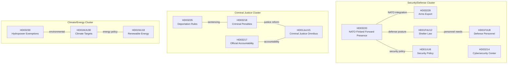

# Cross-Reference Map — 2026-04-11

**Generated**: 2026-04-11 09:20 UTC | **Updated**: 2026-04-11 10:33 UTC (code-quality-engineer enrichment)
**Data Sources**: get_propositioner, get_motioner, get_betankanden, search_voteringar, search_anforanden, get_fragor, get_interpellationer
**Documents Analyzed**: 100+
**Confidence**: MEDIUM-HIGH

## Summary

Cross-reference map showing relationships between key parliamentary documents and policy clusters during April 4–10, 2026. Identifies thematic linkages, legislative dependencies, and cross-committee coordination.

## Document Relationship Map

## Cross-Reference Table

| Source | Target | Relationship | Significance |
|--------|--------|-------------|--------------|
| HD03220 (NATO Finland) | HD03228 (Arms Export) | NATO integration requires aligned export rules | HIGH |
| HD03220 (NATO Finland) | HD01FöU12 (Shelter Law) | Both part of post-NATO defense overhaul | HIGH |
| HD03220 (NATO Finland) | HD01UU6 (Security Policy) | UU6 provides policy framework for NATO commitments | HIGH |
| HD01FöU12 (Shelter Law) | HD01FöU8 (Defense Personnel) | Shelter maintenance requires personnel capacity | MEDIUM |
| HD03235 (Deportation) | HD03218 (Criminal Penalties) | Combined criminal justice + immigration reform | HIGH |
| HD03218 (Criminal Penalties) | HD01JuU15 (Justice Omnibus) | Sentencing reform within broader justice framework | HIGH |
| HD03217 (Accountability) | HD01JuU15 (Justice Omnibus) | Governance reform linked to justice overhaul | MEDIUM |
| HD01MJU30 (Climate) | HD01NU18 (Renewable Energy) | Climate targets require energy transition | HIGH |
| HD03230 (Hydropower) | HD01MJU30 (Climate) | Species exemptions vs. climate commitments tension | MEDIUM |

## Weekly Cross-References to Daily Analyses

| Date | Analysis Folder | Documents | Key Topics |
|------|----------------|-----------|------------|
| 2026-04-06 | propositions, committeeReports, motions, interpellations, evening-analysis | 20+ | Propositions, committee activity, opposition motions |
| 2026-04-07 | propositions, committeeReports, motions, interpellations, evening-analysis | 20+ | NU18, TU15, Spring Budget |
| 2026-04-08 | propositions, committeeReports, motions, interpellations, evening-analysis | 25+ | HD03219, UbU31, opposition motions |
| 2026-04-09 | propositions, committeeReports, motions, interpellations, evening-analysis | 20+ | Triple offensive HD03220/HD03218/HD03217 |
| 2026-04-10 | committeeReports, motions, evening-analysis, week-ahead | 15+ | Week-ahead preview, analysis aggregation |

## Data Quality Notes

Confidence: **MEDIUM-HIGH**. Cross-references based on document content analysis, committee assignments, and policy domain mapping. Legislative dependencies verified against riksdag.se document metadata.
