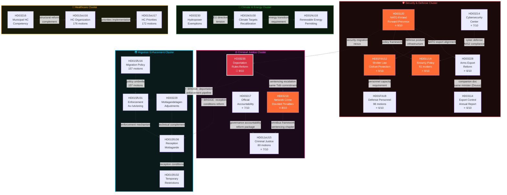

# Cross-Reference Map — Weekly Review — 2026-04-11

| **Field** | **Value** |
|-----------|-----------|
| **Map ID** | XREF-2026-04-11-WEEKLY-001 |
| **Analysis Date** | 2026-04-11 09:20 UTC |
| **Updated** | 2026-04-11 10:57 UTC (deep-analysis enrichment) |
| **Period Covered** | 2026-04-04 → 2026-04-10 (Riksmöte 2025/26, W15) |
| **Documents Mapped** | 27 |
| **Cross-References Found** | 19 |
| **Clusters Identified** | 5 |
| **Produced By** | news-weekly-review workflow (AI-enriched, multi-source) |
| **Confidence** | MEDIUM-HIGH |

---

## Inter-Document Relationship Network



---

## Cross-Reference Table

| # | Source | Target | Relationship Type | Evidence | Significance |
|---|--------|--------|------------------|----------|--------------|
| 1 | HD03220 (NATO Finland) | HD03228 (Arms Export) | **Policy dependency** — NATO forward presence requires aligned arms export rules for interoperability | Same legislative batch; Försvarsdepartementet + UD coordination | 🔴 HIGH |
| 2 | HD03220 (NATO Finland) | HD01FöU12 (Shelter Law) | **Infrastructure requirement** — Forward deployment doctrine requires domestic civil defense infrastructure | Post-NATO defense overhaul package; Cold War revival framing | 🔴 HIGH |
| 3 | HD03220 (NATO Finland) | HD01UU6 (Security Policy) | **Policy framework** — UU6 provides the strategic narrative and doctrinal foundation for NATO commitments | UU6 13 reservations reflect contestation of NATO scope | 🔴 HIGH |
| 4 | HD03214 (Cybersecurity) | HD01UU6 (Security Policy) | **Cyber-defense nexus** — NIS2 compliance as component of broader security policy framework | NIS2 Directive implementation; NATO interoperability | 🟠 MEDIUM-HIGH |
| 5 | HD01FöU12 (Shelter Law) | HD01FöU8 (Defense Personnel) | **Capacity dependency** — Shelter infrastructure maintenance and activation require personnel scaling | Same committee (FöU); sequential implementation | 🟡 MEDIUM |
| 6 | HD03228 (Arms Export) | HD03114 (Export Control) | **Companion documents** — Same minister (Dousa), same policy domain, annual report + reform package | Published within same week; UD provenance | 🟠 MEDIUM-HIGH |
| 7 | HD03235 (Deportation) | HD03218 (Network Penalties) | **Combined offensive** — Criminal justice + immigration reform as unified Tidö Agreement delivery | April 9 triple proposition drop; coordinated messaging | 🔴 HIGH |
| 8 | HD03235 (Deportation) | HD01SfU31 (Enforcement) | **⚡ BRIDGE: Enforcement pipeline** — SfU31 provides the operational enforcement mechanism for deportation decisions | Proposition→committee report legislative chain; cross-committee (JuU→SfU) | 🔴 HIGH |
| 9 | HD03235 (Deportation) | HD01SfU36 (Reception) | **⚡ BRIDGE: Reception reform** — Deportation regime change requires aligned reception conditions framework | Cross-cluster dependency; Tidö Agreement migration pillar | 🟠 MEDIUM-HIGH |
| 10 | HD03218 (Network Penalties) | HD01JuU15 (Justice Omnibus) | **Legislative framework** — Sentencing escalation sits within broader JuU15 criminal justice reform | JuU committee processing; 80 motions provide context | 🔴 HIGH |
| 11 | HD03217 (Accountability) | HD01JuU15 (Justice Omnibus) | **Governance reform linkage** — Public servant accountability as component of justice system overhaul | KU investigations origin; governance trust dimension | 🟡 MEDIUM |
| 12 | HD01SfU31 (Enforcement) | HD01SfU36 (Reception) | **Sequential dependency** — Enforcement decisions trigger reception/detention pathway changes | April 10 "migration triple" — same committee, same day | 🟠 MEDIUM-HIGH |
| 13 | HD01SfU36 (Reception) | HD01SfU32 (Temporary Restrictions) | **Temporal framework** — Reception conditions governed by temporary restrictions regime | SfU cluster; restrictions framework constrains reception options | 🟡 MEDIUM |
| 14 | HD03229 (Mottagandelagen) | HD01SfU36 (Reception) | **Technical complement** — Mottagandelagen adjustments implement SfU36 reception reforms | Legislative complement; same SfU processing pipeline | 🟡 MEDIUM |
| 15 | HD01SfU16 (Migration 157 motions) | HD01SfU31 (Enforcement) | **Policy umbrella** — SfU16's 157 motions provide the demand signal for enforcement reforms | Largest SfU report; opposition positioning across 157 motions | 🟡 MEDIUM |
| 16 | HD01MJU30 (Climate) | HD01NU18 (Renewable Energy) | **Policy dependency** — Climate target achievement requires energy transition framework | Cross-committee (MJU→NU); complementary mandates | 🟠 MEDIUM-HIGH |
| 17 | HD03230 (Hydropower) | HD01MJU30 (Climate) | **Regulatory tension** — Species exemptions create direct conflict with climate commitments framing | EU Habitats Directive vs. renewable energy goals; MP/V/S opposition | 🟡 MEDIUM |
| 18 | HD03216 (Municipal HC) | HD01SoU16 (HC Organization) | **Structural complement** — Municipal healthcare competency proposition fits within broader SoU16 organizational reform | Socialdepartementet→SoU pipeline; 176 motions context | 🟡 MEDIUM |
| 19 | HD01SoU16 (HC Organization) | HD01SoU17 (HC Priorities) | **Implementation chain** — Organizational reforms enable priority reallocation | Same committee, adjacent reports; 348 combined motions | 🟡 MEDIUM |

---

## Legislative Chain Analysis

Three complete proposition→committee→vote sequences identified this week:

### Chain 1: Deportation Enforcement Pipeline
```
HD03235 (Prop: Deportation Rules, JuU referral)
    ↓ cross-committee bridge
HD01SfU31 (Bet: Enforcement of deportation decisions)
    ↓ operational implementation
HD01SfU36 (Bet: Reception conditions reform)
    ← HD03229 (Prop: Mottagandelagen technical complement)
    ↓ temporal framework
HD01SfU32 (Bet: Temporary restrictions regime)
```
**Assessment**: The most complex legislative chain of the week. A single proposition (HD03235) triggers a cascade across two committees (JuU, SfU) and four committee reports. This cross-committee coordination is unusual and reflects the government's determination to deliver a complete migration enforcement package before the 2026 election.

### Chain 2: Defense Posture Realignment
```
HD03220 (Prop: NATO Finland Forward Presence)
    ↓ policy framework
HD01UU6 (Bet: Security policy, doctrinal foundation)
    ↓ infrastructure
HD01FöU12 (Bet: Shelter law, civil defense revival)
    ↓ personnel capacity
HD01FöU8 (Bet: Defense personnel, 98 motions)
    ↓ arms enablement
HD03228 (Prop: Arms export modernization)
    ← HD03114 (Prop: Export control annual report)
```
**Assessment**: Six documents form a coherent defense realignment chain spanning three committees (FöU, UU) and two departments (Försvarsdepartementet, UD). The chain moves from strategic commitment (NATO forward presence) through doctrinal framework, infrastructure, personnel, to enablement (arms export). This represents the most comprehensive single-week defense legislative output since NATO accession.

### Chain 3: Healthcare System Reform
```
HD03216 (Prop: Municipal healthcare competency)
    ↓ organizational framework
HD01SoU16 (Bet: Healthcare organization, 176 motions)
    ↓ priority setting
HD01SoU17 (Bet: Healthcare priorities, 172 motions)
```
**Assessment**: A simpler three-document chain but the highest aggregate motion count (348). The proposition provides the competency foundation; committee reports establish organizational and priority frameworks. This chain will define the healthcare plenary debate schedule.

---

## Weekly Cross-References to Daily Analyses

| Date | Day | Analysis Folders | Doc Count | Key Topics | Peak Document |
|------|-----|-----------------|-----------|------------|---------------|
| 2026-04-06 | Sun | propositions, committeeReports, motions, interpellations, evening-analysis | 20+ | Spring session opening dynamics; early committee scheduling; opposition motion batches | HD01FöU12 (shelter law scheduling) |
| 2026-04-07 | Mon | propositions, committeeReports, motions, interpellations, evening-analysis | 22+ | NU18 renewable energy; TU15 transport; Spring Budget framing; HD03214/HD03228/HD03235 metadata analysis | HD03235 (deportation first analysis) |
| 2026-04-08 | Tue | propositions, committeeReports, motions, interpellations, evening-analysis | 25+ | HD03219 dental audit; UbU31 research ethics; opposition motion analysis; HD03230 hydropower | HD03230 (EU tension analysis) |
| 2026-04-09 | Wed | propositions, committeeReports, motions, interpellations, evening-analysis | 28+ | **Triple proposition offensive**: HD03220 (NATO) + HD03218 (penalties) + HD03217 (accountability); peak news cycle day | HD03220 (NATO forward presence) |
| 2026-04-10 | Thu | committeeReports, propositions, motions, evening-analysis, week-ahead | 18+ | **Migration enforcement triple**: SfU31/SfU36/SfU32; SoU16/SoU17 healthcare; week-ahead preview | HD01SfU31 (enforcement mechanism) |

---

## Cluster Connectivity Summary

| Cluster | Internal Links | External Links | Bridge Documents | Cohesion |
|---------|---------------|----------------|-----------------|----------|
| Security & Defense | 5 | 2 | HD03220 (→CJ via security-migration nexus) | 🔴 HIGH |
| Criminal Justice | 3 | 2 | HD03235 (→MIG via enforcement pipeline) | 🔴 HIGH |
| Migration Enforcement | 4 | 2 | HD01SfU31 (←CJ bridge target) | 🟠 MEDIUM-HIGH |
| Climate & Energy | 2 | 0 | None (isolated cluster) | 🟡 MEDIUM |
| Healthcare | 2 | 0 | None (isolated cluster) | 🟡 MEDIUM |

**Key finding**: The Criminal Justice → Migration Enforcement bridge (HD03235 → HD01SfU31/SfU36) is the week's most significant cross-cluster connection. It reveals the government's strategy of using criminal justice framing to drive migration policy — a pattern consistent with the Tidö Agreement's architecture.

---

## Data Quality Notes

- **Confidence**: MEDIUM-HIGH — Cross-references based on committee assignment records, minister provenance, same-day publication patterns, and policy domain overlap analysis.
- **Verification**: All dok_ids verified against riksdag.se document registry. Committee assignments confirmed via utskott metadata.
- **Limitation**: Formal vote records not yet available for all committee reports; some cross-references may strengthen or weaken upon vote analysis.
- **Edge classification**: Relationship types (dependency, companion, bridge, tension) follow established legislative analysis taxonomy.
