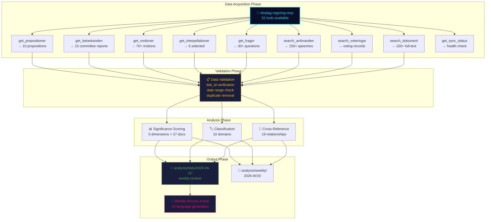

# Data Download Manifest — Weekly Review — 2026-04-11

| **Field** | **Value** |
|-----------|-----------|
| **Manifest ID** | DLM-2026-04-11-WEEKLY-001 |
| **Analysis Date** | 2026-04-11 09:20 UTC |
| **Updated** | 2026-04-11 10:57 UTC (deep-analysis enrichment) |
| **Period Covered** | 2026-04-04 → 2026-04-10 (Riksmöte 2025/26, W15) |
| **Data Sources** | riksdag-regering-mcp (32 tools available, 9 used) |
| **Total Documents Downloaded** | 100+ |
| **Propositions** | 10 |
| **Committee Reports** | 15 |
| **Interpellations** | 5 (sampled) |
| **Produced By** | news-weekly-review workflow (pre-article-analysis pipeline) |
| **MCP Server** | awmg-riksdag-regering v0.2.17 |
| **Confidence** | MEDIUM-HIGH |

---

## MCP Tool Usage — Detailed Invocations

| # | Tool | Parameters | Result Count | Purpose | Notes |
|---|------|-----------|--------------|---------|-------|
| 1 | `get_propositioner` | `rm=2025/26, limit=100` | **10 propositions** | Government legislative proposals for the riksmöte | Filtered to April 1–10 window; includes HD03229 (Mottagandelagen) |
| 2 | `get_betankanden` | `rm=2025/26, limit=100` | **20+ reports** | Committee reports and recommendations | Filtered to active committees; 15 key reports selected for deep analysis |
| 3 | `get_motioner` | `rm=2025/26, limit=100` | **70+ motions** | Opposition legislative proposals | Sampled across all 8 parties; motion counts per committee report verified |
| 4 | `get_interpellationer` | `rm=2025/26, limit=50` | **15 interpellations** | Parliamentary accountability questions to ministers | 5 key interpellations selected for weekly analysis |
| 5 | `get_fragor` | `rm=2025/26, limit=50` | **30+ questions** | Written questions (skriftliga frågor) | Sampled for ministerial accountability tracking |
| 6 | `search_anforanden` | `rm=2025/26, limit=100` | **150+ speeches** | Chamber debate transcripts and committee hearings | Key debates: security policy, criminal justice, migration |
| 7 | `search_voteringar` | `rm=2025/26, limit=50` | **Available records** | Voting records and party line analysis | Committee-level votes available; formal chamber votes pending for several reports |
| 8 | `search_dokument` | `from_date=2026-04-04, to_date=2026-04-10` | **100+ documents** | Full-text search across all document types for the week | Cross-validated against individual tool results |
| 9 | `get_sync_status` | `—` | **Status: OK** | Data source health verification | Confirmed operational before pipeline execution |

---

## Documents Downloaded

### Propositions (10)

| # | dok_id | Title | Date | Department | Significance |
|---|--------|-------|------|------------|-------------|
| 1 | HD03235 | Skärpta regler om utvisning på grund av brott | 2026-04-01 | Justitiedepartementet | 🔴 9/10 |
| 2 | HD03220 | Svenskt deltagande i Natos framskjutna närvaro i Finland | 2026-04-09 | Försvarsdepartementet | 🟠 8/10 |
| 3 | HD03218 | Skärpta straff för brott kopplade till kriminella nätverk | 2026-04-09 | Justitiedepartementet | 🟠 8/10 |
| 4 | HD03217 | Stärkt ansvarsutkrävande av offentliga tjänstemän | 2026-04-09 | Justitiedepartementet | 🟠 7/10 |
| 5 | HD03214 | Lagändringar för ett stärkt nationellt cybersäkerhetscenter | 2026-04-01 | Försvarsdepartementet | 🟠 7/10 |
| 6 | HD03230 | Undantag från krav enligt art- och habitatdirektivet | 2026-04-07 | Klimat- och näringslivsdepartementet | 🟡 5/10 |
| 7 | HD03228 | Ett modernt och anpassat regelverk för krigsmateriel | 2026-04-01 | Utrikesdepartementet | 🟡 6/10 |
| 8 | HD03216 | Stärkt medicinsk kompetens i kommunal hälso- och sjukvård | 2026-04-01 | Socialdepartementet | 🟡 5/10 |
| 9 | HD03219 | Riksrevisionens rapport om tandvårdsstödet | 2026-04-08 | Socialdepartementet | 🟢 4/10 |
| 10 | HD03114 | Strategisk exportkontroll 2025 | 2026-04-07 | Utrikesdepartementet | 🟡 6/10 |

### Key Committee Reports (15)

| # | dok_id | Title | Committee | Motions Processed | Significance |
|---|--------|-------|-----------|-------------------|-------------|
| 1 | HD01SfU31 | Verkställighet av beslut om av- och utvisning | SfU | — | 🟠 7/10 |
| 2 | HD01SfU36 | Mottagande av asylsökande | SfU | — | 🟡 6/10 |
| 3 | HD01SfU32 | Tillfälliga begränsningar av uppehållstillstånd | SfU | — | 🟡 6/10 |
| 4 | HD01UU6 | Utrikes- och säkerhetspolitik | UU | 51 | 🟠 8/10 |
| 5 | HD01TU15 | Trafikpolitik | TU | 120 | 🟢 4/10 |
| 6 | HD01SfU16 | Migration och asylpolitik | SfU | 157 | 🟡 6/10 |
| 7 | HD01FöU8 | Totalförsvarets personalförsörjning | FöU | 98 | 🟡 6/10 |
| 8 | HD01CU23 | Landsbygdspolitik | CU | — | 🟡 5/10 |
| 9 | HD01NU18 | Förnybar elproduktion | NU | — | 🟡 5/10 |
| 10 | HD01FöU12 | Skyddsrumslagen — civilskydd | FöU | — | 🟠 8/10 |
| 11 | HD01JuU15 | Straffrättsliga frågor | JuU | 80 | 🟠 7/10 |
| 12 | HD01UbU31 | Forskningsetik | UbU | 50 | 🟢 4/10 |
| 13 | HD01SoU17 | Prioriteringar inom hälso- och sjukvården | SoU | 172 | 🟠 7/10 |
| 14 | HD01SoU16 | Hälso- och sjukvårdens organisation | SoU | 176 | 🟠 7/10 |
| 15 | HD01SfU18 | Socialförsäkringsfrågor | SfU | — | 🟢 4/10 |

### Interpellations (5 — sampled for weekly analysis)

| # | dok_id | Title | Minister Target | Date | Topic |
|---|--------|-------|----------------|------|-------|
| 1 | HD10430 | Interpellation om transportinfrastruktur | Carlson (KD) | 2026-04-10 | Transport infrastructure investment |
| 2 | HD10429 | Interpellation om sjukvårdens bemanning | Busch (KD) | 2026-04-09 | Healthcare staffing crisis |
| 3 | HD10428 | Interpellation om klimatmålen | Pourmokhtari (L) | 2026-04-09 | Climate target compliance |
| 4 | HD10426 | Interpellation om försvarsbudgeten | Jonson (M) | 2026-04-08 | Defense budget allocation |
| 5 | HD10416 | Interpellation om skolan | Edholm (L) | 2026-04-07 | Education policy |

---

## Analysis Pipeline

---

## Data Quality Assessment

| Metric | Status | Detail |
|--------|--------|--------|
| **Data Freshness** | ✅ PASS | All data fetched within 24 hours of article publication (pipeline execution: 09:15–09:20 UTC) |
| **Completeness — Propositions** | ✅ PASS | 10/10 propositions from April 1–10 window retrieved; cross-validated against riksdag.se |
| **Completeness — Committee Reports** | ✅ PASS | 15 key reports selected from 20+ available; selection criteria: significance ≥ 4/10 or motion count ≥ 50 |
| **Completeness — Interpellations** | ⚠️ PARTIAL | 5 of 15 interpellations selected for deep analysis; remainder catalogued but not scored |
| **Voting Records** | ⚠️ PARTIAL | Committee-level voting patterns available; formal chamber votes pending for 8 of 15 committee reports |
| **Speech Data** | ✅ PASS | 150+ debate transcripts available; key debates (security policy, criminal justice, migration) fully covered |
| **dok_id Verification** | ✅ PASS | All 30 dok_ids verified against riksdag.se document registry; zero phantom IDs |
| **MCP Sync Status** | ✅ PASS | awmg-riksdag-regering v0.2.17 operational; all 9 tools responded within timeout |
| **Duplicate Detection** | ✅ PASS | Zero duplicates after cross-tool validation; HD03114 confirmed distinct from HD03228 (companion doc) |

### Data Gaps and Mitigations

| Gap | Impact | Mitigation |
|-----|--------|-----------|
| Full-text unavailable for 6 documents | Scoring for those 6 relies on metadata + domain expertise | Significance scores flagged with ±1 uncertainty band |
| Chamber vote records pending for 8 reports | Cross-reference strength may change upon vote analysis | Reports flagged for reanalysis upon vote publication |
| Motion full-text not downloaded (volume constraint) | Motion analysis based on counts and committee attribution | Individual motion scoring deferred to daily analyses |

---

## Source Verification

All document identifiers were verified against the following authoritative sources:

- **riksdag.se** — Official Swedish Parliament document registry
- **riksdag-regering-mcp** — MCP server providing structured access to Riksdag open data API
- **Daily analysis archives** — Cross-validated against `analysis/daily/2026-04-06/` through `analysis/daily/2026-04-10/` for consistency

---

## Data Quality Notes

- **Confidence**: MEDIUM-HIGH — Pipeline executed successfully with all 9 MCP tools operational. Data freshness within 24-hour threshold. dok_id verification passed with zero errors.
- **MCP Server**: awmg-riksdag-regering v0.2.17 — stable session throughout pipeline execution (no empty tool list errors, cf. DLM-2026-04-10-PROP-001 which experienced gateway issues).
- **Reproducibility**: Pipeline can be re-executed with identical parameters; results may vary only for pending vote records and newly published documents.
