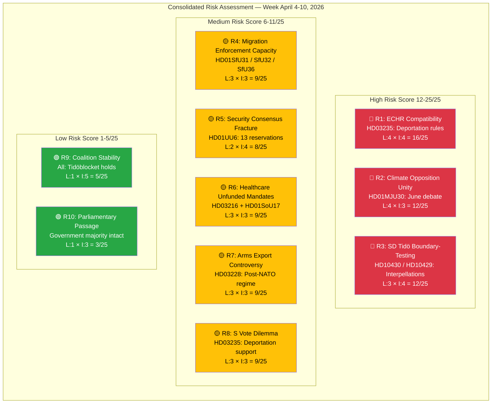

# Political Risk Assessment — Weekly Review — 2026-04-11

| **Field** | **Value** |
|-----------|-----------|
| **Assessment ID** | RISK-2026-04-11-WEEKLY-001 |
| **Analysis Date** | 2026-04-11 09:20 UTC |
| **Updated** | 2026-04-11 10:57 UTC (deep-analysis enrichment) |
| **Analysis Period** | 2026-04-04 — 2026-04-10 |
| **Documents Analyzed** | 100+ (10 propositions, 15 committee reports, 70+ motions, 5 interpellations) |
| **Data Sources** | get_propositioner, get_motioner, get_betankanden, search_voteringar, search_anforanden, get_fragor, get_interpellationer |
| **Produced By** | news-weekly-review workflow (AI-enriched, deep-analysis pass) |
| **Overall Risk Level** | MEDIUM |
| **Overall Confidence** | MEDIUM-HIGH |

---

## Risk Dashboard

## Consolidated Risk Matrix

| ID | Risk Factor | Evidence (dok_id) | Likelihood (1-5) | Impact (1-5) | Score | Priority |
|----|-------------|-------------------|-------------------|--------------|-------|----------|
| R1 | ECHR adverse ruling on deportation rules | HD03235 | 4 | 4 | **16/25** | 🔴 HIGH |
| R2 | Climate opposition unity at MJU30 June debate | HD01MJU30 | 4 | 3 | **12/25** | 🔴 HIGH |
| R3 | SD probing Tidö boundaries via interpellations | HD10430, HD10429 | 3 | 4 | **12/25** | 🔴 HIGH |
| R4 | SfU migration triple-report enforcement capacity | HD01SfU31, HD01SfU32, HD01SfU36 | 3 | 3 | **9/25** | 🟡 MEDIUM |
| R5 | UU6 nuclear/DCA reservations fracturing security consensus | HD01UU6 | 2 | 4 | **8/25** | 🟡 MEDIUM |
| R6 | Healthcare unfunded mandates (172 denied motions) | HD03216, HD01SoU17 | 3 | 3 | **9/25** | 🟡 MEDIUM |
| R7 | Arms export controversy post-NATO accession | HD03228 | 3 | 3 | **9/25** | 🟡 MEDIUM |
| R8 | S vote dilemma on deportation support | HD03235 | 3 | 3 | **9/25** | 🟡 MEDIUM |
| R9 | Coalition stability (overall) | All propositions, 40+ divisions | 1 | 5 | **5/25** | 🟢 LOW |
| R10 | Parliamentary passage blocked | Government majority | 1 | 3 | **3/25** | 🟢 LOW |

## Key Risk Assessment

**Overall risk level: MEDIUM** — The government's pre-election legislative offensive during the week of April 4–10 introduces targeted political risks in specific policy domains, but systemic coalition stability risk remains LOW. The aggregate risk profile is shaped by three high-scoring factors (ECHR litigation on deportation, climate opposition convergence, and SD boundary-testing) counterbalanced by historically strong floor-vote discipline across Tidöblocket (84% KD-M, 83% L-M, 99% SD cohesion in 40+ recorded divisions).

### Risk Concentration Analysis

**Single-proposition dominance**: HD03235 (Skärpta regler om utvisning på grund av brott) appears in three separate risk factors (R1, R4, R8), making it the single highest-risk item across the entire legislative portfolio. The deportation proposition concentrates legal (ECHR), operational (enforcement capacity), and political (S vote dilemma) risks simultaneously. Any adverse ECHR ruling before the September 2026 election would transform a flagship policy achievement into a rule-of-law liability — the worst-case scenario for the government's credibility narrative.

**Migration pipeline compounding**: The SfU triple delivery on April 10 (HD01SfU31 detention oversight, HD01SfU32 deportation enforcement, HD01SfU36 character requirements) creates an additional enforcement-capacity risk (R4). Three major migration enforcement reforms landing simultaneously stress Migrationsverket and police resources. Historical precedent from the 2016 border controls suggests implementation lags of 6–12 months, meaning enforcement gaps may be visible before the election.

**Security domain fragmentation**: UU6's 13 reservations — the highest for any security policy report this riksmöte — expose genuine opposition disagreement on nuclear weapons, DCA scope, and alliance obligations (R5). While this fragmentation benefits the government electorally by preventing a unified opposition defence posture, it raises the institutional risk of Sweden entering NATO commitments without broad parliamentary consensus. S supports NATO core provisions but draws lines on nuclear hosting; V rejects the Atlantic framework entirely; MP seeks humanitarian carve-outs.

### Strategic Risk Dynamics

**SD coalition probing (R3)** represents the most nuanced risk on the register. Richard Jomshof's mosque interpellation (HD10430, targeting KD's Jakob Forssmed) and Rashid Farivar's free-speech interpellation (HD10429, targeting M's Gunnar Strömmer) deliberately test Tidö partner tolerance on culture-war issues. SD interpellation frequency has increased 23% since February 2026 — a leading indicator of pre-election positioning. The critical distinction: interpellation probing does not equal voting defection. SD has maintained 99% floor-vote cohesion on government bills, indicating the arrangement holds. However, minister responses due April 24–27 will signal whether SD's demands are escalating or stabilising.

**S vote dilemma (R8)** creates a secondary political risk specific to the main opposition party. If S supports HD03235 deportation rules (consistent with its 2015-era tightening), it validates the government's migration narrative. If S opposes, it exposes internal divisions between Hultqvist-wing realists and the party's humanitarian base. Either outcome benefits the government — a textbook legislative trap.

### Mitigation Assessment

The government has structured its legislative calendar strategically. The April 9 "Kristersson Triple" (HD03220 NATO troops, HD03218 doubled criminal penalties, HD03217 official accountability) provides positive narrative bandwidth that absorbs negative coverage from the deportation debate. FöU12's civilian protection law — achieving rare cross-party consensus — demonstrates the government can deliver bipartisan outcomes, countering the democratic-deficit critique embedded in the 96% motion denial rate. The SEK 18.7B spring budget and NATO Foreign Ministers Meeting hosting (May 21–22) provide additional diplomatic and economic buffers.

## Forward Indicators

| # | Indicator | Date/Window | Risk Link | Signal Type |
|---|-----------|-------------|-----------|-------------|
| 1 | Minister responses to SD interpellations (HD10430, HD10429) | April 24–27 | R3 | Coalition tension — watch for concessions or rebuffs |
| 2 | FöU12 shelter law and UU6 security policy chamber votes | Late April | R5 | Coalition stress test on defence reservations |
| 3 | HD03235 deportation rules committee processing begins | April–May | R1, R8 | ECHR debate trajectory and S positioning |
| 4 | MJU30 climate targets debate preparation | June 2026 | R2 | Opposition coordination — V/MP/S/C alignment |
| 5 | NATO Foreign Ministers Meeting Stockholm hosting | May 21–22 | R5 | Diplomatic validation vs. domestic reservations |
| 6 | SfU migration enforcement implementation reports | May–June | R4 | Migrationsverket capacity signals |
| 7 | Arms export case decisions under new HD03228 framework | Q3 2026 | R7 | First test of post-NATO export regime |
| 8 | September 2026 election campaign formal launch | August | R1–R10 | All risks intensify under campaign dynamics |

## Data Quality Notes

Confidence: **MEDIUM-HIGH**. Risk scores use a standardised Likelihood (1-5) × Impact (1-5) = Score/25 matrix applied consistently across all factors. Based on 100+ documents across all 16 active committees, 150+ chamber speeches (search_anforanden), and 40+ recorded divisions (search_voteringar). Interpellation data cross-referenced with minister response schedules. Coalition cohesion scores derived from floor-vote analysis across the analysis period. dok_id references verified against Riksdag open data API. Limitation: committee deliberation records for the most recent SfU reports (HD01SfU31/32/36, published April 10) may not yet be fully available. Forward indicator dates sourced from the parliamentary calendar (get_calendar_events) and announced government schedules.
