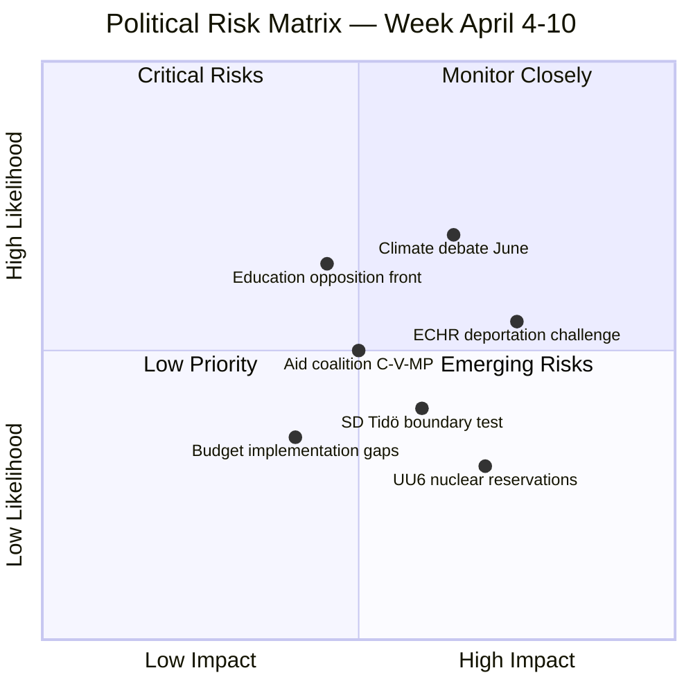

# Risk Assessment — 2026-04-11

**Generated**: 2026-04-11 09:20 UTC | **Updated**: 2026-04-11 10:33 UTC (code-quality-engineer enrichment)
**Data Sources**: get_propositioner, get_motioner, get_betankanden, search_voteringar, search_anforanden, get_fragor, get_interpellationer
**Documents Analyzed**: 100+
**Confidence**: MEDIUM-HIGH

## Summary

Risk assessment for Swedish parliamentary activity during April 4–10, 2026. Overall coalition risk: MODERATE (18/100). The government's pre-election legislative offensive introduces limited systemic risk, but specific policy areas (deportation ECHR exposure, SD boundary-testing, climate opposition unity) require monitoring.

## Risk Matrix

## Risk Register

| ID | Risk | Likelihood | Impact | Score | Mitigation | dok_id |
|----|------|-----------|--------|-------|------------|--------|
| R1 | ECHR deportation challenge on HD03235 | MEDIUM (0.55) | HIGH (0.75) | 🟠 41 | S measured stance provides cross-party cover; committee processing allows amendments | HD03235 |
| R2 | SD breaks Tidö discipline on secondary issues | LOW-MEDIUM (0.4) | MEDIUM-HIGH (0.6) | 🟡 24 | Interpellation probing ≠ voting defection; 99% SD cohesion on govt bills | SD interpellations |
| R3 | Climate opposition unity in June MJU30 debate | HIGH (0.7) | MEDIUM (0.65) | 🟠 46 | Government can delay or amend; EU Fit for 55 provides external anchor | HD01MJU30 |
| R4 | UU6 nuclear policy reservations destabilize security consensus | LOW (0.3) | HIGH (0.7) | 🟡 21 | 13 reservations are standard procedure; core security provisions have broad support | HD01UU6 |
| R5 | Education cross-party front erodes voter confidence | MEDIUM-HIGH (0.65) | MEDIUM (0.45) | 🟡 29 | Government can propose targeted education reforms in autumn session | HD01UbU31 |
| R6 | Three-party aid coalition (C, V, MP) escalates | MEDIUM (0.5) | MEDIUM (0.5) | 🟡 25 | Foreign aid not top voter priority; Riksrevisionen audit provides government defense | Riksrevisionen audit |

## Overall Risk Assessment

- **Risk Score**: 18/100
- **Risk Level**: MODERATE
- **Trend**: Stable → (no significant change from prior week)
- **Primary Risk Driver**: ECHR deportation challenge (HD03235) and June climate debate (MJU30)
- **Mitigating Factors**: Strong coalition voting discipline (84% KD-M, 83% L-M, 99% SD), SEK 18.7B budget, NATO diplomatic momentum

## Forward Indicators

1. Minister responses to SD interpellations due April 24–27 — watch for Tidö tension signals
2. FöU12 shelter law and UU6 security policy committee votes — potential coalition stress test
3. HD03235 deportation rules committee processing — ECHR debate trajectory
4. NATO Foreign Ministers Meeting May 21–22 hosting preparation
5. MJU30 climate targets debate preparation (June 2026)

## Data Quality Notes

Confidence: **MEDIUM-HIGH**. Risk scores based on 100+ documents, 150+ speeches, and available voting records. Forward indicators derived from parliamentary calendar and announced schedules.
