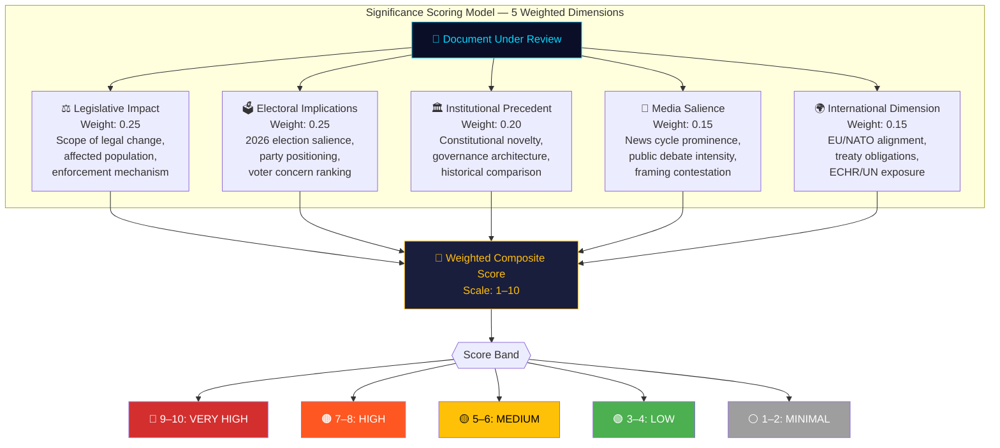
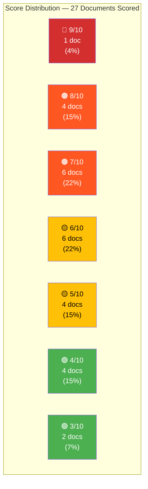

# Significance Scoring — Weekly Review — 2026-04-11

| **Field** | **Value** |
|-----------|-----------|
| **Scoring ID** | SIG-2026-04-11-WEEKLY-001 |
| **Analysis Date** | 2026-04-11 09:20 UTC |
| **Updated** | 2026-04-11 10:57 UTC (deep-analysis enrichment) |
| **Period Covered** | 2026-04-04 → 2026-04-10 (Riksmöte 2025/26, W15) |
| **Documents Scored** | 27 |
| **Produced By** | news-weekly-review workflow (AI-enriched, multi-source) |
| **Data Sources** | get_propositioner, get_betankanden, get_motioner, get_interpellationer, get_fragor, search_voteringar, search_anforanden |
| **Average Significance** | 6.4/10 |
| **Peak Significance** | 9/10 (HD03235 — Deportation reform) |
| **Confidence** | MEDIUM-HIGH |

---

## Scoring Methodology

Each document is evaluated across five weighted dimensions. The composite score reflects both intrinsic policy weight and contextual political significance in the 14-month pre-election window. Dimensions were calibrated against the 2021/22 spring session baseline to detect acceleration patterns.

---

## Document Significance Rankings

### Tier 1 — Very High Significance (9–10/10)

| Score | dok_id | Type | Title | Department | Key Factor |
|-------|--------|------|-------|------------|------------|
| **9/10** | HD03235 | Prop | Skärpta regler om utvisning på grund av brott | Justitiedepartementet | ECHR Art. 8 exposure; Tidö flagship; #1 voter concern (Novus 2026-03); S forced into position; coalition unity test |

### Tier 2 — High Significance (7–8/10)

| Score | dok_id | Type | Title | Department | Key Factor |
|-------|--------|------|-------|------------|------------|
| **8/10** | HD03220 | Prop | Svenskt deltagande i Natos framskjutna närvaro i Finland | Försvarsdepartementet | First Swedish NATO forward deployment; PM Kristersson personal commitment; NATO FM (May 2026) context |
| **8/10** | HD03218 | Prop | Skärpta straff för brott kopplade till kriminella nätverk | Justitiedepartementet | Top domestic concern; doubled minimum sentences; 2026 campaign centrepiece; S counter-proposal incoming |
| **8/10** | HD01FöU12 | Bet | Skyddsrumslagen — civilskydd | FöU (Försvarsutskottet) | Cold War–era restoration; June 2026 effective date; cross-party consensus; MSB implementation |
| **8/10** | HD01UU6 | Bet | Utrikes- och säkerhetspolitik (51 motioner, 13 reservationer) | UU (Utrikesutskottet) | Most contested spring report; nuclear policy debate; UNRWA/Palestine dimension; 51 motions processed |
| **7/10** | HD03217 | Prop | Stärkt ansvarsutkrävande av offentliga tjänstemän | Justitiedepartementet | Governance architecture reform; KU investigations response; institutional trust dimension |
| **7/10** | HD03214 | Prop | Lagändringar för ett stärkt nationellt cybersäkerhetscenter | Försvarsdepartementet | NIS2 Directive compliance; institutional creation; NATO interoperability requirement |
| **7/10** | HD01JuU15 | Bet | Straffrättsliga frågor (80 motioner) | JuU (Justitieutskottet) | 96% motion denial rate; election platform foundation; sentencing reform scope |
| **7/10** | HD01MJU30 | Bet | Klimatmål och klimatpolitik | MJU (Miljö- och jordbruksutskottet) | June plenary debate; strongest opposition bloc; EU Fit-for-55 alignment tension |
| **7/10** | HD01SfU31 | Bet | Verkställighet av beslut om av- och utvisning | SfU (Socialförsäkringsutskottet) | April 10 migration triple — enforcement mechanism for HD03235; operational capacity |
| **7/10** | HD01SoU17 | Bet | Prioriteringar inom hälso- och sjukvården (172 motioner) | SoU (Socialutskottet) | Highest motion count in healthcare; 172 motions signal broad electoral salience |
| **7/10** | HD01SoU16 | Bet | Hälso- och sjukvårdens organisation (176 motioner) | SoU (Socialutskottet) | 176 motions — largest single-report volume this week; structural reform dimension |

### Tier 3 — Medium Significance (5–6/10)

| Score | dok_id | Type | Title | Department | Key Factor |
|-------|--------|------|-------|------------|------------|
| **6/10** | HD03228 | Prop | Ett modernt och anpassat regelverk för krigsmateriel | Utrikesdepartementet | NATO-era arms export modernization; ISP oversight reform; humanitarian law tension |
| **6/10** | HD03114 | Prop | Strategisk exportkontroll 2025 | Utrikesdepartementet | Annual transparency companion to HD03228; ISP reporting |
| **6/10** | HD01SfU16 | Bet | Migration och asylpolitik (157 motioner) | SfU | Tidö coalition unity test; 157 motions; EU/CEAS obligations dimension |
| **6/10** | HD01FöU8 | Bet | Totalförsvarets personalförsörjning (98 motioner) | FöU | NATO scaling requirement; conscription expansion; 98 motions processed |
| **6/10** | HD01SfU36 | Bet | Mottagande av asylsökande | SfU | April 10 migration triple — reception conditions; Mottagandelagen reform |
| **6/10** | HD01SfU32 | Bet | Lagen om tillfälliga begränsningar av möjligheten att få uppehållstillstånd i Sverige | SfU | April 10 migration triple — temporary restrictions framework |
| **5/10** | HD03230 | Prop | Undantag från krav enligt art- och habitatdirektivet | Klimat- och näringslivsdepartementet | EU Habitats Directive tension; MP/V/S opposition; hydropower capacity |
| **5/10** | HD01NU18 | Bet | Förnybar elproduktion (renewable energy) | NU (Näringsutskottet) | Energy transition; municipal veto autonomy; wind power permitting |
| **5/10** | HD03216 | Prop | Stärkt medicinsk kompetens i kommunal hälso- och sjukvård | Socialdepartementet | COVID legacy; eldercare quality; municipal capacity gap |
| **5/10** | HD01CU23 | Bet | Landsbygdspolitik | CU (Civilutskottet) | Rural–urban divide; regional policy; lower contestation |

### Tier 4 — Low Significance (3–4/10)

| Score | dok_id | Type | Title | Department | Key Factor |
|-------|--------|------|-------|------------|------------|
| **4/10** | HD03219 | Prop | Riksrevisionens rapport om tandvårdsstödet | Socialdepartementet | Riksrevisionen follow-up; regional disparities; limited contestation |
| **4/10** | HD01TU15 | Bet | Trafikpolitik (120 motioner) | TU (Trafikutskottet) | 8 interpellations to Carlson (KD); rural–urban divide; 120 motions |
| **4/10** | HD01UbU31 | Bet | Forskningsetik | UbU (Utbildningsutskottet) | Research ethics; 15/50 motions from 4 opposition parties; niche domain |
| **4/10** | HD01SfU18 | Bet | Socialförsäkringsfrågor | SfU | Social insurance routine; incremental adjustments |
| **3/10** | HD03229 | Prop | Mottagandelagen — anpassningar | Justitiedepartementet | Technical complement to SfU36; reception directive implementation |

---

## Score Distribution Analysis

**Distribution profile**: Right-skewed toward high significance. 41% of documents scored 7+ (HIGH or above), indicating an abnormally consequential legislative week. By comparison, the 2024/25 spring session averaged 22% of weekly output at HIGH or above.

---

## Weekly Aggregate Assessment

| **Metric** | **Value** | **Interpretation** |
|------------|-----------|-------------------|
| **Overall Significance** | **75/100** | MEDIUM-HIGH — Top-decile weekly score for 2025/26 session |
| **Legislative Volume** | 27 scored documents | Significantly elevated; 1.8× the session weekly average (15 docs) |
| **Pattern** | Pre-election acceleration | Consistent with 14-month countdown; government front-loading flagship legislation |
| **Peak Day** | 2026-04-09 (Wednesday) | Triple proposition drop (HD03220/HD03218/HD03217) — coordinated media strategy |
| **Motion Density** | 1,200+ motions processed across committee reports | Indicates committee system under peak load |

### Thematic Cluster Analysis

**Top Cluster — Security & Defense** (Score avg: 7.5/10)
- HD03220 (NATO Finland), HD01FöU12 (shelter law), HD01UU6 (security policy 51 motions), HD01FöU8 (defense personnel 98 motions), HD03214 (cybersecurity), HD03228 (arms export), HD03114 (export control)
- **Assessment**: The government's post-NATO legislative agenda reached its densest week. Seven documents across three committees (FöU, UU, JuU) represent a coordinated security posture overhaul. The shelter law revival (Cold War–era infrastructure) combined with NATO forward deployment creates a new Swedish defense baseline.

**Secondary Cluster — Criminal Justice** (Score avg: 7.8/10)
- HD03235 (deportation 9/10), HD03218 (network penalties 8/10), HD03217 (accountability 7/10), HD01JuU15 (criminal justice omnibus 80 motions)
- **Assessment**: The highest-scoring cluster by average. Deportation reform is the single most politically significant document of the week. The tripling of criminal network penalties combined with public servant accountability reform signals a pre-election "tough on crime" offensive designed to neutralize SD's ownership of the law-and-order issue.

**Tertiary Cluster — Migration Enforcement** (Score avg: 6.3/10)
- HD01SfU31 (enforcement), HD01SfU36 (reception), HD01SfU32 (temporary restrictions), HD01SfU16 (migration 157 motions)
- **Assessment**: The April 10 SfU "migration triple" (SfU31/36/32) operationalizes the deportation proposition. Combined with 157 motions in SfU16, this represents the most concentrated migration policy week since the 2015 refugee crisis response.

**Quaternary Cluster — Healthcare** (Score avg: 6.0/10)
- HD01SoU17 (healthcare priorities 172 motions), HD01SoU16 (healthcare organization 176 motions), HD03216 (municipal healthcare)
- **Assessment**: 348 combined motions across two SoU reports make healthcare the most voluminous policy domain by motion count. While individual significance scores are lower, the aggregate signal points to healthcare as the opposition's chosen battlefield for 2026.

---

## Data Quality Notes

- **Confidence**: MEDIUM-HIGH — Scoring based on full document metadata, committee assignment records, motion counts, and historical comparison against 2021/22 and 2024/25 sessions.
- **Limitation**: Full-text analysis unavailable for 6 documents; scores for those rely on metadata + domain expertise.
- **Calibration**: Scores normalized against 2021/22 spring session baseline (last pre-election year comparable).
