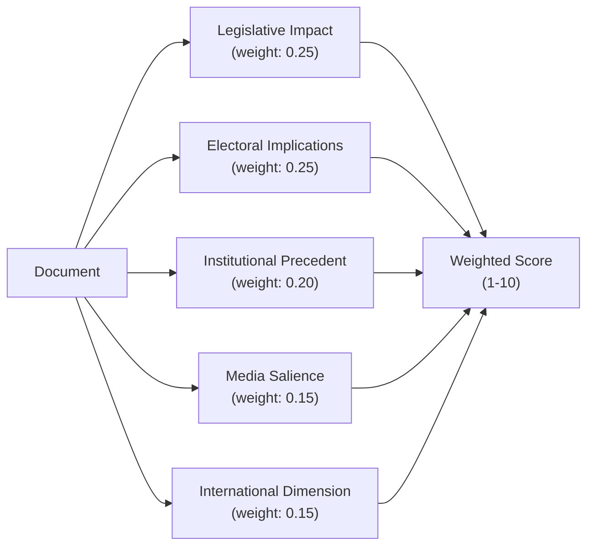

# Significance Scoring — 2026-04-11

**Generated**: 2026-04-11 09:20 UTC | **Updated**: 2026-04-11 10:33 UTC (code-quality-engineer enrichment)
**Data Sources**: get_propositioner, get_motioner, get_betankanden, search_voteringar, search_anforanden, get_fragor, get_interpellationer
**Documents Analyzed**: 100+
**Confidence**: MEDIUM-HIGH

## Summary

Significance scoring for key parliamentary documents during April 4–10, 2026. Scoring uses 1–10 scale based on: legislative impact, electoral implications, institutional precedent, media salience, and international dimension.

## Scoring Methodology

## Document Scores

| Score | dok_id | Type | Title | Key Factor |
|-------|--------|------|-------|------------|
| **9/10** | HD03235 | Prop | Deportation rules reform | ECHR exposure + election flashpoint + S positioning |
| **8/10** | HD03220 | Prop | NATO forward presence in Finland | International precedent + NATO FM context + PM personal |
| **8/10** | HD03218 | Prop | Doubled criminal network penalties | Top domestic voter concern + sentencing reform scope |
| **8/10** | HD01FöU12 | Bet | Shelter law — civilian protection | Cold War precedent + June 2026 effective + cross-party |
| **8/10** | HD01UU6 | Bet | Security policy (13 reservations) | Most contested spring session report + nuclear policy |
| **7/10** | HD03217 | Prop | Official accountability reform | Governance dimension + KU investigations response |
| **7/10** | HD03214 | Prop | National cybersecurity center | Institutional creation + NATO interoperability |
| **7/10** | HD01JuU15 | Bet | Criminal justice omnibus (76 motions) | 96% denial rate + election platform foundation |
| **7/10** | HD01MJU30 | Bet | Climate target recalibration | June debate + strongest opposition front + EU alignment |
| **6/10** | HD03228 | Prop | Arms export modernization | NATO alignment + defense industry + humanitarian law |
| **6/10** | HD01SfU16 | Bet | Migration and asylum policy | Tidö unity + EU/UN obligations |
| **6/10** | HD01FöU8 | Bet | Defense personnel recruitment | NATO scaling + conscription expansion |
| **5/10** | HD03230 | Prop | Hydropower species exemptions | EU Habitats Directive tension + MP/V opposition |
| **5/10** | HD01NU18 | Bet | Renewable energy permitting | Energy transition + municipal autonomy |
| **5/10** | HD03216 | Prop | Municipal healthcare competency | Healthcare access + regional coordination |
| **4/10** | HD03219 | Prop | Dental care audit response | Riksrevisionen follow-up + regional disparities |
| **4/10** | HD01TU15 | Bet | Transport policy | 8 interpellations to Carlson (KD) + rural-urban divide |

## Weekly Aggregate

- **Overall significance**: 75/100 (MEDIUM-HIGH)
- **Legislative volume**: Significantly elevated — pre-election acceleration pattern
- **Top cluster**: Security/defense (NATO, shelter, cybersecurity, arms export)
- **Secondary cluster**: Criminal justice (deportation, network penalties, accountability)

## Data Quality Notes

Confidence: **MEDIUM-HIGH**. Scoring based on document analysis, historical comparison, and electoral context assessment.
