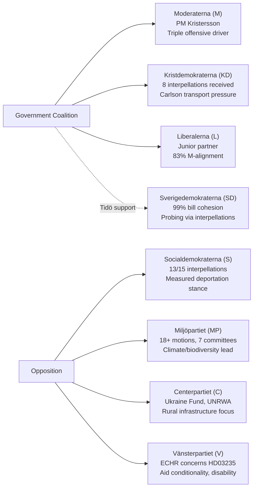

# Stakeholder Perspectives — 2026-04-11

**Generated**: 2026-04-11 09:20 UTC | **Updated**: 2026-04-11 10:33 UTC (code-quality-engineer enrichment)
**Data Sources**: get_propositioner, get_motioner, get_betankanden, search_voteringar, search_anforanden, get_fragor, get_interpellationer
**Documents Analyzed**: 100+
**Confidence**: MEDIUM-HIGH

## Summary

Stakeholder analysis covering all 8 Riksdag parties and key institutional actors during April 4–10, 2026. The Kristersson government's triple offensive reshapes the pre-election landscape, with each party's strategic positioning analyzed.

## Stakeholder Map

## Party-by-Party Analysis

| Party | Role | Key Actions (April 4–10) | Strategic Assessment | dok_id |
|-------|------|--------------------------|---------------------|--------|
| **M** (Kristersson) | PM, coalition leader | April 9 triple offensive: NATO HD03220, criminal penalties HD03218, accountability HD03217 | Pre-election narrative construction: safety + credibility + integrity | HD03220, HD03218, HD03217 |
| **KD** (Busch, Carlson) | Coalition partner | Carlson received 8 interpellations on transport; SD probing on mosque regulation | Under dual pressure from opposition and SD; managing infrastructure expectations | HD01TU15 |
| **L** | Junior coalition partner | 83% M-alignment; supporting all major propositions | Maintaining relevance through alignment; no independent profile emerging | Voting records |
| **SD** (Åkesson) | External Tidö support | 99% bill cohesion; interpellations probing KD/L on mosque/demonstration rights | Testing Tidö boundaries for pre-election positioning without formal break | SD interpellations |
| **S** (Lindberg) | Main opposition | 13/15 interpellations targeting 8 ministers; measured deportation stance | Strategic restraint — preserving election positioning flexibility | HD03235, interpellations |
| **MP** | Green opposition | 18+ motions across 7 committees; leading climate counter-narrative | Most active opposition party per capita; biodiversity and ECHR focus | HD03230, HD01MJU30 |
| **C** | Centre opposition | Ukraine Fund, UNRWA funding, Nordic cooperation, rural infrastructure | Foreign policy and rural constituency focus; forming aid coalition with V, MP | Riksrevisionen audit |
| **V** | Left opposition | ECHR deportation concerns; aid conditionality (OECD DAC); disability rights | Rights-based opposition — international law and social justice framework | HD03235 |

## Institutional Stakeholders

| Actor | Role | Relevance |
|-------|------|-----------|
| **Riksrevisionen** | National Audit Office | Audit on foreign aid triggered C-V-MP opposition front |
| **FöU committee** | Defence | FöU12 shelter law, FöU8 personnel, FöU11 preparedness — defining post-NATO defense posture |
| **UU committee** | Foreign Affairs | UU6 with 13 reservations — most contested spring session report |
| **NATO** | International alliance | FM meeting May 21–22 in Sweden; HD03220 Finland forward presence |
| **EU** | Regulatory framework | Fit for 55, Habitats Directive shaping energy/climate legislation |

## Data Quality Notes

Confidence: **MEDIUM-HIGH**. Stakeholder positions derived from propositions, motions, interpellations, and speech analysis. Party alignment percentages from available voting records.
