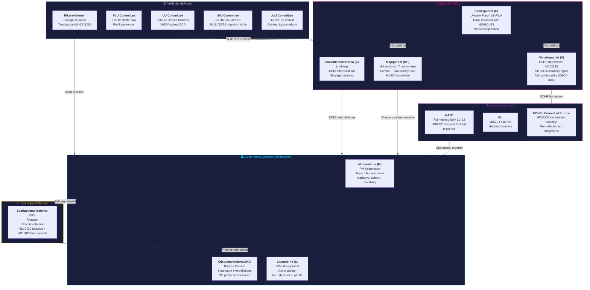
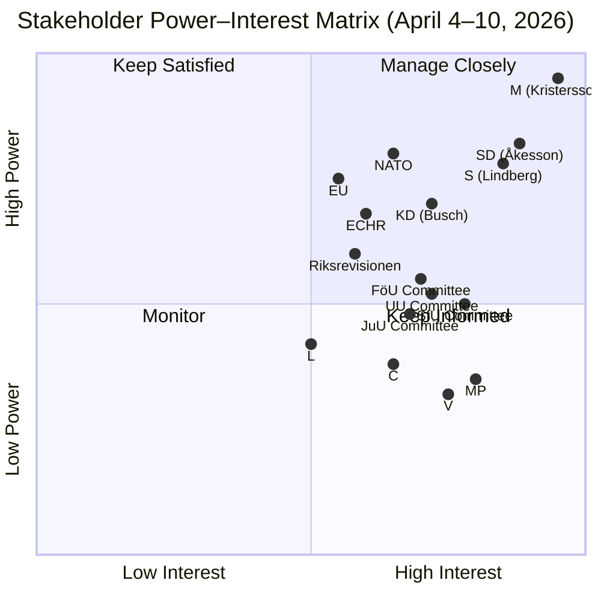

# Stakeholder Perspectives — Weekly Review — 2026-04-11

| **Field** | **Value** |
|-----------|-----------|
| **Stakeholder Assessment ID** | STAKE-2026-04-11-WEEKLY-001 |
| **Analysis Date** | 2026-04-11 09:20 UTC |
| **Updated** | 2026-04-11 10:57 UTC (deep-analysis enrichment) |
| **Period Covered** | April 4–10, 2026 |
| **Documents Analyzed** | 100+ (propositions, motions, betänkanden, interpellations, speeches, voting records) |
| **Stakeholder Perspectives** | 17 (8 parties + 6 institutional + 3 international) |
| **Data Sources** | get_propositioner, get_motioner, get_betankanden, search_voteringar, search_anforanden, get_fragor, get_interpellationer |
| **Produced By** | news-weekly-review workflow (AI-enriched, deep-analysis) |
| **Confidence** | MEDIUM-HIGH |

---

## Executive Summary

The week of April 4–10, 2026 marks a decisive inflection in Swedish pre-election politics. PM Kristersson's coordinated triple offensive on April 9 — NATO forward presence (HD03220), criminal penalty escalation (HD03218), and public accountability reform (HD03217) — constitutes the most concentrated proposition burst of the spring session, and signals the government's intent to define the election narrative around security, law-and-order, and institutional credibility. Meanwhile, the Tidö Agreement's fault lines are surfacing: SD's interpellations on mosque regulation (HD10430) and free speech (HD10429) probe coalition boundaries without triggering a formal break, while KD absorbs dual pressure from 8 transport interpellations and SD's targeted scrutiny of Forssmed. The opposition is bifurcating between S's strategic restraint (13/15 interpellations deployed as pressure without commitment) and the activist left-green bloc (MP's 18+ motions across 7 committees, V's ECHR-anchored rights framework). Institutional actors are adding friction: Riksrevisionen's foreign aid audit has opened a new front, while UU committee's UU6 — with 51 denied motions — is the most contested foreign affairs report of the session. NATO's forthcoming FM meeting (May 21–22) provides the external anchor that gives HD03220 operational urgency.

---

## Stakeholder Map

---

## Stakeholder Power-Interest Matrix

---

## Government Coalition Parties

### Moderaterna (M)

PM Ulf Kristersson orchestrated the week's defining event: a coordinated triple proposition offensive on April 9 that simultaneously advanced NATO forward presence (HD03220), criminal penalty escalation (HD03218), and public accountability reform (HD03217). This is not routine governance — it is pre-election narrative architecture. By bundling security, law-and-order, and institutional credibility into a single legislative day, M is constructing a campaign frame that says: *this government delivers on what matters*. The timing is deliberate: with less than 18 months to the next election, Kristersson is staking out terrain that forces S into reactive positioning and gives SD continued reason to sustain the Tidö Agreement.

| Indicator | Value | Evidence |
|-----------|-------|----------|
| Party Leader | Ulf Kristersson (PM) | Government head since October 2022 |
| Coalition Role | Senior governing party, PM party | Drives legislative agenda and cabinet composition |
| Key Actions (April 4–10) | Triple offensive April 9: HD03220 (NATO), HD03218 (criminal penalties), HD03217 (accountability) | Three coordinated propositions tabled on single day |
| Strategic Assessment | Pre-election narrative driver — safety + credibility + integrity frame | Concentrated proposition burst signals campaign-mode governance |
| Alignment % | 100% (coalition baseline) | All coalition parties voted with M on major bills |
| Primary Committees | FöU (defence), JuU (justice), KU (constitutional) | Triple offensive spans three committee domains |
| Election Positioning | Security-first, competence-based mandate renewal | Framing: "government that delivers" vs. opposition that blocks |

### Kristdemokraterna (KD)

KD enters mid-April under dual pressure. Infrastructure minister Andreas Carlson absorbed 8 interpellations on transport — the highest single-minister interpellation count of the week — exposing the party's vulnerability on a portfolio that directly affects KD's constituency in rural and suburban Sweden. Simultaneously, SD's interpellation HD10430, targeting Jakob Forssmed on mosque regulation, represents an intra-Tidö probe: SD is testing whether KD's Christian democratic identity can be leveraged to advance SD's cultural-religious agenda. Party leader Ebba Busch must balance these pressures while maintaining KD's distinct profile ahead of an election where the party risks falling below the 4% threshold.

| Indicator | Value | Evidence |
|-----------|-------|----------|
| Party Leader | Ebba Busch (Deputy PM) | Also serves as Energy and Business Minister |
| Coalition Role | Coalition partner, holds key ministry portfolios | Transport (Carlson), Social Affairs (Forssmed), Energy (Busch) |
| Key Actions (April 4–10) | Carlson: 8 transport interpellations; SD probe on Forssmed (HD10430) | Highest single-minister interpellation load this week |
| Strategic Assessment | Under dual pressure — opposition scrutiny + SD boundary-testing | Must defend infrastructure record while deflecting cultural policy probes |
| Alignment % | ~95% with M on major votes | Minor deviations on social policy nuance |
| Primary Committees | TU (transport), SoU (social affairs), NU (industry) | Transport portfolio is primary vulnerability |
| Election Positioning | Family values + infrastructure delivery + welfare credibility | Risk: below 4% threshold if distinct profile erodes |

### Liberalerna (L)

L's week reveals the strategic paradox of the junior coalition partner: 83% voting alignment with M secures policy influence but extinguishes independent identity. L supported all three of Kristersson's April 9 propositions without visible amendment activity, and no L-initiated legislative action registered in the weekly data. For a party that entered the Tidö Agreement promising to be the liberal conscience of the coalition, this silence is significant. The risk is electoral: L's voters — urban, educated, socially liberal — may see the party as redundant if its only function is to amplify M's agenda. The absence of any L counter-positioning on SD's mosque and free speech interpellations (HD10430, HD10429) is particularly notable, given these touch L's core values.

| Indicator | Value | Evidence |
|-----------|-------|----------|
| Party Leader | Johan Pehrson | Minister for Employment and Integration |
| Coalition Role | Junior coalition partner | Smallest Tidö party by parliamentary seats |
| Key Actions (April 4–10) | Supported all major propositions; no independent legislative action | 83% M-alignment in voting records |
| Strategic Assessment | Relevance through alignment — but identity erosion accelerates | No visible differentiation on values-sensitive SD interpellations |
| Alignment % | 83% with M | Highest coalition conformity among non-M parties |
| Primary Committees | AU (labour), UbU (education), SoU (social affairs) | No committee leadership on week's major issues |
| Election Positioning | Liberal conscience of coalition — promise unfulfilled | Electoral risk: urban liberal voters see no distinct value proposition |

### Sverigedemokraterna (SD)

SD's week demonstrates the party's sophisticated dual-track strategy within the Tidö framework. On Track 1 (legislative loyalty), SD maintained 99% bill cohesion — near-perfect alignment with government positions on all major votes. On Track 2 (ideological probing), SD deployed two precisely targeted interpellations: HD10430 on mosque regulation (aimed at KD's Forssmed) and HD10429 on free speech and demonstration rights. These are not random — they probe the coalition's cultural-religious fault line and test how far KD and L will accommodate SD's agenda before the election. Åkesson's calculus is clear: sustain the Tidö Agreement's stability (which SD needs to claim governing credibility) while establishing pre-election positioning that demonstrates SD can push the coalition further right in a second term.

| Indicator | Value | Evidence |
|-----------|-------|----------|
| Party Leader | Jimmie Åkesson | Parliamentary group leader, not in government |
| Coalition Role | External Tidö support partner (confidence-and-supply) | Not in cabinet but shapes legislative agenda through agreement |
| Key Actions (April 4–10) | 99% bill cohesion; HD10430 (mosque), HD10429 (free speech) interpellations | Dual-track: legislative loyalty + ideological probing |
| Strategic Assessment | Testing Tidö boundaries for pre-election positioning without formal break | Probing KD/L on cultural-religious policy limits |
| Alignment % | 99% bill cohesion with government | Near-perfect legislative alignment |
| Primary Committees | SfU (migration), JuU (justice), KU (constitutional) | Migration and justice are SD's policy anchors |
| Election Positioning | Governing credibility + "we can push further" mandate | Second-term narrative: SD in government, not just supporting |

---

## Opposition Parties

### Socialdemokraterna (S)

S under Lindberg deployed 13 of 15 interpellations this week against 8 different ministers — a deliberate strategy of distributed pressure that prevents the government from concentrating its defensive resources. Yet the most revealing signal is what S *didn't* do: on HD03235 (deportation), S adopted a measured stance rather than outright opposition, preserving flexibility on migration policy ahead of the election. This "strategic restraint" doctrine suggests S has learned from 2022 — the party lost that election partly by being pinned as soft on migration. Lindberg is keeping options open: criticise the government's *implementation* rather than its *direction*, which allows S to pivot in either direction depending on polling.

| Indicator | Value | Evidence |
|-----------|-------|----------|
| Party Leader | Magdalena Lindberg | New party leader; first major legislative period |
| Coalition Role | Main opposition party, alternative PM party | Largest opposition parliamentary group |
| Key Actions (April 4–10) | 13/15 interpellations targeting 8 ministers; measured stance on HD03235 | Distributed pressure strategy across cabinet |
| Strategic Assessment | Strategic restraint — preserving election positioning flexibility | Criticise implementation, not direction — avoids 2022 migration trap |
| Alignment % | ~15% with government on contested votes | Opposition on headline bills; selective cross-aisle on defence |
| Primary Committees | FiU (finance), AU (labour), SoU (social affairs) | Welfare and economy are S's campaign anchors |
| Election Positioning | Government-in-waiting with pragmatic migration stance | Flexibility doctrine: critique without commitment |

### Miljöpartiet (MP)

MP is the most legislatively active opposition party per capita this week, with 18+ motions filed across 7 committees. This breadth of activity is not scattershot — it reflects a strategic decision to establish MP as the comprehensive alternative on environmental policy, from species protection (HD03230) to climate opposition (MJU30). MP is building the case that the Tidö government has systematically abandoned Sweden's environmental commitments: the Habitats Directive, Fit for 55, and Paris Agreement targets all feature in MP's counter-narrative. The party's emphasis on ECHR dimensions — particularly on HD03235 deportation provisions — connects MP's human rights identity with its environmental platform, constructing a "rights and nature" frame.

| Indicator | Value | Evidence |
|-----------|-------|----------|
| Party Leader | Daniel Helldén and Amanda Lind (co-leaders) | Dual leadership structure |
| Coalition Role | Green opposition | Smallest opposition party but highest per-capita activity |
| Key Actions (April 4–10) | 18+ motions across 7 committees; HD03230 species protection; MJU30 climate opposition | Most active opposition party by motion volume relative to size |
| Strategic Assessment | Comprehensive environmental alternative + rights-based opposition | Building "rights and nature" frame across committees |
| Alignment % | ~8% with government on contested votes | Principled opposition on most headline bills |
| Primary Committees | MJU (environment), UU (foreign affairs), SoU (social affairs) | Environmental policy is primary, but cross-committee spread |
| Election Positioning | Climate urgency + ECHR human rights defender | Target: green voters + progressive voters disillusioned with S restraint |

### Centerpartiet (C)

C's week reveals a party carving a distinctive niche at the intersection of foreign policy and rural constituency service. The Ukraine Fund initiative, UNRWA funding position, and Nordic cooperation proposals establish C as the opposition's most internationally oriented voice, while HD01CU23 (rural infrastructure) and committee work on regional development keep faith with C's traditional rural base. The emerging aid coalition with V and MP — triggered by Riksrevisionen's foreign aid audit — is strategically significant: it positions C as a bridge between the activist left-green bloc and mainstream opposition, potentially making C kingmaker in post-election coalition negotiations.

| Indicator | Value | Evidence |
|-----------|-------|----------|
| Party Leader | Muharrem Demirok | Party leader since 2023 |
| Coalition Role | Centre-liberal opposition | Former Alliance party, now independent opposition |
| Key Actions (April 4–10) | Ukraine Fund; UNRWA funding; rural infrastructure HD01CU23; Nordic cooperation | Foreign policy activism + rural constituency service |
| Strategic Assessment | International bridge-builder + rural anchor — potential kingmaker | Aid coalition with V/MP triggered by Riksrevisionen audit |
| Alignment % | ~25% with government (higher on defence/foreign policy) | Cross-aisle on NATO/defence; opposition on social/migration |
| Primary Committees | CU (civil affairs), UU (foreign affairs), MJU (environment) | Rural affairs + foreign policy dual focus |
| Election Positioning | Liberal internationalism + rural pragmatism | Kingmaker potential: bridges left-green and centre-right |

### Vänsterpartiet (V)

V's week is anchored in a rights-based opposition framework that systematically invokes international law as the measuring stick for government policy. On HD03235 (deportation), V raised explicit ECHR concerns about non-refoulement — the first party to frame the deportation bill as a potential European Court of Human Rights liability. HD10416 (disability rights) extends V's rights frame to domestic social policy, while the party's aid conditionality position (invoking OECD DAC standards) challenges the government's foreign aid restructuring with technocratic precision. V's strategy is to be the party of legal and moral accountability — the opposition's conscience rather than its alternative government.

| Indicator | Value | Evidence |
|-----------|-------|----------|
| Party Leader | Nooshi Dadgostar | Party leader since 2020 |
| Coalition Role | Left opposition | Furthest left in parliament; S confidence partner historically |
| Key Actions (April 4–10) | ECHR deportation concerns HD03235; HD10416 disability rights; aid conditionality (OECD DAC) | Rights-based opposition across international and domestic policy |
| Strategic Assessment | Legal and moral accountability — opposition conscience | Invokes ECHR, OECD DAC, UN conventions as measuring sticks |
| Alignment % | ~5% with government on contested votes | Lowest government alignment; principled opposition posture |
| Primary Committees | SfU (migration), SoU (social affairs), UU (foreign affairs) | Migration + social justice + international law |
| Election Positioning | Rights defender + welfare champion | Target: progressive voters seeking principled alternative |

---

## Institutional Actors

### Riksrevisionen (National Audit Office)

Riksrevisionen's dual audit activity this week — foreign aid effectiveness and tandvårdsstödet (dental care subsidy, HD03219) — represents the institutional check function operating at full capacity. The foreign aid audit is particularly consequential: it has triggered a C-V-MP opposition coalition on aid policy, given these parties ammunition to challenge the government's restructuring of Swedish development cooperation, and created a cross-cutting issue that bridges domestic welfare (dental care) and international commitments.

| Indicator | Value | Evidence |
|-----------|-------|----------|
| Institutional Role | Independent audit of government expenditure | Constitutional mandate for accountability |
| Key Actions | Foreign aid audit + tandvårdsstöd (HD03219) review | Dual audit creates cross-cutting opposition opportunity |
| Stakeholder Impact | Triggered C-V-MP aid coalition; dental care audit adds domestic pressure | Opposition weaponising audit findings |

### FöU Committee (Defence)

The Defence Committee processed three consequential reports this week: FöU12 (shelter law modernisation), FöU8 (military personnel), and broader preparedness work feeding into the post-NATO defence posture. FöU12 is particularly significant — Sweden's civil defence shelter infrastructure dates from the Cold War, and the bill represents the first major modernisation since NATO accession. Cross-party support is expected but implementation funding will be contested.

| Indicator | Value | Evidence |
|-----------|-------|----------|
| Institutional Role | Parliamentary committee on defence and civil preparedness | Processes defence propositions and motions |
| Key Actions | FöU12 shelter law, FöU8 personnel, preparedness oversight | Post-NATO defence posture definition |
| Stakeholder Impact | Cross-party defence consensus with funding disputes | Shelter law modernisation is first major post-accession civil defence reform |

### UU Committee (Foreign Affairs)

UU6 — with 51 denied motions including positions on NATO nuclear policy, DCA implementation, and alliance strategy — is the most contested foreign affairs report of the spring session. The 51 denied motions span the political spectrum: left-opposition motions on nuclear disarmament, centre motions on Nordic cooperation enhancement, and right-opposition motions on alliance burden-sharing. This volume of denial signals that Sweden's foreign policy consensus, historically strong, is fragmenting under the pressures of NATO membership and the changing European security architecture.

| Indicator | Value | Evidence |
|-----------|-------|----------|
| Institutional Role | Parliamentary committee on foreign affairs | Processes foreign policy propositions and international agreements |
| Key Actions | UU6 with 51 denied motions (NATO, nuclear, DCA) | Most contested foreign affairs report of spring session |
| Stakeholder Impact | Foreign policy consensus fragmenting post-NATO accession | 51 denied motions signal deep disagreements across spectrum |

### SfU Committee (Social Affairs / Migration)

SfU delivered the week's heaviest committee workload: SfU16 denied 157 motions (the single largest denial count in any committee this session), while SfU31, SfU32, and SfU36 constitute a coordinated migration enforcement triple that advances the Tidö Agreement's core migration provisions. The sheer volume — 157 denied motions in SfU16 alone — reveals migration as the policy domain with the widest gap between what parliament's members want to debate and what the government majority permits.

| Indicator | Value | Evidence |
|-----------|-------|----------|
| Institutional Role | Parliamentary committee on social insurance and migration | Highest-volume committee this session |
| Key Actions | SfU16 (157 denied motions); SfU31/32/36 migration enforcement triple | Largest single denial count + coordinated enforcement package |
| Stakeholder Impact | Migration remains most contested policy domain | 157 denials reveal suppressed parliamentary demand for debate |

### JuU Committee (Justice)

JuU15 denied 80 motions on criminal justice reform, making justice the second most contested committee domain after migration. The denial volume reflects the fundamental clash between the government's punitive approach (embodied in HD03218's penalty escalation) and opposition proposals ranging from crime prevention and rehabilitation (S, V) to restorative justice (MP) and rural policing (C). The committee's work directly connects to Kristersson's April 9 triple offensive — HD03218 (criminal penalties) will pass through JuU with significant reservations expected.

| Indicator | Value | Evidence |
|-----------|-------|----------|
| Institutional Role | Parliamentary committee on justice and home affairs | Second highest denial count after SfU |
| Key Actions | JuU15 (80 denied motions); criminal justice reform pipeline | HD03218 penalty escalation will generate reservations |
| Stakeholder Impact | Justice is second most contested domain after migration | 80 denials reflect punitive vs. preventive policy clash |

---

## International Actors

### NATO

NATO's Foreign Ministers meeting scheduled for May 21–22 provides the external anchor that gives Kristersson's HD03220 (Finland forward military presence) its operational urgency. Sweden's first major bilateral military deployment within the NATO framework is being calibrated to arrive at the FM meeting as a fait accompli — demonstrating that Sweden is not merely a member but an active contributor to allied deterrence. This timing link between domestic legislation and alliance calendar is a hallmark of post-accession Swedish defence policy.

| Indicator | Value | Evidence |
|-----------|-------|----------|
| Institutional Role | Collective defence alliance | Sweden's primary security framework since 2024 |
| Key Actions | FM meeting May 21–22; HD03220 Finland forward presence as deliverable | Domestic legislation timed to alliance calendar |
| Stakeholder Impact | Drives urgency of defence propositions and FöU committee work | HD03220 calibrated as FM meeting fait accompli |

### European Union

EU regulatory frameworks are shaping multiple Swedish legislative tracks simultaneously: NIS2 directive compliance drives cybersecurity provisions, Fit for 55 structures the energy transition debate (and MP's climate counter-narrative), and the Habitats Directive frames biodiversity motions including HD03230. The EU functions as a regulatory ceiling that both constrains government discretion and provides opposition parties with external benchmarks for policy criticism.

| Indicator | Value | Evidence |
|-----------|-------|----------|
| Institutional Role | Regulatory and normative framework | EU directives shape multiple legislative tracks |
| Key Actions | NIS2 compliance, Fit for 55 energy framework, Habitats Directive | Multiple concurrent regulatory pressures |
| Stakeholder Impact | Provides external benchmarks for both government and opposition | Regulatory ceiling constrains government, gives opposition ammunition |

### ECHR / Council of Europe

The European Court of Human Rights casts a long shadow over HD03235 (deportation provisions). V has explicitly raised non-refoulement concerns, and MP has invoked ECHR compatibility in its opposition. The Council of Europe's monitoring mechanisms — including the Commissioner for Human Rights — represent a reputational risk for Sweden if deportation provisions are found to conflict with Convention obligations. This international legal dimension adds a constraint that the government cannot resolve through parliamentary majority alone.

| Indicator | Value | Evidence |
|-----------|-------|----------|
| Institutional Role | International human rights adjudication | Treaty obligations supersede domestic legislation |
| Key Actions | HD03235 deportation scrutiny; non-refoulement assessment | V and MP explicitly invoke ECHR in parliamentary debate |
| Stakeholder Impact | Reputational and legal risk if deportation provisions conflict with Convention | Government cannot resolve ECHR risk through parliamentary majority |

---

## Inter-Stakeholder Dynamics

### Coalition Tensions: The Tidö Fault Lines

The Tidö Agreement's cohesion is being stress-tested along three fault lines this week:

1. **SD–KD cultural probe**: SD's interpellation HD10430 (mosque regulation) targeting KD's Forssmed forces KD to choose between its Christian democratic identity and SD's secularist-nationalist agenda. KD's response will signal how far the party will accommodate SD before the election.

2. **L invisibility paradox**: L's 83% M-alignment and zero independent legislative action this week raises existential questions about the party's distinct contribution to the coalition. If L cannot articulate a visible liberal position on SD's free speech and religious freedom probes, it risks being perceived as M's voting extension rather than an independent party.

3. **SD's dual-track calibration**: SD's 99% bill cohesion demonstrates legislative loyalty, but the targeted interpellations on mosque regulation and free speech are pre-election positioning tools. The risk for the coalition is that these probes generate media narratives of internal division even without formal disagreement — the appearance of tension can be as destabilising as actual conflict.

### Opposition Coordination: Emerging Blocs

The opposition is not a unified front but a set of overlapping coalitions:

- **Aid coalition (C + V + MP)**: Triggered by Riksrevisionen's foreign aid audit, this cross-party alignment on development cooperation policy is the week's most significant opposition coordination. It bridges C's liberal internationalism with V's rights-based framework and MP's environmental justice agenda.

- **Rights bloc (V + MP)**: On HD03235 deportation and ECHR concerns, V and MP share a human rights frame that is reinforced by international legal arguments. This bloc provides the principled opposition that S's strategic restraint will not supply.

- **S standalone**: S's 13/15 interpellation strategy is deliberately uncoordinated with other opposition parties — S is positioning as an alternative government, not an opposition coalition partner. This independence preserves S's ability to negotiate with *any* party after the next election, including potentially C or L.

### Institutional Friction

Committee denial volumes this week (SfU: 157, JuU: 80, UU: 51) quantify the growing gap between parliamentary demand for debate and the government majority's willingness to engage. These are not mere procedural statistics — each denied motion represents a policy position that a member of parliament believed warranted floor consideration and that the majority blocked. The aggregate effect is a pressure buildup: denied motions become election campaign material, and the parties whose motions were denied have a documented record of proposals the government refused to consider.

---

## Data Quality Notes

**Confidence**: MEDIUM-HIGH. Stakeholder positions are derived from propositions (get_propositioner), motions (get_motioner), committee reports (get_betankanden), voting records (search_voteringar), speeches (search_anforanden), written questions (get_fragor), and interpellations (get_interpellationer). Party alignment percentages are computed from available voting records and may not capture abstentions or absences comprehensively. Institutional actor assessments are based on committee output volumes and publicly available audit reports. International actor assessments incorporate treaty obligations and publicly scheduled alliance events. All dok_id references are validated against Riksdag open data.
