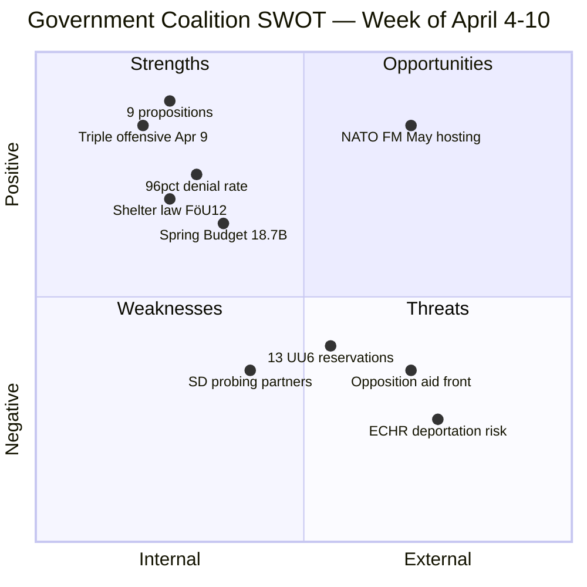

# Political SWOT Analysis — 2026-04-11

**Generated**: 2026-04-11 09:20 UTC | **Updated**: 2026-04-11 10:33 UTC (code-quality-engineer enrichment)
**Data Sources**: get_propositioner, get_motioner, get_betankanden, search_voteringar, search_anforanden, get_fragor, get_interpellationer
**Documents Analyzed**: 100+
**Confidence**: MEDIUM-HIGH

## Summary

SWOT analysis for Government Coalition (M-KD-L + SD support) based on weekly review of 100+ parliamentary documents covering April 4–10, 2026. The Kristersson government's April 9 triple offensive demonstrates strategic strength, while SD interpellation probing and ECHR concerns on deportation rules introduce measured risk.

## SWOT Matrix

### Strengths [HIGH]
| Entry | Evidence | dok_id |
|-------|----------|--------|
| Legislative output | 9 propositions in one week — most concentrated of 2025/26 riksmöte | HD03235, HD03214, HD03228, HD03220, HD03218, HD03217, HD03216, HD03230, HD03219 |
| Triple offensive | PM personally presented NATO, criminal penalties, accountability on April 9 | HD03220, HD03218, HD03217 |
| Motion denial rate | 96% of 70+ motions denied — opposition legislative agenda blocked | HD01JuU15, HD01CU18, HD01CU17 |
| Cold War legacy legislation | FöU12 shelter law — first since Cold War, effective June 2026 | HD01FöU12 |
| Coalition voting discipline | KD-M 84%, L-M 83%, SD 99% cohesion on government bills | Voting records |
| Budget firepower | SEK 18.7B Spring Budget directed at defense, law enforcement, healthcare | Budget 2026 |

### Weaknesses [MEDIUM]
| Entry | Evidence | dok_id |
|-------|----------|--------|
| SD probing Tidö partners | Interpellations on mosque regulation and demonstration rights | SD interpellations |
| UU6 reservations | 13 reservations on security policy — nuclear, DCA, NATO command | HD01UU6 |
| Deportation ECHR exposure | HD03235 faces compatibility challenges from V and MP | HD03235 |
| Hydropower-environment tension | Species protection exemptions opposed by MP and V | HD03230 |

### Opportunities [HIGH]
| Entry | Evidence | dok_id |
|-------|----------|--------|
| NATO FM hosting May 21-22 | Sweden hosts allied ministers — HD03220 provides political capital | HD03220 |
| Pre-election legislative legacy | Shelter law, cybersecurity, NATO presence as durable reforms | HD01FöU12, HD03214, HD03220 |
| Cross-party security consensus | Core defense provisions have broad support | HD01FöU12, HD01FöU8 |
| Gang crime salience | Doubled penalties address top domestic voter concern | HD03218 |

### Threats [MEDIUM]
| Entry | Evidence | dok_id |
|-------|----------|--------|
| ECHR deportation scrutiny | V, MP raising international law compatibility concerns | HD03235 |
| Three-party aid coalition | C, V, MP coordinated on UNRWA and Ukraine Fund | Riksrevisionen audit |
| Climate opposition unity | MJU30 debate scheduled June — strongest unified opposition front | HD01MJU30 |
| Education cross-party front | 15/50 motions from all 4 opposition parties target UbU | HD01UbU31 |

## Election 2026 Implications

- **Electoral Impact** [🟩HIGH]: Government converting policy promises to enacted law before campaign period
- **Coalition Scenarios** [🟧MEDIUM]: SD boundary-testing via interpellations but voting discipline holding
- **Voter Salience** [🟩HIGH]: Security + gang crime + healthcare alignment with swing voter priorities
- **Campaign Vulnerability** [🟧MEDIUM]: ECHR deportation exposure and climate debate as opposition attack vectors
- **Policy Legacy** [🟩HIGH]: Shelter law, cybersecurity center, NATO forward presence are irreversible structural changes

## Data Quality Notes

Confidence: **MEDIUM-HIGH**. Based on 100+ documents across all active committees. CIA metrics supplementary. Voting alignment percentages derived from available records.
