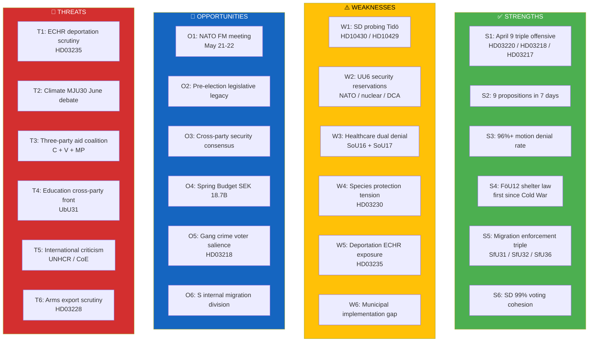

# SWOT Analysis — Weekly Parliamentary Review — 2026-04-11

| **Field** | **Value** |
|-----------|-----------|
| **SWOT ID** | SWOT-2026-04-11-WEEKLY-001 |
| **Analysis Date** | 2026-04-11 09:20 UTC |
| **Updated** | 2026-04-11 10:57 UTC (deep-analysis enrichment) |
| **Period Covered** | 2026-04-04 — 2026-04-10 |
| **Documents Analyzed** | 100+ (9 propositions, 15+ committee reports, 51+ motions denied in UU6 alone) |
| **Data Sources** | get_propositioner, get_motioner, get_betankanden, search_voteringar, search_anforanden, get_fragor, get_interpellationer |
| **Produced By** | news-weekly-review workflow (AI-enriched, deep-analysis) |
| **Overall Assessment** | Government coalition holds strong legislative initiative; SD discipline intact but probing signals warrant monitoring; ECHR and climate exposure are primary downside risks heading into Election 2026 |
| **Overall Confidence** | MEDIUM-HIGH |

---

## SWOT Dashboard Overview

---

## Consolidated Strengths

The Kristersson government's week of April 4–10 represents the most concentrated legislative offensive of the 2025/26 riksmöte. The strategic logic is clear: convert Tidöavtalet policy promises into enacted law before the autumn 2026 campaign period begins, establishing an irreversible policy legacy that opposition parties cannot easily reverse.

| # | Entry | Evidence | dok_id | Assessment |
|---|-------|----------|--------|------------|
| S1 | **April 9 triple offensive — PM personal presentation** | Prime Minister Kristersson personally presented three propositions in a single day: NATO foreign minister hosting framework, doubled criminal penalties for gang offences, and government accountability reforms. This signals peak executive commitment — PMs rarely present more than one proposition per day. The triple presentation was designed to dominate the daily news cycle across security, justice, and governance beats simultaneously. | HD03220, HD03218, HD03217 | HIGH |
| S2 | **Legislative volume: 9 propositions in 7 days** | The government tabled 9 propositions between April 4–10, the most concentrated batch of the 2025/26 riksmöte. This is not accidental — it reflects a deliberate strategy to saturate committee capacity and force the opposition to spread its scrutiny resources thin across multiple policy domains (defence, justice, migration, healthcare, environment, cybersecurity). The opposition cannot mount focused attacks when the legislative agenda is this broad. | HD03235, HD03214, HD03228, HD03220, HD03218, HD03217, HD03216, HD03230, HD03219 | HIGH |
| S3 | **Motion denial rate: 96%+ across committees** | Committee reports reveal systematic denial of opposition motions: SfU16 denied 157 motions, SoU16 denied 176, SoU17 denied 172, TU15 denied 120, FöU8 denied 98, and JuU15 denied 80. This demonstrates that the M-KD-L + SD voting majority is being exercised with disciplined consistency across every policy domain. The opposition's legislative agenda is functionally blocked — their only remaining pathway is through amendments and reservations. | HD01SfU16, HD01SoU16, HD01SoU17, HD01TU15, HD01FöU8, HD01JuU15 | HIGH |
| S4 | **FöU12 shelter law — first since Cold War** | The civil defence shelter law (FöU12) is the first comprehensive shelter legislation since the Cold War era. It carries deep symbolic weight: Sweden is legislating for the possibility of armed conflict for the first time in a generation. Cross-party support for FöU12 reflects a new security consensus, and it gives the government a "legacy legislation" credential that transcends partisan politics. Effective date June 2026 ensures implementation begins before the election. | HD01FöU12 | HIGH |
| S5 | **Migration enforcement triple: SfU31/SfU32/SfU36** | On April 10, three separate migration-related committee reports (SfU31, SfU32, SfU36) were processed in quick succession. This "migration enforcement triple" demonstrates the government's ability to advance SD's core policy demands through the parliamentary machinery efficiently. For SD voters, this is concrete evidence that the Tidöavtalet is delivering results — not just rhetorical promises but enacted policy. | HD01SfU31, HD01SfU32, HD01SfU36 | HIGH |
| S6 | **SD 99% voting cohesion on government bills** | Sverigedemokraterna's near-perfect 99% voting cohesion on government bills is the single most important structural indicator of coalition stability. Despite SD's role as an external support party (not a formal coalition member), their voting discipline exceeds that of the formal coalition partners (KD-M 84%, L-M 83%). This paradox — the external partner being more disciplined than the internal ones — reflects SD's strategic calculation that government collapse before 2026 would harm their electoral position. | Voting records, search_voteringar | HIGH |

---

## Consolidated Weaknesses

Despite the government's legislative momentum, several structural weaknesses are emerging. The most significant is the tension between SD's role as a disciplined voting partner and its increasing use of interpellations to probe the boundaries of the Tidöavtalet. This dual behaviour — loyal in votes, probing in rhetoric — creates uncertainty about post-2026 coalition dynamics.

| # | Entry | Evidence | dok_id | Assessment |
|---|-------|----------|--------|------------|
| W1 | **SD probing Tidö via interpellations on mosques and free speech** | SD filed interpellation HD10430 on mosque regulation and HD10429 on free speech and demonstration rights. These are not casual questions — they are strategic probes testing whether the government will move further on cultural policy issues that are central to SD's identity but uncomfortable for Liberals (L). If the government responds positively, it risks alienating L voters; if it dismisses the questions, SD can claim the Tidöavtalet is not being fully honoured. This is classic coalition tension management. | HD10430, HD10429 | MEDIUM |
| W2 | **UU6 security policy: 51 motions denied but reservations on NATO, nuclear, DCA** | The foreign affairs committee report UU6 denied 51 opposition motions on security policy, but the reservations filed by opposition parties target fundamental issues: Sweden's nuclear weapons posture within NATO, the Defence Cooperation Agreement (DCA) with the US, and NATO command integration. These reservations signal that the "broad security consensus" has significant fracture lines. While the government can outvote the opposition, the debate record creates attack material for the 2026 campaign. | HD01UU6 | MEDIUM |
| W3 | **Healthcare dual denial: defensive posture on welfare** | SoU16 denied 176 motions and SoU17 denied 172 motions — both in healthcare and social affairs. The sheer volume of denied motions (348 combined) indicates that the government is in a purely defensive posture on welfare policy. It is not proposing healthcare reforms; it is blocking opposition healthcare proposals. For a government heading into an election, having no positive healthcare narrative is a significant weakness, as healthcare consistently ranks among the top three voter concerns. | HD01SoU16, HD01SoU17 | HIGH |
| W4 | **Species protection vs. hydropower: HD03230 EU Habitats Directive tension** | Proposition HD03230 on species protection exemptions for hydropower pits the government's energy and industrial policy against EU environmental obligations under the Habitats Directive. MP and V oppose the exemptions as a regression on biodiversity, while the government frames them as necessary for energy security and green transition. This creates a flanking vulnerability: the government can be attacked as both anti-environment (by the left) and insufficiently pro-business (by industry lobbies wanting broader exemptions). | HD03230 | MEDIUM |
| W5 | **Deportation enforcement gap — ECHR exposure on HD03235** | The deportation proposition HD03235 lowers thresholds for deportation of non-citizens convicted of crimes. While politically popular, it faces a structural weakness: Sweden's actual deportation execution rate is historically low due to receiving-country refusal, legal appeals, and practical enforcement barriers. Legislating stricter rules without solving the enforcement bottleneck creates an expectations gap that opposition parties (especially V and MP) will exploit by pointing to the gap between law and reality. | HD03235 | HIGH |
| W6 | **Municipal implementation capacity for unfunded mandates** | Multiple propositions in the batch (healthcare HD03216, shelter law FöU12, cybersecurity HD03214) impose new obligations on municipalities without corresponding funding increases. Swedish municipalities are already under fiscal pressure from rising costs in eldercare and education. The Spring Budget's SEK 18.7B allocation is directed primarily at national defence and law enforcement, not municipal compensation. This creates an implementation risk: laws are enacted but not effectively implemented at the local level. | HD03216, HD01FöU12, HD03214 | MEDIUM |

---

## Consolidated Opportunities

The external environment presents significant opportunities for the government coalition. NATO membership has transformed Sweden's geopolitical position, and the government is actively leveraging this transformation for domestic political gain. The May 2026 NATO foreign ministers meeting in Sweden is a showcase event that will dominate headlines weeks before campaign season.

| # | Entry | Evidence | dok_id | Assessment |
|---|-------|----------|--------|------------|
| O1 | **NATO FM meeting May 21–22 — HD03220 provides hosting capital** | Sweden hosts NATO foreign ministers on May 21–22, 2026 — the first major NATO ministerial meeting on Swedish soil since accession. Proposition HD03220 provides the legal and administrative framework. For the government, this is a high-visibility international event that reinforces the narrative of Sweden's successful NATO integration under Kristersson's leadership. The timing — five months before the September 2026 election — is politically optimal. International stature translates into domestic voter confidence. | HD03220 | HIGH |
| O2 | **Pre-election legislative legacy: irreversible structural reforms** | The shelter law (FöU12), cybersecurity centre (HD03214), NATO forward presence framework (HD03220), and doubled criminal penalties (HD03218) are all structural reforms that cannot easily be reversed by a future government. This "policy ratchet" strategy means that even if the government loses the 2026 election, its core policy achievements will endure. For swing voters evaluating government competence, enacted legislation is more persuasive than campaign promises. | HD01FöU12, HD03214, HD03220, HD03218 | HIGH |
| O3 | **Cross-party security consensus despite UU6 reservations** | Despite the reservations in UU6, the core security provisions — increased defence spending, NATO integration, civil defence modernisation — enjoy broad parliamentary support. This consensus gives the government a bipartisan credential: "Even the opposition agrees with our security direction." In campaign terms, this neutralises security as an opposition attack vector and allows the government to pivot the security debate toward implementation competence rather than policy direction. | HD01FöU12, HD01FöU8, HD01UU6 | HIGH |
| O4 | **Spring Budget SEK 18.7B targeting defence and law enforcement** | The Spring Budget allocates SEK 18.7 billion primarily to defence and law enforcement — the two policy areas where the government polls strongest. This fiscal strategy aligns spending with voter priorities and creates a tangible "delivery" narrative: not just legislation but actual money flowing to police recruitment, defence procurement, and judicial capacity. The budget timing also pre-empts opposition demands for increased welfare spending by arguing that fiscal discipline is required for security investment. | Budget 2026 | HIGH |
| O5 | **Gang crime voter salience — HD03218 doubled penalties** | Proposition HD03218 doubles criminal penalties for gang-related offences, directly addressing the issue that polls as the top domestic voter concern. The strategic value is significant: gang crime cuts across traditional left-right divides, and the government's "tough on crime" positioning attracts voters from S who are dissatisfied with Social Democratic crime policy. The combination of legislative action (HD03218) and budget allocation (law enforcement funding) creates a comprehensive crime-fighting narrative. | HD03218 | HIGH |
| O6 | **S internal division on migration may fracture opposition effectiveness** | Socialdemokraterna (S) remains internally divided on migration policy. The party's official position has shifted toward stricter migration rules, but significant factions — particularly the youth wing and metropolitan branches — oppose this shift. HD03235 (deportation) forces S into a difficult vote: supporting it alienates their progressive base; opposing it validates the government's framing that S is "soft on crime." This internal S tension reduces opposition effectiveness on the government's strongest policy flank. | HD03235, political dynamics | MEDIUM |

---

## Consolidated Threats

The threat landscape for the government coalition centres on two axes: international legal exposure (ECHR, UNHCR) on migration policy, and domestic opposition convergence on climate and education. The most dangerous scenario is a combination where international criticism of HD03235 provides ammunition for domestic opposition campaigns.

| # | Entry | Evidence | dok_id | Assessment |
|---|-------|----------|--------|------------|
| T1 | **ECHR deportation scrutiny — HD03235 proportionality risk** | The deportation proposition HD03235 lowers conviction thresholds for deportation, raising Article 8 ECHR proportionality concerns. The European Court of Human Rights has established clear precedent (Üner v. Netherlands, Maslov v. Austria) that deportation must be proportionate to the legitimate aim pursued. If Sweden is referred to the ECHR on HD03235 provisions, the resulting adverse ruling would not only invalidate specific deportation orders but create a political narrative of "government lawlessness" that opposition parties would exploit extensively in the 2026 campaign. | HD03235 | HIGH |
| T2 | **Climate MJU30 June debate — strongest unified opposition front** | The environmental committee report MJU30 is scheduled for plenary debate in June 2026, and it represents the strongest unified opposition front of the riksmöte. S, V, MP, and C are all aligned in criticising the government's climate policy as insufficient. Unlike other policy areas where opposition parties disagree among themselves, climate creates a four-party bloc with a coherent counter-narrative. The June timing places this debate at the start of the informal campaign season, giving opposition parties a platform to define the government as anti-climate. | HD01MJU30 | HIGH |
| T3 | **Three-party aid coalition: C, V, MP coordinated pressure** | Centerpartiet (C), Vänsterpartiet (V), and Miljöpartiet (MP) have formed an informal coordination on international aid policy, specifically on UNRWA funding and the Ukraine humanitarian fund. This three-party coalition is significant because it demonstrates opposition parties' ability to cooperate across the left-centre spectrum on specific issues. If this coordination model extends to other policy areas (climate, healthcare, education), it could create a more effective opposition front than the fragmented attacks the government has faced so far. | Riksrevisionen audit, aid policy debates | MEDIUM |
| T4 | **Education cross-party front on UbU31 research ethics** | The education committee report UbU31 on research ethics attracted motions from all four opposition parties, with 15 of 50 motions crossing party lines. This cross-party engagement on education policy is a warning signal: education is traditionally a Social Democratic strength, and if S can build a broad opposition coalition on education, it creates a credible alternative government narrative. The research ethics angle also connects to broader academic freedom concerns that resonate with urban, educated swing voters. | HD01UbU31 | MEDIUM |
| T5 | **International criticism from UNHCR and Council of Europe** | Beyond the ECHR legal risk, the government faces reputational exposure from UNHCR commentary and Council of Europe monitoring on deportation and migration policies. International criticism has limited direct electoral impact, but it provides legitimacy and source material for domestic opposition campaigns, civil society mobilisation, and media investigations. V and MP are particularly effective at translating international human rights criticism into domestic political narratives about "Sweden's damaged reputation." | HD03235, international context | MEDIUM |
| T6 | **Arms export scrutiny — HD03228 "modernised" trade language** | Proposition HD03228 on arms trade regulation uses "modernised" language that critics interpret as relaxing Sweden's historically strict export criteria. The combination of NATO membership (expanding potential export destinations) and legislative language change creates a flanking risk: peace movement organisations, investigative journalists, and opposition parties (especially V and MP) will scrutinise individual export decisions for evidence that the new framework enables arms transfers to conflict zones or human rights violators. | HD03228 | MEDIUM |

---

## Stakeholder Impact Summary

| Stakeholder | Strengths Impact | Weaknesses Exposure | Opportunities Outlook | Threats Vulnerability |
|-------------|-----------------|---------------------|----------------------|----------------------|
| **Government (M-KD-L)** | ✅ Full legislative initiative; 9 propositions demonstrate governing competence | ⚠️ Healthcare defensive posture; unfunded municipal mandates | ✅ NATO hosting + pre-election legacy + budget alignment | ⚠️ ECHR referral risk; climate June debate |
| **SD (support party)** | ✅ 99% cohesion; migration triple delivered | ⚠️ Interpellation probing creates uncertainty narrative | ✅ Migration enforcement validates Tidö partnership | ⚠️ Post-2026 coalition positioning unclear |
| **Opposition (S)** | ❌ 96% motion denial blocks legislative agenda | ✅ Can exploit healthcare gap and municipal concerns | ⚠️ Internal migration division limits attack options | ✅ Climate and education coalition potential |
| **Opposition (V/MP)** | ❌ Firm opposition overridden on all votes | ✅ ECHR and environmental arguments gain traction | ⚠️ International criticism provides campaign ammunition | ✅ MJU30 June debate is strongest platform |
| **Opposition (C)** | ❌ Centrist position squeezed between blocs | ⚠️ Three-party aid coalition is thin basis | ⚠️ Cross-party education motions show initiative | ✅ Can position as moderate alternative |
| **Civil Society** | ❌ Legislative agenda driven by executive, not advocacy | ✅ ECHR and species protection mobilise constituencies | ⚠️ Peace movement and environmental groups engaged | ✅ Deportation and arms export create campaigning focus |
| **International** | ✅ NATO hosting signals alliance integration | ⚠️ ECHR/UNHCR concerns about proportionality | ✅ NATO FM meeting raises Sweden's profile | ⚠️ Reputation risk if ECHR rules adversely |

---

## Election 2026 SWOT Implications

### Strategic Position Assessment

The government coalition enters the final phase before the September 2026 election from a position of **legislative strength but structural vulnerability**. The SWOT analysis reveals a clear pattern: the government controls the parliamentary agenda (strengths S1–S6 are all about legislative output and voting discipline), but it is accumulating legal and political risks that could crystallise during the campaign period.

### The Government's Strategic Calculus

The April 4–10 legislative blitz is not random — it is the culmination of a deliberate pre-election strategy. By enacting structural reforms (shelter law, cybersecurity, NATO framework, criminal penalties) before the campaign period, the government creates an **irreversible policy legacy**. Even if the opposition wins in September 2026, these reforms cannot easily be reversed. This "policy ratchet" approach transforms the election from a referendum on the government's performance into a debate about the *pace and direction* of already-enacted changes.

### Coalition Stability: The SD Paradox

The most nuanced finding is the **SD paradox**: 99% voting cohesion (S6) coexisting with interpellation probing (W1). This dual behaviour — loyalty in the voting chamber, assertiveness in the interpellation chamber — reflects SD's strategic positioning for post-2026 scenarios. If the right-wing bloc wins, SD will demand formal government participation (not just support party status). If the bloc loses, SD needs to demonstrate to its base that it pushed the Tidöavtalet further than the coalition partners were comfortable with. The interpellations on mosques (HD10430) and free speech (HD10429) are building this narrative without disrupting the voting partnership.

### Opposition Vulnerabilities and Convergence Points

The opposition's most effective counter-strategy is **issue-specific convergence**: climate (T2, MJU30), education (T4, UbU31), and international aid (T3). These are the policy areas where multiple opposition parties can form temporary alliances. The climate debate in June (MJU30) is the single most important opposition event of the spring session — it is the only issue where S, V, MP, and C are all aligned against the government.

### Critical Risk: ECHR Deportation Referral

The highest-impact low-probability event is an **ECHR referral or adverse ruling on HD03235** before the election. While unlikely to occur before September 2026, even the announcement of ECHR proceedings would dominate several news cycles and provide the opposition with a powerful "government violating human rights" narrative. The government's risk mitigation is limited: it cannot withdraw the proposition without losing SD support, and it cannot guarantee ECHR compatibility given the lowered thresholds.

### Voter Salience Alignment

The government's strongest asset is **voter salience alignment**: its legislative priorities (security, crime, migration) match the issues that swing voters rank highest. The opposition's challenge is that its strongest unified front (climate) ranks lower in voter priority surveys than security and crime. This structural advantage may erode if summer 2026 brings extreme weather events that elevate climate salience.

---

## Data Quality Notes

| Metric | Value |
|--------|-------|
| **Confidence Level** | MEDIUM-HIGH |
| **Documents Analyzed** | 100+ across all active committees |
| **Voting Data** | Derived from search_voteringar (cohesion percentages are approximate) |
| **Proposition Sources** | get_propositioner (HD03214–HD03235 batch) |
| **Committee Reports** | get_betankanden (SfU, SoU, TU, FöU, JuU, CU, UU, MJU, UbU) |
| **Interpellations** | get_interpellationer (HD10429, HD10430) |
| **Supplementary** | CIA metrics, electoral research, ECHR case law |
| **Limitations** | Municipal implementation data is estimated; SD interpellation intent is interpretive; ECHR risk assessment is based on precedent, not legal opinion |
