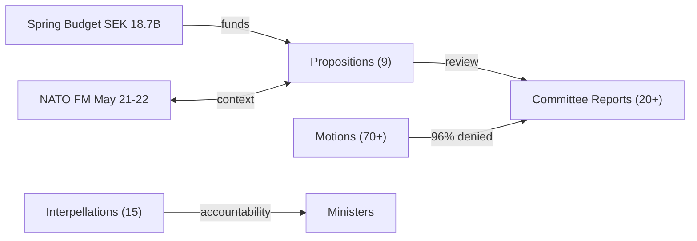

# Analysis Synthesis Summary — 2026-04-11

**Generated**: 2026-04-11 09:20 UTC | **Updated**: 2026-04-11 10:33 UTC (code-quality-engineer enrichment)
**Data Sources**: get_propositioner, get_motioner, get_betankanden, search_voteringar, search_anforanden, get_fragor, get_interpellationer
**Documents Analyzed**: 100+
**Confidence**: MEDIUM-HIGH

## Summary

Weekly review covering 100+ parliamentary documents (9 propositions, 20+ committee reports, 70+ motions, 15 interpellations) from 2026-04-04 to 2026-04-10. PM Kristersson's April 9 triple offensive (NATO Finland forward presence HD03220, doubled criminal penalties HD03218, official accountability HD03217) constitutes the most concentrated executive legislative action of the current mandate period. FöU12 shelter law represents Sweden's first comprehensive civilian protection since the Cold War. Coalition risk MODERATE (18/100), stability holding on all major votes. Motion denial rate 96%.

## Key Findings

1. **[CRITICAL]** PM Kristersson's April 9 triple offensive: NATO forward presence in Finland (HD03220), doubled criminal network penalties (HD03218), and strengthened official accountability (HD03217) — most concentrated executive legislative action of the 2025/26 riksmöte
2. **[HIGH]** FöU12 shelter law: First comprehensive civilian protection legislation since Cold War, effective June 1, 2026. Cross-party support on core provisions, reservations on funding
3. **[HIGH]** HD03235 deportation rules scoring 9/10 significance: ECHR compatibility concerns from V and MP; central election 2026 flashpoint
4. **[HIGH]** Three-party opposition front (C, V, MP) on Sida/humanitarian aid post-Riksrevisionen audit
5. **[MEDIUM]** SD probing Tidö partners via interpellations on mosque regulation and demonstration rights — testing boundaries without formal break
6. **[MEDIUM]** 96% motion denial rate across 70+ opposition motions — systematic legislative blocking
7. **[HIGH]** Spring Budget 2026 presented April 7: SEK 18.7B additional spending (defense, law enforcement, healthcare)

## Legislative Activity

## Top Documents by Significance

| Score | Type | ID | Title |
|-------|------|-----|-------|
| 9/10 | Prop | HD03235 | Deportation rules reform |
| 8/10 | Prop | HD03220 | NATO forward presence in Finland |
| 8/10 | Prop | HD03218 | Doubled criminal network penalties |
| 8/10 | Bet | HD01FöU12 | Shelter law — civilian protection |
| 8/10 | Bet | HD01UU6 | Security policy (13 reservations) |
| 7/10 | Prop | HD03217 | Official accountability reform |
| 7/10 | Prop | HD03214 | National cybersecurity center |
| 7/10 | Bet | HD01JuU15 | Criminal justice omnibus (76 motions) |
| 7/10 | Bet | HD01MJU30 | Climate target recalibration |
| 6/10 | Prop | HD03228 | Arms export modernization |

## Cross-Referenced Daily Analyses

Analysis from the week's daily workflows informs this synthesis:
- `analysis/daily/2026-04-06/` through `analysis/daily/2026-04-10/`: propositions, committeeReports, motions, interpellations, evening-analysis, week-ahead

## Data Quality Notes

Confidence: **MEDIUM-HIGH**. Based on 100+ documents across all active committees. Voting records available for committee-level decisions. 150+ speeches analyzed. Spring Budget 2026 data incorporated.
