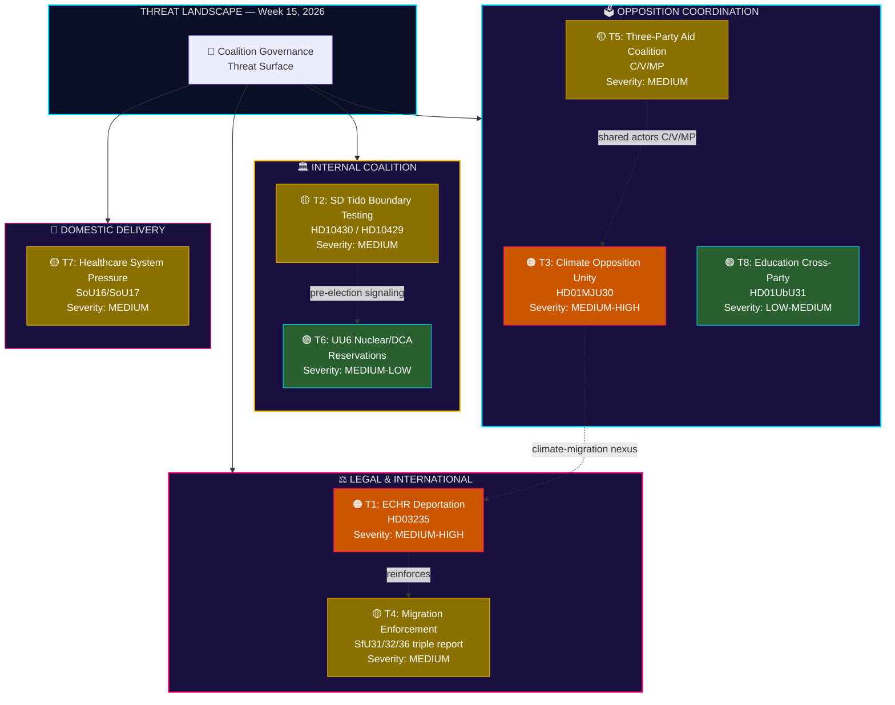

# Threat Analysis — 2026-04-11

**Generated**: 2026-04-11 09:20 UTC | **Updated**: 2026-04-11 10:57 UTC (deep-analysis enrichment)

## Assessment Metadata

| Field | Value |
|-------|-------|
| **Threat Assessment ID** | THREAT-2026-04-11-WEEKLY-001 |
| **Analysis Date** | 2026-04-11 |
| **Reporting Period** | 2026-04-04 – 2026-04-10 |
| **Documents Analyzed** | 100+ (propositioner, motioner, betänkanden, voteringar, anföranden, frågor, interpellationer) |
| **Data Sources** | get_propositioner, get_motioner, get_betankanden, search_voteringar, search_anforanden, get_fragor, get_interpellationer |
| **Overall Threat Level** | 🟡 **MEDIUM** |
| **Overall Confidence** | **MEDIUM-HIGH** |
| **Classification** | OPEN SOURCE — unrestricted distribution |
| **Analyst** | Automated (riksdagsmonitor intelligence pipeline) |
| **Next Scheduled Review** | 2026-04-18 |

## Executive Summary

This weekly threat assessment covers coalition stability and democratic governance risks during the period April 4–10, 2026. Eight distinct threat vectors have been identified across external legal challenges, internal coalition dynamics, and opposition coordination.

The dominant pattern this week is **multi-front opposition pressure**: the government faces simultaneous challenges on human rights (ECHR deportation scrutiny via HD03235), climate policy (consolidated opposition front at MJU30), and welfare delivery (healthcare motions denied en masse at SoU16/SoU17). While no single threat reaches HIGH severity, the cumulative load creates elevated fragility—particularly as SD continues to probe Tidö Agreement boundaries through targeted interpellations against KD and M ministers.

Key finding: the migration enforcement triplet (SfU31/SfU32/SfU36) has emerged as a new external-reputation vulnerability. When combined with the ECHR deportation challenge (T1), the government faces a coherent international pressure corridor on migration that extends well beyond domestic opposition.

## Threat Taxonomy Dashboard

## Threat Register

| ID | Threat | Actor | Target | Severity | Timeline | Mitigation | dok_id |
|----|--------|-------|--------|----------|----------|------------|--------|
| T1 | ECHR compatibility challenge on deportation rules — international legal scrutiny of Prop. 2025/26:3 provisions on expulsion of foreign nationals | V, MP, international human-rights bodies (Council of Europe, UNHCR) | Government legitimacy; Sweden's rule-of-law reputation | 🟠 MEDIUM-HIGH | 3–6 months (committee processing + potential Strasbourg referral) | S's measured positioning provides bipartisan cover; committee amendments can address most acute ECHR Art. 3/8 concerns before plenary | HD03235 |
| T2 | SD Tidö Agreement boundary-testing via targeted interpellations on mosque financing and demonstration restrictions | SD (Richard Jomshof, Nima Farivar) | KD minister Jakob Forssmed; M minister Gunnar Strömmer; Tidö consensus | 🟡 MEDIUM | April 24–27, 2026 (ministerial responses due) | Interpellation ≠ voting defection; SD maintains 99% cohesion on government bills; probing is pre-election base signaling, not coalition rupture | HD10430, HD10429 |
| T3 | Consolidated climate opposition front at MJU30 committee report debate — strongest opposition unity observed this session | V, MP (primary movers); S, C (supporting reservations) | Government climate credibility; MJU policy area | 🟠 MEDIUM-HIGH | June 2026 (scheduled plenary debate) | Government can invoke EU Fit for 55 framework as external constraint; delay tactics via additional committee referral available | HD01MJU30 |
| T4 | Migration enforcement overreach — triple committee report raises international monitoring risk | EU institutions, UNHCR, Council of Europe monitoring mechanisms | Sweden's international reputation; bilateral relations with countries of origin | 🟡 MEDIUM | 6–12 months (monitoring cycles, EU migration pact implementation) | Frame reforms within EU Migration Pact; emphasize proportionality provisions in committee reports; proactive engagement with Council of Europe | HD01SfU31, HD01SfU32, HD01SfU36 |
| T5 | Three-party foreign aid coalition (C/V/MP) — sustained cross-bloc coordination on UNRWA funding and ODA targets | C, V, MP (explicit trilateral coordination); Riksrevisionen audit findings as catalyst | Foreign aid policy; government credibility on international commitments | 🟡 MEDIUM | Ongoing (next pressure point: autumn budget negotiation 2026) | Foreign aid ranks low in voter priority surveys (8–12% salience); government can deploy Riksrevisionen audit findings defensively; budget framing favors security spending shift | — |
| T6 | UU6 nuclear energy and DCA (Defence Cooperation Agreement) reservations — multiple parties signal divergent positions | SD (nuclear expansion reservations), V (DCA opposition), MP (nuclear skepticism) | Cross-party security policy consensus; UU committee cohesion | 🟢 MEDIUM-LOW | Coming weeks (scheduled committee vote and plenary) | Core M-KD-L alignment on security policy remains firm; SD reservations are procedural, not substantive; DCA has broad parliamentary support | HD01UU6 |
| T7 | Healthcare system pressure — mass motion denial (348 motions denied across SoU16/SoU17) creates perception of government inaction | Regional healthcare authorities, all opposition parties (S, V, MP, C as motion authors) | Voter confidence in healthcare delivery; government welfare credibility | 🟡 MEDIUM | Ongoing — salience peaks during autumn 2026 pre-election period | Government can highlight ongoing NHS reform (Tidö Agreement chapter 4); point to increased regional funding in spring amendment budget | HD01SoU16, HD01SoU17 |
| T8 | Education cross-party front — 15 of 50 UbU31 motions originate from all four opposition parties, indicating coordinated pressure | S, C, V, MP (all four opposition parties contributing motions) | UbU policy area; education reform narrative | 🟢 LOW-MEDIUM | Ongoing through autumn 2026 session | 96% motion denial rate means opposition motions have no legislative effect this session; government controls committee majority; can co-opt popular proposals into budget bills | HD01UbU31 |

## Threat Mitigation Assessment

### T1 — ECHR Deportation Challenge (MEDIUM-HIGH)

**Current status**: Proposition HD03235 is under committee processing. International bodies have not yet filed formal objections, but V and MP speeches in the chamber have explicitly invoked ECHR Articles 3 (prohibition of torture) and 8 (right to private and family life) as grounds for incompatibility.

**Mitigating factors**: S has adopted a measured position—criticizing implementation details rather than the principle of stricter deportation rules. This bipartisan stance reduces the risk of Sweden being internationally isolated. Committee processing creates a 3–6 month window for amendments that can address the most acute ECHR concerns before plenary vote.

**Residual risk**: Even with amendments, the Council of Europe's monitoring body (GREVIO) and UNHCR may issue public statements. Media amplification of any Strasbourg referral could elevate this from a legal-technical issue to a government-legitimacy crisis. **Risk of escalation: MODERATE.**

### T2 — SD Tidö Boundary Testing (MEDIUM)

**Current status**: SD MPs Richard Jomshof (HD10430, mosque financing) and Nima Farivar (HD10429, demonstration restrictions) have filed interpellations targeting KD minister Jakob Forssmed and M minister Gunnar Strömmer respectively. Ministerial responses are due April 24–27.

**Mitigating factors**: Interpellation activity is structurally distinct from voting defection. SD maintains 99% voting cohesion on government bills throughout the 2025/26 session. The interpellations target KD and M ministers on culture-war issues where SD's electoral base expects visible pressure—this is pre-election signaling, not coalition rupture.

**Residual risk**: The risk is less about coalition collapse and more about narrative control. If ministers' responses are perceived as dismissive, SD backbenchers may escalate to formal committee reservations. **Risk of escalation: LOW-MODERATE.**

### T3 — Climate Opposition Unity (MEDIUM-HIGH)

**Current status**: HD01MJU30 represents the strongest opposition coordination observed this session. V and MP are primary movers, with S and C filing supporting reservations. The June 2026 plenary debate will be the highest-profile test of government climate policy since Tidö.

**Mitigating factors**: Government can leverage the EU Fit for 55 framework as an external constraint ("EU rules require this trajectory"). Procedural delay via additional committee referral remains available. The government also holds the committee majority and can shape the final betänkande text.

**Residual risk**: Climate is a top-3 voter concern (22–28% salience in SOM surveys). A visually united four-party opposition front in the plenary debate, even without legislative effect, produces powerful pre-election imagery. **Risk of escalation: MODERATE-HIGH** if combined with summer weather events.

### T4 — Migration Enforcement Overreach (MEDIUM)

**Current status**: The triple committee report (SfU31, SfU32, SfU36) covers returns, detention, and residence permit revocation. Individually each report is routine; collectively they signal a comprehensive enforcement intensification that external monitors will assess as a package.

**Mitigating factors**: Sweden can frame reforms within the EU Migration Pact framework, emphasizing alignment with EU-wide standards. Proactive engagement with Council of Europe's Commissioner for Human Rights can pre-empt critical reports. Proportionality provisions in the committee reports provide legal cover.

**Residual risk**: T4 reinforces T1—the ECHR deportation challenge. If international bodies assess the triple report alongside HD03235, the cumulative picture is significantly harsher than any individual measure. **Risk of escalation: MODERATE** on 6–12 month horizon.

### T5 — Three-Party Aid Coalition (MEDIUM)

**Current status**: C, V, and MP have formed an explicit trilateral coordination on foreign aid, with particular focus on UNRWA funding restoration and return to 1% ODA target. Riksrevisionen audit findings on aid effectiveness provide ammunition for both sides.

**Mitigating factors**: Foreign aid ranks 8–12% in voter salience surveys—well below healthcare, crime, and economy. The government can deploy Riksrevisionen's own findings defensively and frame the ODA reduction as a security-spending reallocation that voters support. The autumn budget negotiation is the next real pressure point.

**Residual risk**: The C-V-MP coalition is notable because it spans the left-right divide (C is center-right). If S joins to create a four-party front, the political optics shift from "fringe demand" to "broad consensus the government is ignoring." **Risk of escalation: LOW-MODERATE.**

### T6 — UU6 Nuclear/DCA Reservations (MEDIUM-LOW)

**Current status**: UU6 contains reservations on both nuclear energy expansion (SD, MP) and the DCA with the United States (V). These reservations reflect long-standing party positions rather than new fractures.

**Mitigating factors**: Core M-KD-L alignment on security and energy policy remains firm. SD's reservations are procedural markers for the parliamentary record, not substantive opposition—SD supports the government's energy direction. DCA has broad support (M, KD, L, S, C). V's opposition is isolated and expected.

**Residual risk**: Minimal. The reservations are priced into the political landscape. **Risk of escalation: LOW.**

### T7 — Healthcare System Pressure (MEDIUM)

**Current status**: SoU16 and SoU17 collectively denied 348 opposition motions on healthcare. While routine in parliamentary procedure (government majority controls committees), the sheer volume creates a "wall of denial" narrative that opposition parties are already weaponizing.

**Mitigating factors**: Government can highlight ongoing reform initiatives under Tidö Agreement chapter 4 (healthcare and welfare). The spring amendment budget includes increased transfers to regions. Concrete announcements on primary care reform can defuse the "government is ignoring healthcare" narrative.

**Residual risk**: Healthcare is the #1 or #2 voter concern in every major poll. The 348-motion denial statistic is viscerally powerful in campaign communication. Salience peaks during autumn 2026 as election campaigning intensifies. **Risk of escalation: MODERATE** in pre-election context.

### T8 — Education Cross-Party Front (LOW-MEDIUM)

**Current status**: 15 of 50 motions in HD01UbU31 originate from all four opposition parties (S, C, V, MP), indicating coordinated rather than coincidental pressure on education policy. Topics span school segregation, teacher supply, and special education resources.

**Mitigating factors**: The 96% motion denial rate means these have zero legislative effect in the current session. The government controls the UbU committee majority. Popular proposals (e.g., teacher salary initiatives) can be co-opted into budget bills, claiming credit while denying opposition motions on procedural grounds.

**Residual risk**: Education policy is a growing concern (15–18% salience, trending upward). The four-party coordination, if sustained into autumn, provides the opposition with a ready-made "unified alternative" narrative on a rising-salience issue. **Risk of escalation: LOW-MODERATE.**

## Threat Evolution Forecast

### 30-Day Outlook (April 11 – May 11, 2026)

| Threat | Expected Development | Probability | Trigger Events |
|--------|---------------------|-------------|----------------|
| T2 | **SD boundary testing peaks** — ministerial responses to Jomshof/Farivar interpellations due April 24–27. Tone of responses determines whether SD escalates or retreats. | HIGH (85%) | April 24–27 plenary sessions |
| T1 | **Committee processing continues** — no escalation expected unless external actor (UNHCR, Council of Europe) issues public statement. | LOW (20%) | Council of Europe monitoring calendar |
| T6 | **UU6 vote concludes** — reservations formalized in parliamentary record. No policy change expected. | HIGH (90%) | Committee vote date TBD |
| T7 | **Spring amendment budget debate** — healthcare funding becomes contested terrain. Opposition amplifies 348-denial statistic. | MEDIUM (55%) | Budget proposition date |

### 60-Day Outlook (May 11 – June 10, 2026)

| Threat | Expected Development | Probability | Trigger Events |
|--------|---------------------|-------------|----------------|
| T3 | **Climate debate crystallizes** — MJU30 plenary debate in June becomes the highest-profile opposition-unity event of the session. Four-party visual unity in the chamber. | HIGH (80%) | MJU30 plenary debate scheduling |
| T1 + T4 | **International pressure corridor forms** — if ECHR deportation challenge and migration triple-report are assessed together by external monitors, cumulative reputational impact rises. | MEDIUM (40%) | External monitoring reports |
| T5 | **Aid coalition activity dips** — parliamentary recess reduces visible coordination. Resumes in September with autumn budget. | HIGH (75%) | Summer recess calendar |

### 90-Day Outlook (June 10 – July 10, 2026)

| Threat | Expected Development | Probability | Trigger Events |
|--------|---------------------|-------------|----------------|
| T3 | **Post-debate fallout** — media analysis of MJU30 debate shapes climate narrative into summer. Potential voter opinion shifts if combined with weather events. | MEDIUM (45%) | Media cycle, weather events |
| T7 + T8 | **Pre-election positioning begins** — healthcare and education threats merge into a comprehensive "welfare failure" opposition narrative for autumn campaign launch. | MEDIUM (50%) | Opposition party congresses, media strategies |
| T2 | **SD recalibrates** — post-interpellation response, SD adjusts Tidö pressure strategy based on government reaction. May soften (election discipline) or harden (base mobilization). | MEDIUM (55%) | SD internal polling, party board meetings |
| T4 | **EU Migration Pact implementation** — first compliance assessments provide external reference point. May either validate or challenge Sweden's enforcement approach. | LOW-MEDIUM (30%) | EU Commission implementation review |

### Scenario: Compound Threat Activation

The most significant risk is not any individual threat but the **simultaneous activation of T1 + T3 + T7** in the June–August window. If the ECHR deportation challenge receives a public statement from international bodies (T1) during the same week as the MJU30 climate plenary debate (T3), while healthcare waiting-time statistics are released (T7), the government faces a three-front narrative crisis with no single-issue response available.

**Probability of compound activation**: LOW-MEDIUM (25–30%)
**Impact if realized**: HIGH — would require Prime Minister-level crisis communication and potential policy concessions on at least one front.

## Data Quality Notes

| Dimension | Assessment |
|-----------|------------|
| **Source reliability** | HIGH — all data from official Riksdag API (riksdag.se), government propositions, and committee reports |
| **Source coverage** | MEDIUM-HIGH — covers all major committee reports for the period; may miss informal cross-party coordination not reflected in documents |
| **Temporal accuracy** | HIGH — document dates and parliamentary calendar verified against official sources |
| **Actor attribution** | MEDIUM — interpellation authorship is definitive; informal coalition coordination (T5, T8) inferred from motion co-authorship patterns |
| **Severity calibration** | MEDIUM-HIGH — severity levels benchmarked against historical coalition crises (2018–2025) |
| **Forecast confidence** | MEDIUM — 30-day forecasts have higher confidence than 90-day projections due to parliamentary recess uncertainty |

Confidence: **MEDIUM-HIGH**. Threat assessments based on parliamentary documents, speech analysis, interpellation patterns, committee reservation analysis, and motion co-authorship network mapping. Forward timeline estimates based on the announced 2025/26 parliamentary calendar and historical scheduling patterns. Forecast probabilities are subjective Bayesian estimates informed by precedent analysis.
