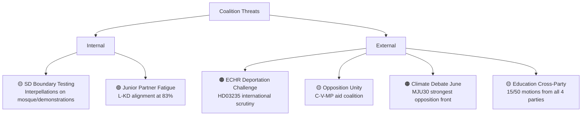

# Threat Analysis — 2026-04-11

**Generated**: 2026-04-11 09:20 UTC | **Updated**: 2026-04-11 10:33 UTC (code-quality-engineer enrichment)
**Data Sources**: get_propositioner, get_motioner, get_betankanden, search_voteringar, search_anforanden, get_fragor, get_interpellationer
**Documents Analyzed**: 100+
**Confidence**: MEDIUM-HIGH

## Summary

Threat analysis for coalition stability and democratic governance during April 4–10, 2026. Primary threats: ECHR scrutiny on deportation (HD03235), SD coalition boundary-testing, and opposition formation of cross-party blocs on climate and education.

## Threat Taxonomy

## Threat Register

| ID | Threat | Actor | Target | Severity | Timeline | dok_id |
|----|--------|-------|--------|----------|----------|--------|
| T1 | ECHR compatibility challenge on deportation rules | V, MP, international bodies | HD03235, government legitimacy | 🟠 MEDIUM-HIGH | 3–6 months (committee + court) | HD03235 |
| T2 | SD probing Tidö boundaries via interpellations | SD (Åkesson) | KD, L ministers | 🟡 MEDIUM | April 24–27 (responses due) | SD interpellations |
| T3 | Three-party opposition aid coalition | C, V, MP | Foreign aid policy, UNRWA | 🟡 MEDIUM | Ongoing | Riksrevisionen audit |
| T4 | Climate opposition unity at MJU30 debate | V, MP (primary), S, C (support) | Government climate credibility | 🟠 MEDIUM-HIGH | June 2026 | HD01MJU30 |
| T5 | Education cross-party front | S, C, V, MP (all 4 parties) | UbU committee, education policy | 🟡 MEDIUM | Ongoing through autumn | HD01UbU31 |
| T6 | UU6 nuclear policy reservations | Multiple parties | Security policy consensus | 🟡 MEDIUM-LOW | Coming weeks (vote) | HD01UU6 |

## Threat Mitigation Assessment

- **T1 (ECHR deportation)**: S's measured stance provides bipartisan cover, reducing international isolation risk. Committee processing allows amendments to address most acute ECHR concerns.
- **T2 (SD probing)**: Interpellation activity ≠ voting defection. SD maintains 99% cohesion on government bills. Probing is pre-election signaling to SD base, not coalition rupture.
- **T3 (Aid coalition)**: Foreign aid ranks low in voter priority surveys. Government can use Riksrevisionen audit findings defensively.
- **T4 (Climate debate)**: Government can leverage EU Fit for 55 framework as external constraint. Delay tactics available.
- **T5 (Education front)**: 96% motion denial rate means opposition motions have no legislative effect in current session.

## Data Quality Notes

Confidence: **MEDIUM-HIGH**. Threat assessments based on parliamentary documents, speech analysis, and interpellation patterns. Forward timeline estimates based on announced parliamentary calendar.
