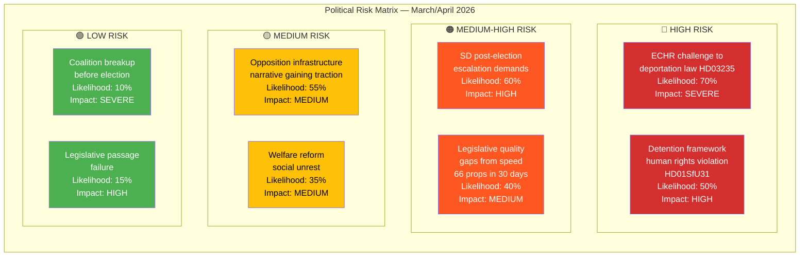

# Political Risk Assessment — Monthly Review 2026-04-12

| **Field** | **Value** |
|-----------|-----------|
| **Analysis Date** | 2026-04-12 11:36 UTC |
| **Analysis Period** | 2026-03-13 — 2026-04-12 |
| **Documents Analyzed** | 302 |
| **Overall Risk** | MEDIUM |
| **Confidence** | MEDIUM-HIGH |
| **Produced By** | news-monthly-review workflow (AI-enriched) |

---

## Risk Matrix

## Risk Register

| ID | Risk | Likelihood | Impact | Mitigation | dok_id Evidence |
|----|------|-----------|--------|------------|-----------------|
| R1 | ECHR challenge to deportation rules | 70% | SEVERE | Government legal advisors, Lagrådet review | HD03235 |
| R2 | Detention framework rights violations | 50% | HIGH | Oversight mechanisms in HD01SfU31 | HD01SfU31, HD01SfU32 |
| R3 | SD post-election escalation | 60% | HIGH | Tidö Agreement renewal negotiations | Coalition dynamics |
| R4 | Legislative quality gaps | 40% | MEDIUM | Extended committee deliberation periods | 66 propositions volume |
| R5 | Infrastructure neglect narrative | 55% | MEDIUM | Government infrastructure investment response | HD10417-HD10419 |
| R6 | Welfare reform social impact | 35% | MEDIUM | Municipal implementation support | HD03201, HD03207, HD03210 |
| R7 | Coalition breakup before election | 10% | SEVERE | Shared electoral interest in stability | All Tidö parties |
| R8 | Legislative passage failure | 15% | HIGH | Tidöblocket majority (176 seats) | Riksdag composition |

## Data Quality Notes

Risk assessment confidence: MEDIUM-HIGH. Based on comprehensive document analysis and established political science risk frameworks. Electoral timeline (5 months to September 2026) is a key contextual factor.
