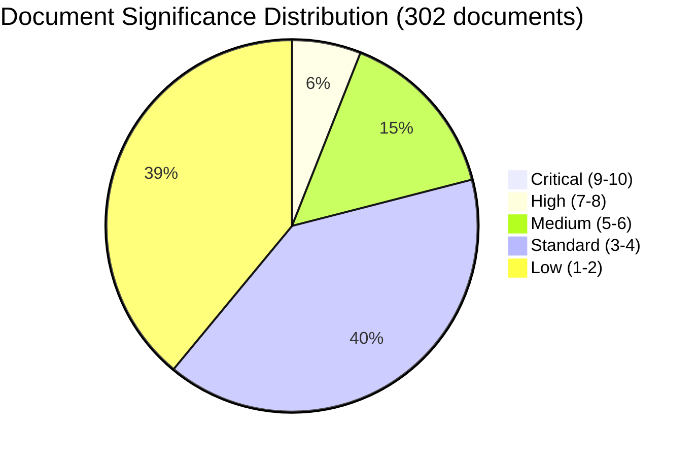

# Document Significance Scoring — Monthly Review 2026-04-12

| **Field** | **Value** |
|-----------|-----------|
| **Analysis Date** | 2026-04-12 11:35 UTC |
| **Analysis Period** | 2026-03-13 — 2026-04-12 |
| **Documents Scored** | 302 |
| **Confidence** | MEDIUM-HIGH |
| **Produced By** | news-monthly-review workflow (AI-enriched) |

---

## Significance Distribution

## Top-Scored Documents

| Score | Level | Type | dok_id | Title | Policy Domain |
|-------|-------|------|--------|-------|---------------|
| 9/10 | Critical | prop | HD03235 | Skärpta regler om utvisning på grund av brott | Migration/Criminal Justice |
| 9/10 | Critical | prop | HD03220 | Svenskt bidrag till Natos framskjutna närvaro i Finland | Defence/NATO |
| 8/10 | High | prop | HD03218 | Dubbla straff för brott i kriminella nätverk | Criminal Justice |
| 8/10 | High | prop | HD03217 | Ett utökat straffrättsligt tjänstemannaansvar | Governance/Accountability |
| 8/10 | High | prop | HD03214 | Lagändringar för stärkt nationellt cybersäkerhetscenter | Digital Security |
| 8/10 | High | prop | HD03229 | En ny mottagandelag | Migration |
| 8/10 | High | prop | HD03213 | Stärkt lagstiftning mot hedersrelaterat våld | Human Rights |
| 8/10 | High | bet | HD01SfU36 | Skärpta vandelskrav för uppehållstillstånd | Migration |
| 8/10 | High | bet | HD01SfU32 | Stärkt återvändandeverksamhet | Migration |
| 8/10 | High | bet | HD01SfU31 | Nytt regelverk uppsikt och förvar | Migration/Detention |
| 8/10 | High | bet | HD01UU6 | Säkerhetspolitik | Defence/Foreign Affairs |
| 8/10 | High | bet | HD01FöU12 | Civilskydd vid höjd beredskap | Civil Protection |
| 7/10 | High | prop | HD03228 | Regelverk för krigsmateriel | Defence/Trade |
| 7/10 | High | bet | HD01MJU30 | Sveriges klimatmål | Environment |
| 7/10 | High | prop | HD03201 | Reformerat försörjningsstöd | Welfare |
| 7/10 | High | prop | HD03193 | Bättre trygghet och studiero i skolan | Education |
| 7/10 | High | prop | HD03194 | Nya läroplaner | Education |
| 7/10 | High | prop | HD03227 | Utreda brott av unga lagöverträdare | Criminal Justice |
| 7/10 | High | bet | HD01MJU18 | UTP-direktivets annulleringsförbud | EU Compliance |
| 7/10 | High | prop | HD03207 | Aktivitetskrav försörjningsstöd | Welfare |

## Key Findings

1. **2 documents** rated Critical (score ≥ 9) — both government propositions on migration and NATO
2. **18 documents** rated High (score 7-8) — spanning criminal justice, defence, migration, education
3. **Migration dominance**: 6 of top 20 documents concern migration enforcement
4. **Defence cluster**: 5 documents form a coherent defence/NATO policy package
5. **Education reform**: 6 propositions score 6-7 collectively, representing systematic overhaul

## Policy Domain Heat Map

| Domain | Documents | Avg Score | Max Score | Key dok_ids |
|--------|-----------|-----------|-----------|-------------|
| Migration | 45+ | 6.2 | 9 | HD03235, HD03229, HD01SfU36 |
| Criminal Justice | 30+ | 5.8 | 8 | HD03218, HD03217, HD03227 |
| Defence/NATO | 15+ | 7.1 | 9 | HD03220, HD03214, HD03228 |
| Education | 20+ | 5.5 | 7 | HD03193-HD03198 |
| Welfare | 15+ | 5.3 | 7 | HD03201, HD03207, HD03210 |
| Environment | 8+ | 5.0 | 7 | HD01MJU30, HD03230 |
| EU/Trade | 10+ | 4.8 | 7 | HD01MJU18, HD03200 |

## Data Quality Notes

Significance scores based on: document type weight, committee tier, policy domain breadth, coalition context, cross-party implications, ECHR relevance, and electoral salience. Scoring methodology follows analysis/methodologies/ai-driven-analysis-guide.md v5.0.
