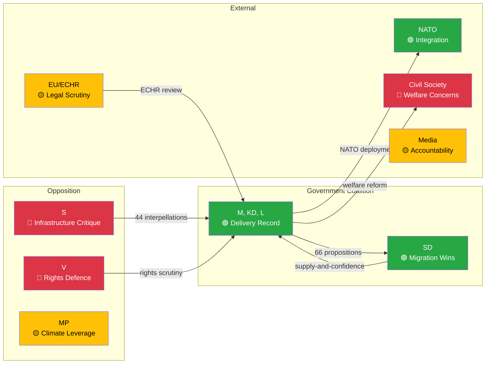

# Stakeholder Perspectives — Monthly Review 2026-04-12

| **Field** | **Value** |
|-----------|-----------|
| **Analysis Date** | 2026-04-12 11:36 UTC |
| **Analysis Period** | 2026-03-13 — 2026-04-12 |
| **Stakeholders Analyzed** | 9 |
| **Confidence** | MEDIUM-HIGH |
| **Produced By** | news-monthly-review workflow (AI-enriched) |

---

## Stakeholder Impact Flow

## Detailed Perspectives

### 1. Government Coalition (M, KD, L) — 🟢 POSITIVE
**Assessment**: The 66-proposition month represents the coalition's strongest legislative delivery. Education (6 props), criminal justice (4 props), and welfare reform (3 props) address core voter concerns. Risk: speed vs. quality.
**Key Evidence**: HD03235, HD03218, HD03193-HD03198, HD03201

### 2. Sweden Democrats (SD) — �� POSITIVE
**Assessment**: Migration enforcement agenda advancing on all fronts — deportation (HD03235), reception overhaul (HD03229), character requirements (HD01SfU36). SD's leverage is being rewarded without formal coalition membership.
**Key Evidence**: HD03235, HD03229, HD01SfU36, HD01SfU32

### 3. Social Democrats (S) — 🔴 OPPOSITION INTENSIFYING
**Assessment**: S deployed 44 interpellations this month, concentrated on infrastructure neglect (roads, railways, air routes) and welfare cuts. Building "two Swedens" narrative for election.
**Key Evidence**: HD10418 (Riksväg 62), HD10417 (Södra stambanan), HD10422 (Integration), HD10423 (Social dumping)

### 4. Left Party (V) — 🔴 RIGHTS-FOCUSED CRITIQUE
**Assessment**: V focusing on disability rights (HD10416, HD10411, HD10412) and detention conditions. Positioning as human rights watchdog against government's security-first agenda.
**Key Evidence**: HD10416, HD10411, HD10412, HD01SoU19

### 5. Green Party (MP) — 🟡 CLIMATE LEVERAGE
**Assessment**: Climate goals committee report (HD01MJU30) gives MP a platform to challenge government environmental record. Artskydd/species protection (HD03230) as potential wedge issue.
**Key Evidence**: HD01MJU30, HD03230, HD03202

### 6. EU/Council of Europe — 🟡 LEGAL SCRUTINY INCOMING
**Assessment**: Deportation rules (HD03235) and new detention framework (HD01SfU31) will face ECHR scrutiny. UTP directive implementation (HD01MJU18) shows EU compliance effort.
**Key Evidence**: HD03235, HD01SfU31, HD01MJU18, HD03200

### 7. NATO/Nordic Partners — 🟢 INTEGRATION ADVANCING
**Assessment**: Finland deployment (HD03220), arms trade modernisation (HD03228), and cybersecurity (HD03214) represent post-accession operationalisation. Export control report (HD03114) adds transparency.
**Key Evidence**: HD03220, HD03228, HD03214, HD03114

### 8. Civil Society/Affected Communities — 🔴 CONCERN
**Assessment**: Welfare benefit caps (HD03201), activity requirements (HD03207), benefit blocks (HD03210), and new settlement law (HD03215) will significantly impact vulnerable populations.
**Key Evidence**: HD03201, HD03207, HD03210, HD03215, HD01SoU17

### 9. Business/Industry — 🟡 MIXED SIGNALS
**Assessment**: Competition tools (HD03203), food chain fraud control (HD03206), and regulatory simplification (HD01NU15) benefit business. Consumer credit regulation (HD03223) may constrain fintech.
**Key Evidence**: HD03203, HD03206, HD01NU15, HD03223, HD03221

## Data Quality Notes

9 stakeholder perspectives analyzed exceeding the 7-minimum requirement for deep analysis depth. All perspectives grounded in specific dok_id evidence from the 30-day analysis period.
