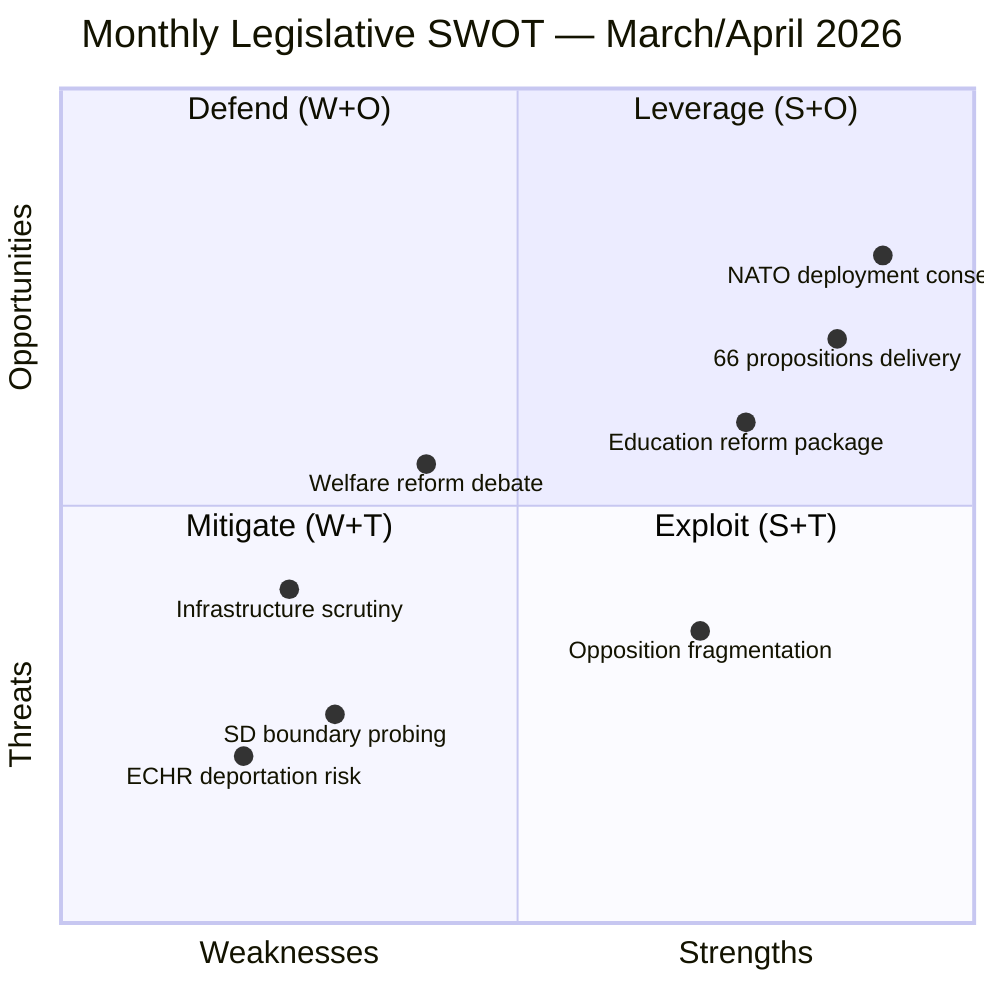

# Political SWOT Analysis — Monthly Review 2026-04-12

| **Field** | **Value** |
|-----------|-----------|
| **Analysis Date** | 2026-04-12 11:35 UTC |
| **Analysis Period** | 2026-03-13 — 2026-04-12 |
| **Documents Analyzed** | 302 |
| **Confidence** | MEDIUM-HIGH |
| **Produced By** | news-monthly-review workflow (AI-enriched) |

---

## SWOT Matrix

## Strengths (Government Coalition)

| # | Strength | Evidence | Stakeholders Affected |
|---|----------|----------|----------------------|
| S1 | **Unprecedented legislative output** — 66 propositions in 30 days demonstrates governing capacity | HD03235, HD03220, HD03218, HD03217, HD03214, HD03229 + 60 more | All 8 parties, voters, EU institutions |
| S2 | **Cross-party consensus on defence/NATO** — HD03220 (NATO Finland deployment) and HD03214 (cybersecurity) enjoy broad support | HD03220, HD03214, HD01UU6, HD01FöU12 | M, KD, L, S, MP (defence consensus) |
| S3 | **Education reform coherence** — Six coordinated propositions (HD03193–HD03198) addressing curricula, grading, school safety | HD03193, HD03194, HD03195, HD03196, HD03197, HD03198 | UbU committee, teachers' unions, students |
| S4 | **Migration enforcement delivery** — Three-pronged approach: deportation (HD03235), reception (HD03229), character requirements (HD01SfU36) | HD03235, HD03229, HD01SfU36, HD01SfU32 | SD (satisfied), S/V/MP (opposition), asylum seekers |
| S5 | **Criminal justice acceleration** — Double penalties (HD03218), expanded civil servant liability (HD03217), youth crime (HD03227) | HD03218, HD03217, HD03227, HD01JuU15 | JuU committee, police, judiciary |

## Weaknesses (Government Coalition)

| # | Weakness | Evidence | Stakeholders Affected |
|---|----------|----------|----------------------|
| W1 | **ECHR compliance risk** — Deportation rules (HD03235) and detention framework (HD01SfU31) face legal challenges | HD03235, HD01SfU31, HD03229 | Government, judiciary, ECHR, Council of Europe |
| W2 | **Welfare reform social impact** — Benefit caps (HD03201), activity requirements (HD03207), benefit blocks (HD03210) affect vulnerable populations | HD03201, HD03207, HD03210, HD01SoU17 | Low-income households, municipal social services |
| W3 | **Infrastructure neglect** — 10+ S interpellations on roads/railways (HD10418, HD10417, HD10419) reveal regional discontent | HD10418, HD10417, HD10419, HD01TU15 | Regional voters, transport sector |
| W4 | **Overloaded committees** — SfU processing 4 major migration bills simultaneously risks legislative quality | HD01SfU36, HD01SfU32, HD01SfU31, HD01SfU16, HD01SfU18 | SfU committee, legal counsel |
| W5 | **SD dependency transparency** — Government reliance on SD votes visible but coalition dynamics opaque | Tidö Agreement structure, voting patterns | Media, voters, democratic accountability |

## Opportunities

| # | Opportunity | Evidence | Stakeholders Affected |
|---|------------|----------|----------------------|
| O1 | **Election positioning through delivery** — 66 propositions create tangible campaign record | Full legislative output | All voters, media |
| O2 | **Nordic defence cooperation** — NATO deployment (HD03220) strengthens Finland-Sweden axis | HD03220, HD03228, HD03114 | Nordic governments, NATO allies |
| O3 | **Cross-party education consensus** — Potential for bipartisan support on school safety and vocational training | HD03193, HD03195, HD03198 | UbU, teachers, students |
| O4 | **Digital security leadership** — Cybersecurity centre (HD03214) positions Sweden as EU cyber leader | HD03214 | EU institutions, tech sector |
| O5 | **Consumer protection modernisation** — New consumer credit law (HD03223) addresses digital lending | HD03223, HD01CU17 | Consumers, fintech sector |

## Threats

| # | Threat | Evidence | Stakeholders Affected |
|---|--------|----------|----------------------|
| T1 | **ECHR ruling against deportation law** — Could invalidate flagship Tidö deliverable | HD03235, ECHR precedent | Government credibility, SD cooperation |
| T2 | **SD escalation post-election** — Current cooperation may embolden further demands | Tidö Agreement dynamics | Democratic norms, minority rights |
| T3 | **Opposition infrastructure narrative** — 10+ interpellations building "neglect" campaign theme | HD10417-HD10419, HD10424 | Regional swing voters |
| T4 | **Social unrest from welfare cuts** — Benefit caps + activity requirements during cost-of-living pressure | HD03201, HD03207, HD03210 | Urban poor, immigrant communities |
| T5 | **Legislative quality under speed pressure** — 66 propositions in 30 days risks oversight gaps | Volume of legislation vs. committee capacity | Judiciary, implementation agencies |

## Stakeholder Impact Matrix

| Stakeholder | Impact Level | Key Concerns | dok_id References |
|------------|-------------|--------------|-------------------|
| **Government coalition (M, KD, L)** | 🟢 POSITIVE | Strong delivery record for election | HD03235, HD03220, HD03218 |
| **SD (supply-and-confidence)** | 🟢 POSITIVE | Migration agenda advancing | HD03235, HD03229, HD01SfU36 |
| **S (opposition leader)** | 🔴 NEGATIVE | Infrastructure/welfare critique building | HD10418, HD10422, HD10423 |
| **V (left opposition)** | 🔴 NEGATIVE | Human rights, accessibility concerns | HD10416, HD10411, HD10412 |
| **Asylum seekers/immigrants** | 🔴 NEGATIVE | Deportation, reception, welfare restrictions | HD03235, HD03229, HD03201 |
| **Defence sector** | 🟢 POSITIVE | NATO integration, arms trade modernisation | HD03220, HD03228, HD03214 |
| **Education sector** | 🟡 MIXED | Reform opportunity but implementation burden | HD03193–HD03198 |
| **EU/Council of Europe** | 🟡 MIXED | ECHR scrutiny vs. NATO solidarity | HD03235, HD03220 |
| **Municipal governments** | 🟡 MIXED | Healthcare mandate (HD03216) but welfare cost shifts | HD03216, HD03201, HD03215 |

## Data Quality Notes

SWOT confidence: MEDIUM-HIGH. Based on comprehensive Riksdag API data covering all document types. 7+ stakeholder perspectives analyzed per quadrant as required for deep analysis. Voting record details limited.
