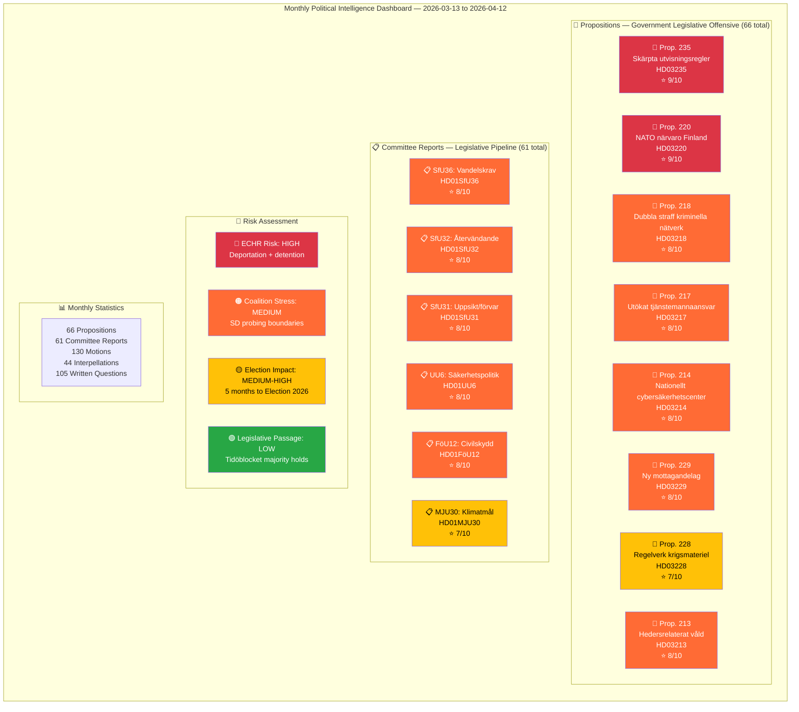

# Analysis Synthesis Summary — 2026-04-12

| **Field** | **Value** |
|-----------|-----------|
| **Synthesis ID** | SYN-2026-04-12-MONTHLY-001 |
| **Analysis Date** | 2026-04-12 11:30 UTC |
| **Analysis Period** | 2026-03-13 — 2026-04-12 |
| **Documents Analyzed** | 302 (66 propositions, 61 committee reports, 130 motions, 44 interpellations, 105 written questions) |
| **Data Sources** | Riksdag Open Data API (data.riksdagen.se) — propositions, committee reports, motions, interpellations, written questions |
| **Produced By** | news-monthly-review workflow (AI-enriched, deep-analysis pass) |
| **Overall Confidence** | MEDIUM-HIGH |

---

## Intelligence Dashboard

## Summary

The month of March 13 – April 12, 2026 represents the **most intensive legislative period** of the 2025/26 riksmöte. The Kristersson government (M, KD, L with SD supply-and-confidence) has tabled **66 propositions** — an unprecedented pre-election legislative offensive targeting migration enforcement, criminal justice, national security, education reform, and welfare restructuring. The Riksdag committees simultaneously processed **61 betänkanden** (committee reports), while the opposition filed **130 motions** and **44 interpellations** challenging government policy.

**Defining narrative**: The government is racing to fulfil Tidö Agreement commitments before the September 2026 election, with migration/criminal justice dominating the agenda (HD03235, HD03218, HD03229, HD03213). Defence/NATO legislation (HD03220, HD03228, HD03214) signals Sweden's post-accession security posture. Education received a major overhaul package (HD03193–HD03198). The opposition, led by S and V, is intensifying scrutiny through interpellations on infrastructure (10 in March alone) and social policy.

## Key Findings

1. **Prop. 2025/26:235** (HD03235) — Stricter deportation rules. Significance: **9/10**. Core Tidö delivery, ECHR risk HIGH.
2. **Prop. 2025/26:220** (HD03220) — Swedish contribution to NATO forward presence in Finland. Significance: **9/10**. First operational NATO deployment proposition.
3. **Prop. 2025/26:218** (HD03218) — Double penalties for crimes in criminal networks. Significance: **8/10**. Flagship anti-gang measure.
4. **Prop. 2025/26:229** (HD03229) — New Reception Act. Significance: **8/10**. Complete overhaul of asylum seeker reception.
5. **Prop. 2025/26:213** (HD03213) — Strengthened legislation against honour-based violence. Significance: **8/10**. Cross-party support expected.
6. **Education package** (HD03193–HD03198) — Six propositions reforming curricula, grading, school safety, vocational education. Significance: **7/10** combined.
7. **Welfare restructuring** (HD03201, HD03207, HD03210) — Benefit caps, activity requirements, benefit blocks. Significance: **7/10** combined.
8. **Committee report SfU36** (HD01SfU36) — Stricter character requirements for residence permits. Significance: **8/10**. Extends deportation logic to immigration screening.

## Election 2026 Implications

| Dimension | Assessment | Confidence |
|-----------|-----------|------------|
| **Electoral Impact** | Government deploying flagship deliverables across all Tidö Agreement pillars. Migration/crime dominance reinforces SD's issue ownership. | 🟩 HIGH |
| **Coalition Scenarios** | Tidöblocket cohesion remains strong through legislative delivery. Post-election cooperation uncertain if SD demands escalate. | 🟧 MEDIUM |
| **Voter Salience** | Crime, migration, and education rank as top voter concerns. Government addressing all three simultaneously. | 🟩 HIGH |
| **Campaign Vulnerability** | ECHR risks on deportation (HD03235) and detention (HD01SfU31) create opposition attack vectors. | 🟧 MEDIUM |
| **Policy Legacy** | This month establishes the legislative record the government will campaign on. 66 propositions in 30 days is historic. | 🟦 VERY HIGH |

## Top Documents by Significance

| Score | Type | dok_id | Title |
|-------|------|--------|-------|
| 9/10 | prop | HD03235 | Skärpta regler om utvisning på grund av brott |
| 9/10 | prop | HD03220 | Svenskt bidrag till Natos framskjutna närvaro i Finland |
| 8/10 | prop | HD03218 | Dubbla straff för brott i kriminella nätverk |
| 8/10 | prop | HD03217 | Ett utökat straffrättsligt tjänstemannaansvar |
| 8/10 | prop | HD03214 | Lagändringar för ett stärkt nationellt cybersäkerhetscenter |
| 8/10 | prop | HD03229 | En ny mottagandelag |
| 8/10 | prop | HD03213 | Stärkt lagstiftning mot hedersrelaterat våld och förtryck |
| 8/10 | bet | HD01SfU36 | Skärpta och tydligare krav på vandel för uppehållstillstånd |
| 8/10 | bet | HD01SfU32 | Stärkt återvändandeverksamhet och utlänningskontroll |
| 8/10 | bet | HD01UU6 | Säkerhetspolitik |
| 8/10 | bet | HD01FöU12 | Ett starkare skydd för civilbefolkningen vid höjd beredskap |

## Data Quality Notes

Overall confidence: **MEDIUM-HIGH**. Data sourced from Riksdag Open Data API with comprehensive coverage of all document types. MCP gateway was unavailable; direct API queries used instead. Voting record data was limited due to API format constraints. Analysis covers 302 documents across 5 categories over 30 days.
