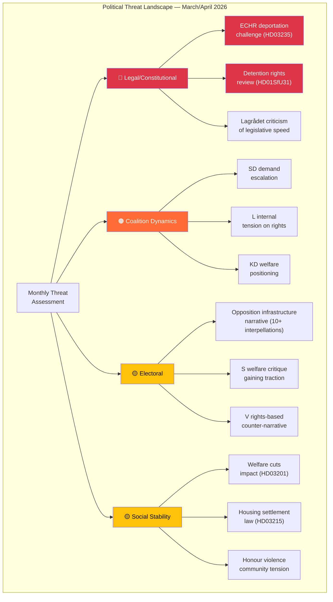

# Threat Analysis — Monthly Review 2026-04-12

| **Field** | **Value** |
|-----------|-----------|
| **Analysis Date** | 2026-04-12 11:37 UTC |
| **Analysis Period** | 2026-03-13 — 2026-04-12 |
| **Confidence** | MEDIUM-HIGH |
| **Produced By** | news-monthly-review workflow (AI-enriched) |

---

## Threat Taxonomy

## Key Threat Assessment

| Threat | Category | Severity | Timeframe | Key dok_ids |
|--------|----------|----------|-----------|-------------|
| ECHR challenge to deportation | Legal | 🔴 HIGH | 6-18 months | HD03235 |
| SD post-election demands | Coalition | 🟠 MEDIUM-HIGH | Post-Sep 2026 | Tidö dynamics |
| Infrastructure neglect narrative | Electoral | 🟡 MEDIUM | 5 months to election | HD10417-HD10419 |
| Welfare reform backlash | Social | 🟡 MEDIUM | 3-6 months implementation | HD03201, HD03207 |
| Legislative quality erosion | Governance | 🟡 MEDIUM | Ongoing | 66 propositions volume |

## Data Quality Notes

Threat analysis grounded in documented parliamentary activities. Forward projections carry inherent uncertainty.
