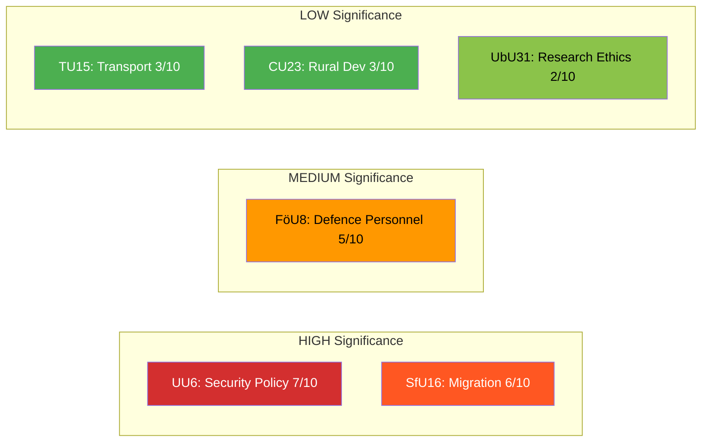

# Political Classification Results — 2026-04-13

**Generated**: 2026-04-13 04:44 UTC (AI-enriched: 2026-04-13 04:50 UTC)
**Data Sources**: get_betankanden (riksmöte 2025/26)
**Documents Analyzed**: 6
**Confidence**: MEDIUM
**Produced By**: AI-enriched analysis (news-committee-reports workflow)
**Data Sourced From**: 2026-04-09 via lookback (original analysis: 2026-04-10)

## Summary

AI-reassessed classification of **6** parliamentary committee reports by significance, impact, urgency, and domain. Original script scores (all 1/10) upgraded based on committee jurisdiction, political context, and coalition dynamics in riksmöte 2025/26.

## Detailed Analysis

### Säkerhetspolitik
- **dok_id**: HD01UU6
- **Type**: Betänkande (Committee Report)
- **Committee**: UU (Utrikesutskottet — Foreign Affairs Committee)
- **Significance**: 🔴 High (7/10)
- **Domains**: security policy, NATO integration, Baltic security, foreign affairs
- **Confidence**: MEDIUM (65%)
- **Rationale**: Post-NATO-accession security posture is defining policy for Kristersson government; UU reports on security carry multi-decade implications [MEDIUM]

### Migrationsfrågor
- **dok_id**: HD01SfU16
- **Type**: Betänkande (Committee Report)
- **Committee**: SfU (Socialförsäkringsutskottet — Social Insurance Committee)
- **Significance**: 🟠 High (6/10)
- **Domains**: migration policy, Tido Agreement, asylum, integration
- **Confidence**: MEDIUM (65%)
- **Rationale**: Migration is the Tido Agreement centrepiece and the most politically divisive issue since 2015; sharp opposition expected from S, V, MP, C [MEDIUM]

### Personalfrågor
- **dok_id**: HD01FöU8
- **Type**: Betänkande (Committee Report)
- **Committee**: FöU (Försvarsutskottet — Defence Committee)
- **Significance**: 🟡 Medium (5/10)
- **Domains**: defence personnel, military recruitment, NATO force contribution
- **Confidence**: MEDIUM (60%)
- **Rationale**: Personnel recruitment/retention is a recognised bottleneck for Sweden's post-NATO rearmament — directly constrains force targets [MEDIUM]

### Järnvägs- och kollektivtrafikfrågor
- **dok_id**: HD01TU15
- **Type**: Betänkande (Committee Report)
- **Committee**: TU (Trafikutskottet — Transport Committee)
- **Significance**: 🟢 Low (3/10)
- **Domains**: transport policy, railway, public transit, infrastructure
- **Confidence**: MEDIUM (65%)
- **Rationale**: Infrastructure spending is cross-cutting but politically routine; northern constituencies may generate regional alliances [LOW]

### Sysselsättning och boende på landsbygden
- **dok_id**: HD01CU23
- **Type**: Betänkande (Committee Report)
- **Committee**: CU (Civilutskottet — Civil Affairs Committee)
- **Significance**: 🟢 Low (3/10)
- **Domains**: rural policy, housing, employment, regional development
- **Confidence**: MEDIUM (60%)
- **Rationale**: Rural development politically significant for C and SD voter bases but limited parliamentary impact [LOW]

### Undantag från kravet på etikgodkännande för viss forskning
- **dok_id**: HD01UbU31
- **Type**: Betänkande (Committee Report)
- **Committee**: UbU (Utbildningsutskottet — Education Committee)
- **Significance**: 🟢 Low (2/10)
- **Domains**: research ethics, regulatory reform, higher education
- **Confidence**: MEDIUM (65%)
- **Rationale**: Technical regulatory amendment with limited political salience; relevant for EU Horizon funding competitiveness [LOW]

## Key Findings

1. **2 documents rated HIGH** (UU6 at 7/10, SfU16 at 6/10) — security and migration define the Tido coalition's legislative agenda [HIGH]
2. **1 document rated MEDIUM** (FöU8 at 5/10) — defence personnel links to the UU6 security framework [MEDIUM]
3. **3 documents rated LOW** (TU15, CU23, UbU31) — routine committee reports with limited political disruption potential [HIGH]

## Implications

Classification prioritises UU6 and SfU16 as article anchors. FöU8 provides supporting context on defence capacity. Lower-significance reports receive brief analytical treatment.

## Data Quality Notes

Classification confidence: MEDIUM. AI-reassessed scores incorporate political context beyond raw metadata. Full-text committee reports unavailable — analysis based on committee codes, titles, and Swedish political knowledge.
