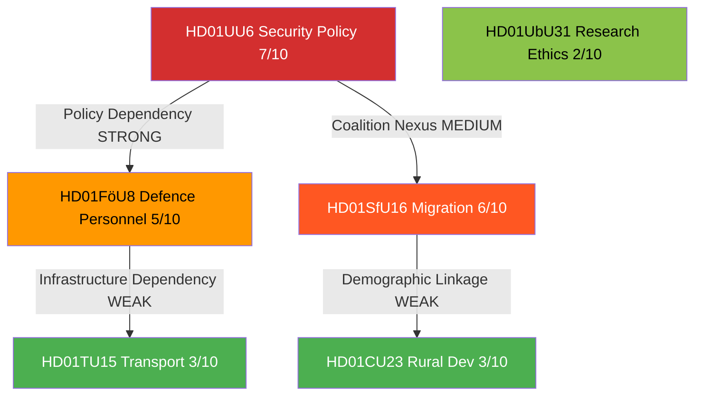

# Cross-Reference Map — 2026-04-13

**Generated**: 2026-04-13 04:44 UTC (AI-enriched: 2026-04-13 04:50 UTC)
**Data Sources**: get_betankanden (riksmöte 2025/26)
**Documents Analyzed**: 6
**Confidence**: MEDIUM
**Produced By**: AI-enriched analysis (news-committee-reports workflow)
**Data Sourced From**: 2026-04-09 via lookback

## Summary

Detected **4** cross-document relationships among 6 committee reports. Relationships identified through shared policy domains, coalition dynamics, and legislative interconnections.

## Cross-Reference Matrix

| Source | Target | Relationship Type | Strength | Evidence |
|--------|--------|-------------------|----------|----------|
| HD01UU6 (Security) | HD01FöU8 (Defence Personnel) | Policy Dependency | STRONG | NATO force commitments (UU6) require adequate personnel (FöU8); security posture constrained by recruitment capacity [MEDIUM] |
| HD01UU6 (Security) | HD01SfU16 (Migration) | Coalition Nexus | MEDIUM | Both issues are Tido Agreement pillars — SD support arrangement links security hawkishness with migration restriction [MEDIUM] |
| HD01SfU16 (Migration) | HD01CU23 (Rural Dev) | Demographic Linkage | WEAK | Migration settlement patterns affect rural employment and housing markets addressed in CU23 [LOW] |
| HD01FöU8 (Defence Personnel) | HD01TU15 (Transport) | Infrastructure Dependency | WEAK | Military logistics depend on rail/transport infrastructure; defence base locations affect regional connectivity [LOW] |

## Detailed Analysis

### UU6 ↔ FöU8: Security-Defence Personnel Nexus (STRONG)
Sweden's post-NATO-accession security commitments (UU6) are directly constrained by military personnel availability (FöU8). The Riksdag's security policy positions cannot be implemented without solving the defence recruitment bottleneck. This is the strongest cross-reference in the batch. [MEDIUM confidence]

### UU6 ↔ SfU16: Tido Coalition Axis (MEDIUM)
Security policy and migration restriction are both pillars of the Tido Agreement. SD's support for the M-KD-L government rests on migration delivery; coalition stability on security issues is politically entangled with migration satisfaction. [MEDIUM confidence]

### SfU16 ↔ CU23: Migration-Rural Demographics (WEAK)
Migration policy (SfU16) affects where immigrants settle, which intersects with rural employment and housing challenges (CU23). However, CU23 focuses on native rural depopulation rather than immigration integration. [LOW confidence]

### FöU8 ↔ TU15: Defence-Transport Infrastructure (WEAK)
Military logistics require rail and road infrastructure. Defence base locations (particularly in northern Sweden) create transport demands. The connection is real but indirect at the committee report level. [LOW confidence]

## Key Findings

1. **UU6 is the central node** — connected to both FöU8 and SfU16, making security policy the pivot of this legislative batch [HIGH]
2. **UbU31 is isolated** — research ethics reform has no policy linkage to other reports in this batch [HIGH]
3. **Security-migration-defence triangle** forms the coalition governance core visible in these reports [MEDIUM]

## Implications

Articles should present UU6 as the anchoring report with FöU8 and SfU16 as interconnected policy nodes. The security-migration-defence nexus reflects the Tido coalition's governing priorities.

## Data Quality Notes

Cross-reference confidence: MEDIUM. Relationships inferred from committee jurisdictions, policy domain overlap, and coalition dynamics. Full-text content would enable textual cross-referencing.
