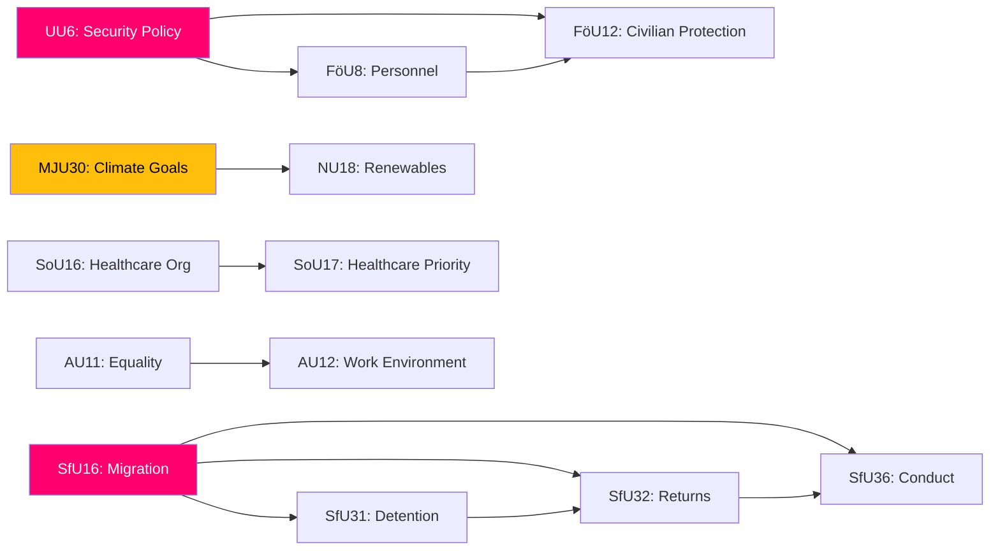

# 🔗 Cross-Reference Map — Committee Reports 2026-04-13

| Field | Value |
|-------|-------|
| **Date** | 2026-04-13 |
| **Documents Mapped** | 20 |

## Cross-Document Connections

## Cluster Analysis

| Cluster | Documents | Connection Type |
|---------|-----------|-----------------|
| Security-Defence | UU6, FöU8, FöU12, FöU11 | NATO integration chain |
| Migration Enforcement | SfU16, SfU31, SfU32, SfU36 | Tidö Agreement package |
| Energy-Climate | NU18, MJU30 | EU directive implementation |
| Healthcare | SoU16, SoU17 | System reform scope |
| Labour-Social | AU11, AU12, SfU18 | Social policy maintenance |
