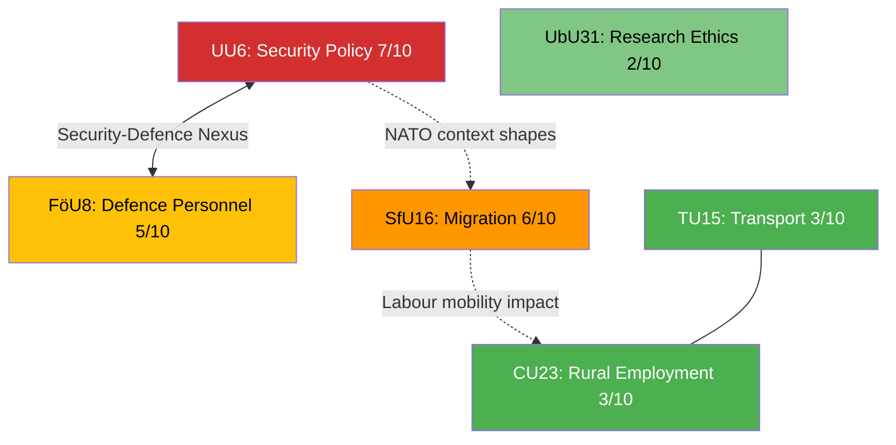

# Cross-Reference Map — 2026-04-13

**Generated**: 2026-04-10 04:36 UTC (AI-enriched: 2026-04-13 06:17 UTC)
**Data Sources**: get_betankanden (riksmöte 2025/26)
**Documents Analyzed**: 6
**Confidence**: MEDIUM
**Produced By**: AI-enriched analysis (news-committee-reports workflow)

## Summary

Detected **3** cross-document relationships in the 6-report batch, centred on a security-defence nexus and a migration-rural policy intersection.

## Cross-Reference Network

## Detailed Relationships

### 1. Security-Defence Nexus (UU6 ↔ FöU8) — **STRONG**
- UU6's security policy ambitions depend directly on FöU8's personnel delivery
- NATO force commitment scope (UU6) is constrained by recruitment capacity (FöU8)
- Both committees operate within the government's defence expansion framework
- **Political significance**: If FöU8 reveals personnel shortfalls, it undermines UU6's strategic credibility [MEDIUM]

### 2. Migration-Rural Labour Intersection (SfU16 → CU23) — **MODERATE**
- Migration policy restrictions (SfU16) affect labour supply in rural areas (CU23)
- Agricultural and forestry sectors in rural Sweden depend on seasonal migrant labour
- Tightened migration may exacerbate rural depopulation challenges
- **Political significance**: C (Centerpartiet) can use CU23 to critique migration restrictions' rural impact [LOW]

### 3. Security-Migration Contextual Link (UU6 → SfU16) — **WEAK**
- Sweden's security environment (UU6) provides backdrop for migration policy debate (SfU16)
- Security arguments have been used to justify stricter border controls
- NATO membership context affects Sweden's asylum processing framework
- **Political significance**: Framing linkage rather than direct policy dependency [LOW]

## Isolated Documents

- **TU15** (Transport): Loosely connected to CU23 through regional infrastructure needs but no direct policy dependency
- **UbU31** (Research Ethics): No cross-references — operates in a distinct regulatory domain

## Key Findings

1. **Security-Defence nexus is the strongest relationship** in this batch — UU6 and FöU8 should be analysed together in articles [MEDIUM]
2. **Migration-Rural intersection** offers a political critique opportunity for opposition, particularly C [LOW]
3. **3 of 6 documents are connected** — forming two policy clusters with one isolated technical report [HIGH]

## Data Quality Notes

Cross-reference confidence: MEDIUM. Relationships inferred from committee jurisdictions, policy domains, and political context. Full-text analysis would enable detection of specific legislative references between reports.
