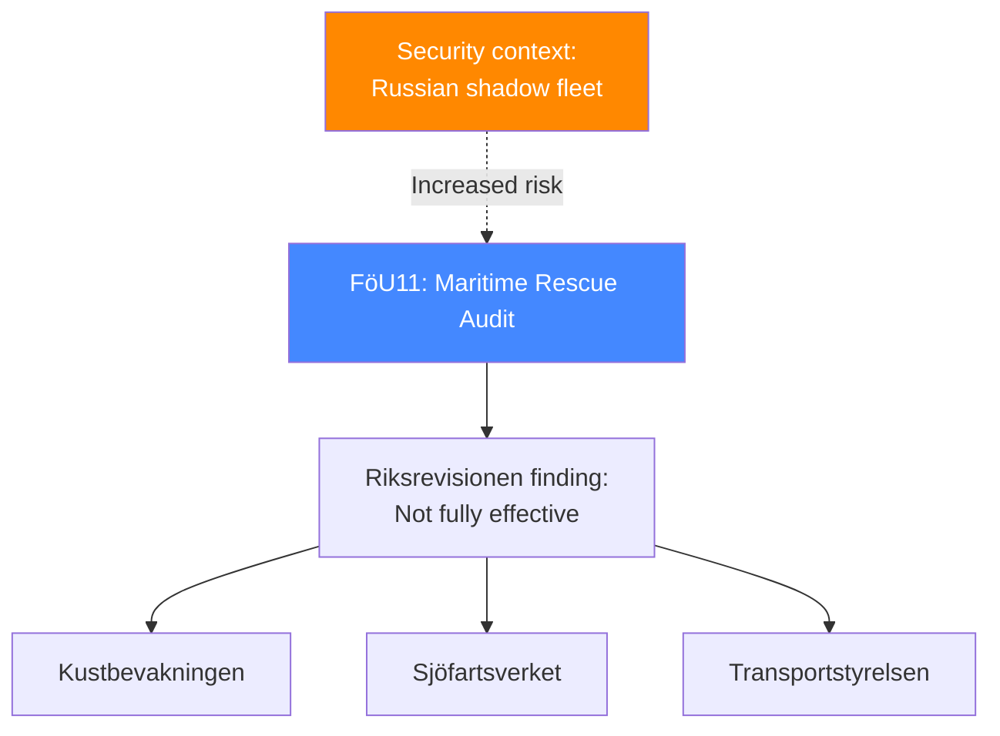

# 🔍 Per-File Political Intelligence Analysis: HD01FöU11

| Field | Value |
|-------|-------|
| **Document ID** | HD01FöU11 |
| **Title** | Riksrevisionens rapport om miljöräddning vid stora olyckor till sjöss (Audit: Maritime Environmental Rescue) |
| **Date** | 2026-04-01 |
| **Riksmöte** | 2025/26 |
| **Committee** | FöU (Defence) |
| **Analysis Timestamp** | 2026-04-13 09:04 UTC |

## 🎯 Executive Summary

The Defence Committee processes the government's response to Riksrevisionen's audit finding that Kustbevakningen, Sjöfartsverket, and Transportstyrelsen fail to work efficiently on maritime environmental rescue. The audit identifies inter-agency coordination failures and capability gaps, particularly concerning given increased Russian shadow fleet oil transport in Swedish waters. The committee accepts the government's remedial plans. **[MEDIUM]**

| Dimension | Score (0-10) | Rationale |
|-----------|-------------|-----------|
| Parliamentary Impact | 5 | Audit response — procedural |
| Policy Impact | 6 | Multi-agency coordination reform needed |
| Public Interest | 5 | Baltic environmental protection |
| Urgency | 5 | Ongoing shadow fleet risk |
| Cross-Party Significance | 4 | Limited partisan dimension |
| **Total** | **25/50** | **LOW significance** |

## 📈 Risk Assessment

| Risk | L (1-5) | I (1-5) | Score | Level |
|------|---------|---------|-------|-------|
| Major Baltic oil spill with inadequate response capacity | 3 | 5 | 15 | 🔴 VERY HIGH |
| Inter-agency coordination remains fragmented | 3 | 3 | 9 | 🟡 MEDIUM |

## 🔮 Forward Indicators

1. **Russian shadow fleet incidents in Baltic** — any near-miss validates urgency of coordination improvements **[HIGH]**
