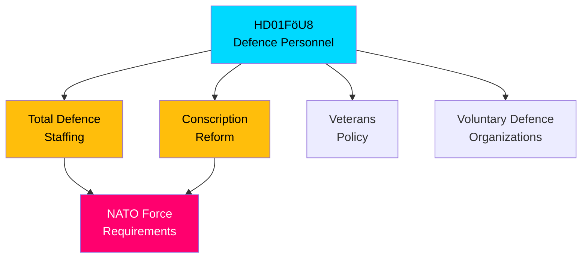

# 🔍 Per-File Political Intelligence Analysis: HD01FöU8

| Field | Value |
|-------|-------|
| **Document ID** | HD01FöU8 |
| **Document Type** | committeeReports |
| **Title** | Personalfrågor (Defence Personnel Issues) |
| **Date** | 2026-04-09 |
| **Riksmöte** | 2025/26 |
| **Source MCP Tool** | get_betankanden |
| **Analysis Timestamp** | 2026-04-13 06:59 UTC |
| **Analyst** | news-committee-reports |

## 🎯 Executive Summary

The Defence Committee (FöU) recommends rejecting all 98 opposition motions on defence personnel, covering total defence staffing, conscription, veterans, and voluntary defence organizations. With Sweden's NATO membership requiring rapid military expansion from 40,000 to 90,000+ personnel by 2030, this rejection of diverse recruitment and retention proposals represents a significant policy risk. The committee's reliance on "ongoing work" fails to address documented personnel bottlenecks that threaten Sweden's credibility as a NATO ally. **[HIGH]**

## 📊 Political Classification

| Dimension | Score (0-10) | Rationale |
|-----------|-------------|-----------|
| Parliamentary Impact | 7 | 98 motions — significant opposition engagement on defence |
| Policy Impact | 8 | Personnel bottleneck is Sweden's #1 NATO integration challenge |
| Public Interest | 6 | Defence personnel less visible than equipment procurement |
| Urgency | 8 | NATO commitments require personnel ramp-up by 2028-2030 |
| Cross-Party Significance | 7 | S, C, V, MP all submitted personnel proposals |
| **Total** | **36/50** | **HIGH significance** |

## 🔄 SWOT Analysis

### Strengths
| # | Statement | Evidence | Confidence | Impact |
|---|-----------|----------|------------|--------|
| 1 | Government maintains single personnel strategy under defence minister | FöU8: all 98 motions rejected as committee trusts ongoing work | **[MEDIUM]** | Medium |

### Weaknesses
| # | Statement | Evidence | Confidence | Impact |
|---|-----------|----------|------------|--------|
| 1 | Personnel gap is Sweden's most critical NATO integration vulnerability | FöU8 covers conscription expansion, volunteer organizations — all rejected without alternatives | **[HIGH]** | High |
| 2 | Blanket rejection of retention proposals risks talent exodus to private sector | FöU8: motions on pay, conditions, career paths all rejected | **[MEDIUM]** | High |

### Threats
| # | Statement | Evidence | Confidence | Impact |
|---|-----------|----------|------------|--------|
| 1 | NATO readiness assessments may expose Sweden's personnel shortfall | FöU8 rejects 98 proposals to address known gaps, NATO expects 2% GDP compliance | **[HIGH]** | High |
| 2 | Conscription expansion without adequate support creates retention crisis | FöU8 covers värnplikt motions — rejection means current expansion pace maintained | **[MEDIUM]** | Medium |

## 📈 Risk Assessment

| Risk | Likelihood (1-5) | Impact (1-5) | Score | Level |
|------|------------------|--------------|-------|-------|
| NATO Force Structure targets missed due to personnel shortfall | 4 | 4 | 16 | 🔴 VERY HIGH |
| Defence personnel retention crisis worsens | 3 | 4 | 12 | 🟠 HIGH |
| Conscription expansion quality drops with rapid scaling | 3 | 3 | 9 | 🟡 MEDIUM |

## 🔮 Forward Indicators

1. **Försvarsmakten quarterly personnel report** — if recruitment falls below target, validates opposition concerns **[HIGH]**
2. **NATO Capability Review of Sweden** — any personnel-related findings signal international pressure **[HIGH]**
3. **Budget bill autumn 2026** — defence personnel allocation reveals true government commitment **[MEDIUM]**

## 🗳️ Election 2026 Implications

- **Electoral Impact**: Defence personnel is bipartisan concern — both blocs claim to prioritize it **[MEDIUM]**
- **Coalition Scenarios**: S may use personnel gap to argue government incompetence on its own priority **[MEDIUM]**
- **Policy Legacy**: Personnel decisions made now determine NATO readiness for next 5+ years **[HIGH]**
