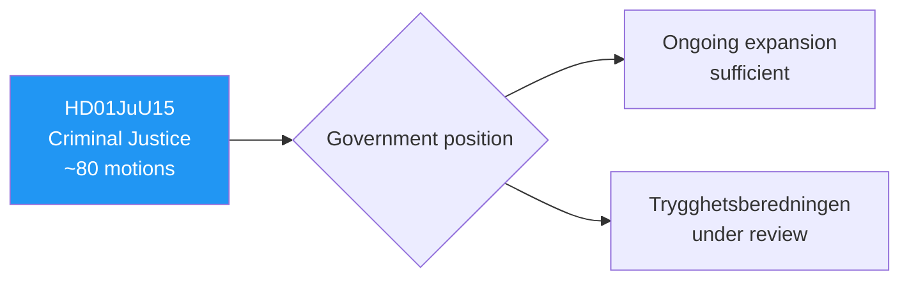

# 🔍 Per-File Political Intelligence Analysis: HD01JuU15

| Field | Value |
|-------|-------|
| **Document ID** | HD01JuU15 |
| **Title** | Kriminalvårdsfrågor (Criminal Justice Issues) |
| **Date** | 2026-04-02 |
| **Riksmöte** | 2025/26 |
| **Committee** | JuU (Justice) |
| **Analysis Timestamp** | 2026-04-13 09:02 UTC |

## 🎯 Executive Summary

The Justice Committee rejects approximately 80 motions on criminal justice covering Trygghetsberedningens proposals, prison and remand facility expansion, and women inmates' needs. The referral to "ongoing investigation and preparation work" reflects the government's massive ongoing criminal justice expansion program while signaling no additional measures beyond existing commitments. **[MEDIUM]**

| Dimension | Score (0-10) | Rationale |
|-----------|-------------|-----------|
| Parliamentary Impact | 6 | 80 motions rejected |
| Policy Impact | 6 | Status quo on prison expansion |
| Public Interest | 6 | Crime/safety is voter concern |
| Urgency | 5 | Ongoing programs |
| Cross-Party Significance | 5 | Limited cross-party tension on expansion |
| **Total** | **28/50** | **MEDIUM significance** |

## 📈 Risk Assessment

| Risk | L (1-5) | I (1-5) | Score | Level |
|------|---------|---------|-------|-------|
| Prison capacity insufficient despite expansion | 3 | 3 | 9 | 🟡 MEDIUM |
| Women inmates' needs neglected | 2 | 3 | 6 | 🟢 LOW |

## 🔮 Forward Indicators

1. **Kriminalvården capacity reports** — overcrowding data validates expansion urgency **[MEDIUM]**
