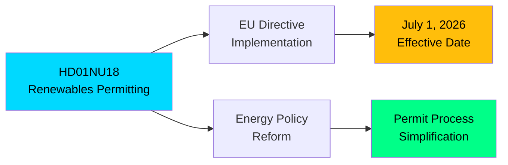

# 🔍 Per-File Political Intelligence Analysis: HD01NU18

| Field | Value |
|-------|-------|
| **Document ID** | HD01NU18 |
| **Document Type** | committeeReports |
| **Title** | Tillståndsprövning enligt förnybartdirektivet (Permitting under the Renewables Directive) |
| **Date** | 2026-04-08 |
| **Riksmöte** | 2025/26 |
| **Source MCP Tool** | get_betankanden |
| **Analysis Timestamp** | 2026-04-13 07:02 UTC |
| **Analyst** | news-committee-reports |

## 🎯 Executive Summary

The Industry Committee (NU) recommends approving the government's proposal for a new law implementing the EU Renewables Directive, simplifying and shortening permit processes for renewable energy projects. Effective July 1, 2026, this represents Sweden's most significant energy permitting reform in years. The political significance lies in the government — which has been criticized for slowing the green transition — now fast-tracking EU-mandated renewables infrastructure. **[MEDIUM]**

## 📊 Political Classification

| Dimension | Score (0-10) | Rationale |
|-----------|-------------|-----------|
| Parliamentary Impact | 6 | Government proposal — expected to pass |
| Policy Impact | 7 | Accelerates renewable energy deployment |
| Public Interest | 6 | Energy costs and green transition affect all citizens |
| Urgency | 7 | July 1, 2026 deadline — pre-election implementation |
| Cross-Party Significance | 5 | Some opposition may argue insufficient ambition |
| **Total** | **31/50** | **MEDIUM-HIGH significance** |

## 📈 Risk Assessment

| Risk | Likelihood (1-5) | Impact (1-5) | Score | Level |
|------|------------------|--------------|-------|-------|
| Permit reform insufficient — projects still delayed | 3 | 3 | 9 | 🟡 MEDIUM |
| Conflicting nuclear/renewables policy signals | 3 | 3 | 9 | 🟡 MEDIUM |
| Municipal opposition to wind/solar installations | 3 | 4 | 12 | 🟠 HIGH |

## 🗳️ Election 2026 Implications

- **Electoral Impact**: Demonstrates government can deliver on EU obligations — counters "anti-green" narrative **[MEDIUM]**
- **Voter Salience**: Energy policy top-5 issue; permits reform a concrete deliverable **[MEDIUM]**
