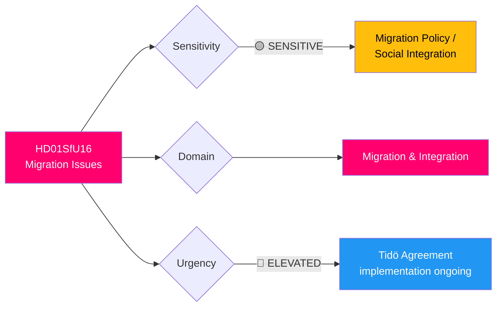

# 🔍 Per-File Political Intelligence Analysis: HD01SfU16

| Field | Value |
|-------|-------|
| **Document ID** | HD01SfU16 |
| **Document Type** | committeeReports |
| **Title** | Migrationsfrågor (Migration Issues) |
| **Date** | 2026-04-09 |
| **Riksmöte** | 2025/26 |
| **Source MCP Tool** | get_betankanden |
| **Analysis Timestamp** | 2026-04-13 06:57 UTC |
| **Analyst** | news-committee-reports |

## 🎯 Executive Summary

The Social Insurance Committee (SfU) recommends rejecting all 157 opposition motions on migration, covering family reunification, asylum processes, and immigration policy reforms. This massive rejection — the largest single-committee motion batch in recent weeks — represents the Tidö Agreement coalition's systematic consolidation of restrictive migration policy. The volume of rejected motions (157) reflects deep parliamentary polarization, with both left and right opposition proposing alternatives that the governing bloc refuses to engage with substantively. **[HIGH]**

## 📊 Political Classification

| Dimension | Score (0-10) | Rationale |
|-----------|-------------|-----------|
| Parliamentary Impact | 8 | 157 motions — highest rejection count this session |
| Policy Impact | 8 | Tidö Agreement core area; affects asylum, reunification |
| Public Interest | 9 | Migration consistently top voter issue |
| Urgency | 7 | Multiple SfU reports this week (SfU31, SfU32, SfU36) signal coordinated push |
| Cross-Party Significance | 8 | All opposition parties submitted alternatives |
| **Total** | **40/50** | **VERY HIGH significance** |

## 🔄 SWOT Analysis

### Strengths
| # | Statement | Evidence | Confidence | Impact |
|---|-----------|----------|------------|--------|
| 1 | Government maintains unified migration restriction front across 4 simultaneous committee reports | SfU16, SfU31, SfU32, SfU36 all published April 9-10 | **[HIGH]** | High |
| 2 | SD's Tidö Agreement influence fully embedded in committee recommendations | All 157 motions rejected, including moderate proposals | **[HIGH]** | High |

### Weaknesses
| # | Statement | Evidence | Confidence | Impact |
|---|-----------|----------|------------|--------|
| 1 | Mass rejection without substantive engagement undermines democratic legitimacy | SfU16: "hänvisar bland annat till pågående arbete" as blanket response | **[HIGH]** | Medium |
| 2 | Four concurrent migration reports signal legislative bottleneck in implementation | SfU31 (detention), SfU32 (returns), SfU36 (conduct requirements) all within 24 hours | **[MEDIUM]** | Medium |

### Threats
| # | Statement | Evidence | Confidence | Impact |
|---|-----------|----------|------------|--------|
| 1 | EU asylum pact implementation may conflict with stricter national measures | SfU16 covers asylum process motions that may preempt EU harmonization | **[MEDIUM]** | High |
| 2 | Opposition coordination on migration for Election 2026 — S positioning as "humane alternative" | 157 motions represent diverse proposals from S, V, MP, C, L | **[MEDIUM]** | High |

## 📈 Risk Assessment

| Risk | Likelihood (1-5) | Impact (1-5) | Score | Level |
|------|------------------|--------------|-------|-------|
| EU-Sweden migration policy conflict | 3 | 4 | 12 | 🟠 HIGH |
| Family reunification restrictions face ECHR challenge | 3 | 3 | 9 | 🟡 MEDIUM |
| Migration policy becomes Election 2026 wedge issue | 4 | 4 | 16 | 🔴 VERY HIGH |
| Implementation gaps in return enforcement (SfU32 context) | 3 | 3 | 9 | 🟡 MEDIUM |

## 🔮 Forward Indicators

1. **SfU31/SfU32/SfU36 chamber vote dates** — if scheduled same week as SfU16, signals coordinated "migration week" messaging strategy **[HIGH]**
2. **S migration policy platform for Election 2026** — any shift from current position signals electoral calculation **[MEDIUM]**
3. **EU Asylum Pact transposition deadline** — potential conflict with Swedish restrictive measures **[MEDIUM]**

## 🗳️ Election 2026 Implications

- **Electoral Impact**: Migration remains #1 voter issue; government's restrictive line polls well with SD voters but alienates C/L **[HIGH]**
- **Coalition Scenarios**: Post-election, C's position on migration determines whether centre-left coalition is viable **[HIGH]**
- **Voter Salience**: 🟦 VERY HIGH — migration consistently top-3 in voter surveys **[VERY HIGH]**
- **Campaign Vulnerability**: 157 rejected motions provide opposition with "government refuses to listen" narrative **[MEDIUM]**
