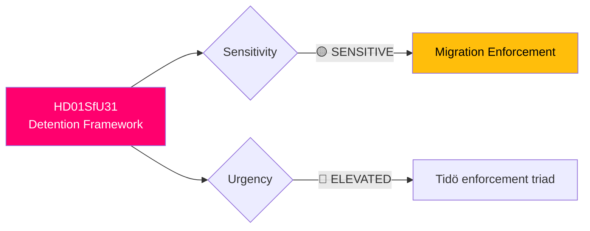

# 🔍 Per-File Political Intelligence Analysis: HD01SfU31

| Field | Value |
|-------|-------|
| **Document ID** | HD01SfU31 |
| **Title** | Ett nytt regelverk för uppsikt och förvar (New Framework for Supervision and Detention) |
| **Date** | 2026-04-10 |
| **Riksmöte** | 2025/26 |
| **Committee** | SfU (Social Insurance) |
| **Analysis Timestamp** | 2026-04-13 08:57 UTC |

## 🎯 Executive Summary

The Social Insurance Committee proposes a comprehensive new detention and supervision framework for asylum seekers and irregular migrants, replacing existing regulations. Released alongside SfU32 (returns enforcement) and SfU36 (conduct requirements) within 24 hours, this forms the Tidö Agreement's migration enforcement triad. The new framework expands grounds for detention, streamlines supervision procedures, and strengthens enforcement powers — raising proportionality concerns under ECHR Article 5. **[HIGH]**

| Dimension | Score (0-10) | Rationale |
|-----------|-------------|-----------|
| Parliamentary Impact | 6 | Government proposal — likely passes with SD support |
| Policy Impact | 8 | Fundamentally restructures detention authority |
| Public Interest | 7 | Human rights implications highly debated |
| Urgency | 7 | Part of coordinated migration package |
| Cross-Party Significance | 6 | S, V, MP oppose; C ambivalent |
| **Total** | **34/50** | **HIGH significance** |

## 🔄 SWOT Analysis

### Strengths
| # | Statement | Evidence | Confidence | Impact |
|---|-----------|----------|------------|--------|
| 1 | Streamlines fragmented detention legal framework | SfU31 replaces multiple provisions in Aliens Act Chapter 10-11 | **[HIGH]** | Medium |

### Weaknesses
| # | Statement | Evidence | Confidence | Impact |
|---|-----------|----------|------------|--------|
| 1 | Expanded detention grounds without proportional judicial oversight | New framework broadens criteria beyond current necessity test | **[MEDIUM]** | High |

### Threats
| # | Statement | Evidence | Confidence | Impact |
|---|-----------|----------|------------|--------|
| 1 | ECHR Article 5 challenge — expanded detention must meet proportionality | Constitutional review likely by Lagrådet and eventual ECHR scrutiny | **[MEDIUM]** | High |

## 📈 Risk Assessment

| Risk | L (1-5) | I (1-5) | Score | Level |
|------|---------|---------|-------|-------|
| ECHR proportionality challenge | 3 | 4 | 12 | 🟠 HIGH |
| Detention capacity exceeds physical infrastructure | 3 | 3 | 9 | 🟡 MEDIUM |

## 🔮 Forward Indicators

1. **Chamber vote scheduling alongside SfU32/SfU36** — simultaneous scheduling confirms coordinated enforcement push **[HIGH]**
2. **Lagrådet constitutional review findings** — any reservations signal proportionality concerns **[MEDIUM]**
