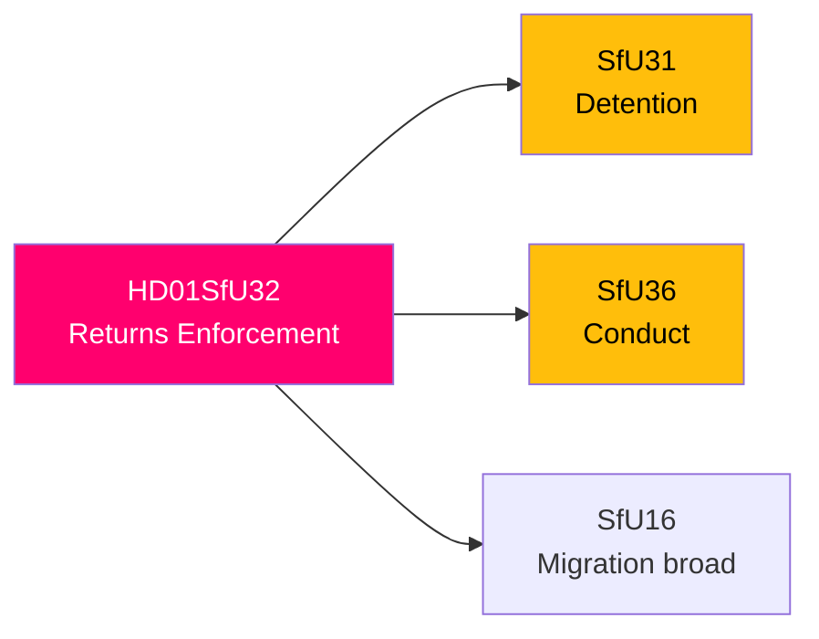

# 🔍 Per-File Political Intelligence Analysis: HD01SfU32

| Field | Value |
|-------|-------|
| **Document ID** | HD01SfU32 |
| **Title** | Stärkt återvändandeverksamhet och utlänningskontroll (Strengthened Returns and Immigration Control) |
| **Date** | 2026-04-10 |
| **Riksmöte** | 2025/26 |
| **Committee** | SfU (Social Insurance) |
| **Analysis Timestamp** | 2026-04-13 08:58 UTC |

## 🎯 Executive Summary

SfU32 strengthens the state's enforcement capacity for returning irregular migrants and rejected asylum seekers. Part of the Tidö Agreement migration triad (SfU31+SfU32+SfU36), this report expands police authority for internal immigration controls and increases cooperation requirements with municipalities. The legislation seeks to close enforcement gaps identified in previous Migrationsverket reviews. **[HIGH]**

| Dimension | Score (0-10) | Rationale |
|-----------|-------------|-----------|
| Parliamentary Impact | 6 | Government proposal with SD backing |
| Policy Impact | 7 | Expands enforcement powers significantly |
| Public Interest | 7 | Returns enforcement is electorally salient |
| Urgency | 7 | Coordinated with SfU31/SfU36 |
| Cross-Party Significance | 6 | Opposition fragmented on enforcement |
| **Total** | **33/50** | **HIGH significance** |

## 🔄 SWOT Analysis

### Strengths
| # | Statement | Evidence | Confidence | Impact |
|---|-----------|----------|------------|--------|
| 1 | Addresses documented enforcement gaps in return processes | SfU32 responds to Migrationsverket implementation reports | **[HIGH]** | Medium |

### Threats
| # | Statement | Evidence | Confidence | Impact |
|---|-----------|----------|------------|--------|
| 1 | Municipal capacity strain — new cooperation requirements without matching resources | Municipalities must assist in enforcement without additional funding | **[MEDIUM]** | Medium |

## 📈 Risk Assessment

| Risk | L (1-5) | I (1-5) | Score | Level |
|------|---------|---------|-------|-------|
| Implementation gap — municipalities resist cooperation | 3 | 3 | 9 | 🟡 MEDIUM |
| Return agreements with origin countries insufficient | 3 | 4 | 12 | 🟠 HIGH |

## 🔮 Forward Indicators

1. **Migrationsverket return statistics Q2 2026** — baseline for measuring enforcement effectiveness **[HIGH]**
2. **SKR (municipal association) response** — resistance signals implementation challenges **[MEDIUM]**
