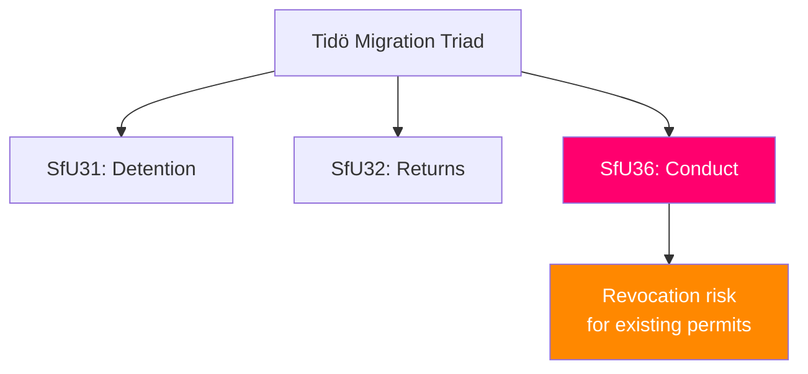

# 🔍 Per-File Political Intelligence Analysis: HD01SfU36

| Field | Value |
|-------|-------|
| **Document ID** | HD01SfU36 |
| **Title** | Skärpta och tydligare krav på vandel för uppehållstillstånd (Stricter Conduct Requirements for Residence Permits) |
| **Date** | 2026-04-10 |
| **Riksmöte** | 2025/26 |
| **Committee** | SfU (Social Insurance) |
| **Analysis Timestamp** | 2026-04-13 08:59 UTC |

## 🎯 Executive Summary

SfU36 introduces stricter and more explicit conduct requirements for obtaining and retaining residence permits. Completing the Tidö migration enforcement triad, this report links residency rights to behavior standards, potentially enabling revocation for criminal convictions or antisocial behavior. This represents the most constitutionally sensitive element of the triad, as it introduces conduct-based conditionality to established residency rights. **[HIGH]**

| Dimension | Score (0-10) | Rationale |
|-----------|-------------|-----------|
| Parliamentary Impact | 6 | Government proposal |
| Policy Impact | 7 | Introduces conduct conditionality to residency |
| Public Interest | 7 | Highly debated — media salience |
| Urgency | 7 | Coordinated package |
| Cross-Party Significance | 6 | V, MP strongly opposed |
| **Total** | **33/50** | **HIGH significance** |

## 🔄 SWOT Analysis

### Strengths
| # | Statement | Evidence | Confidence | Impact |
|---|-----------|----------|------------|--------|
| 1 | Responds to voter demand for integration conditionality | Migration consistently top voter issue; SD core demand | **[HIGH]** | Medium |

### Threats
| # | Statement | Evidence | Confidence | Impact |
|---|-----------|----------|------------|--------|
| 1 | Conduct-based revocation may face constitutional challenge | Retroactive application to existing permits raises Regeringsformen concerns | **[MEDIUM]** | High |
| 2 | Subjective "conduct" criteria create uneven application | Risk of discriminatory enforcement patterns | **[MEDIUM]** | Medium |

## 📈 Risk Assessment

| Risk | L (1-5) | I (1-5) | Score | Level |
|------|---------|---------|-------|-------|
| Constitutional challenge to conduct conditionality | 3 | 4 | 12 | 🟠 HIGH |
| Discriminatory enforcement patterns | 3 | 3 | 9 | 🟡 MEDIUM |

## 🔮 Forward Indicators

1. **Lagrådet review of conduct criteria specificity** — vague criteria invite legal challenge **[HIGH]**
2. **ECHR comparison with similar European conduct requirements** — if found excessive, signals future litigation **[MEDIUM]**
