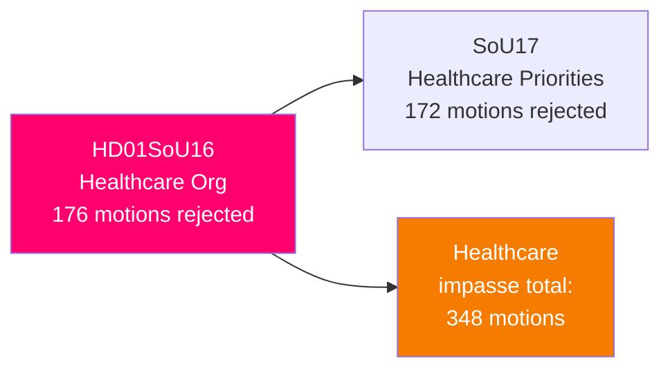

# 🔍 Per-File Political Intelligence Analysis: HD01SoU16

| Field | Value |
|-------|-------|
| **Document ID** | HD01SoU16 |
| **Title** | Hälso- och sjukvårdens organisation (Healthcare Organization) |
| **Date** | 2026-04-01 |
| **Riksmöte** | 2025/26 |
| **Committee** | SoU (Social Affairs) |
| **Analysis Timestamp** | 2026-04-13 09:00 UTC |

## 🎯 Executive Summary

The Social Affairs Committee rejects all 176 motions on healthcare organization covering financing, privatization, equitable access, mental health, and multimorbidity. This massive rejection — the second-largest in this batch after SfU16 — signals legislative paralysis on Sweden's deepening healthcare access crisis. The committee's blanket referral to "ongoing work" masks the absence of any concrete government reform proposals despite wait times reaching historic levels. **[HIGH]**

| Dimension | Score (0-10) | Rationale |
|-----------|-------------|-----------|
| Parliamentary Impact | 6 | 176 motions rejected — significant opposition effort |
| Policy Impact | 6 | Status quo maintained — no reform |
| Public Interest | 7 | Wait times and access are top voter concerns |
| Urgency | 5 | No immediate legislative deadline |
| Cross-Party Significance | 6 | All opposition parties submitted motions |
| **Total** | **30/50** | **MEDIUM significance** |

## 🔄 SWOT Analysis

### Weaknesses
| # | Statement | Evidence | Confidence | Impact |
|---|-----------|----------|------------|--------|
| 1 | Government offers no alternative reform pathway — pure rejection without counter-proposals | SoU16 summary: "hänvisar främst till pågående arbete" | **[HIGH]** | High |
| 2 | Mental health proposals dismissed despite rising demand | Motions on "psykisk hälsa hos vuxna, barn och unga" rejected | **[HIGH]** | Medium |

### Threats
| # | Statement | Evidence | Confidence | Impact |
|---|-----------|----------|------------|--------|
| 1 | Healthcare access becomes dominant Election 2026 issue | 348 rejected motions (SoU16+SoU17) provide opposition ammunition | **[HIGH]** | High |

## 📈 Risk Assessment

| Risk | L (1-5) | I (1-5) | Score | Level |
|------|---------|---------|-------|-------|
| Healthcare wait times worsen, government blamed | 4 | 3 | 12 | 🟠 HIGH |
| Opposition campaigns on 348 rejected healthcare motions | 4 | 3 | 12 | 🟠 HIGH |

## 🔮 Forward Indicators

1. **SKL wait time statistics Q2 2026** — worsening metrics fuel opposition narrative **[HIGH]**
2. **Government healthcare reform announcement** — any proactive measure before election signals awareness of vulnerability **[MEDIUM]**
