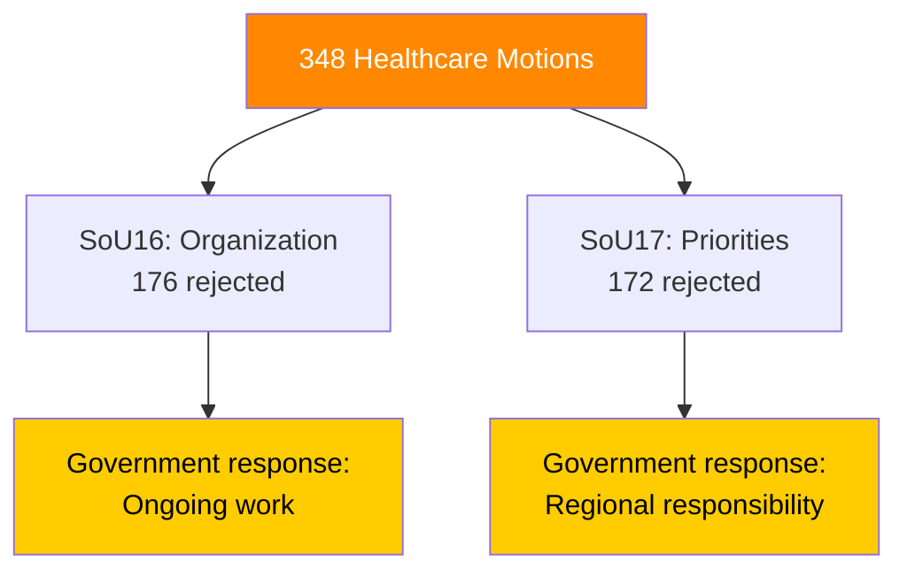

# 🔍 Per-File Political Intelligence Analysis: HD01SoU17

| Field | Value |
|-------|-------|
| **Document ID** | HD01SoU17 |
| **Title** | Prioriteringar inom hälso- och sjukvården (Healthcare Priorities) |
| **Date** | 2026-04-01 |
| **Riksmöte** | 2025/26 |
| **Committee** | SoU (Social Affairs) |
| **Analysis Timestamp** | 2026-04-13 09:01 UTC |

## 🎯 Executive Summary

The Social Affairs Committee rejects 172 motions on healthcare priorities and medical ethics, deferring responsibility to regional healthcare principals. Combined with SoU16 (176 motions), this represents 348 rejected healthcare proposals — the largest policy-area rejection cluster in this batch. The committee explicitly states that "sjukvårdshuvudmännens ansvar" (healthcare principals' responsibility) governs prioritization, deflecting national-level accountability. **[MEDIUM]**

| Dimension | Score (0-10) | Rationale |
|-----------|-------------|-----------|
| Parliamentary Impact | 6 | 172 motions rejected |
| Policy Impact | 6 | Status quo on medical ethics, disease-specific funding |
| Public Interest | 7 | Patient organizations affected |
| Urgency | 5 | No legislative deadline |
| Cross-Party Significance | 6 | Broad opposition submissions |
| **Total** | **30/50** | **MEDIUM significance** |

## 📈 Risk Assessment

| Risk | L (1-5) | I (1-5) | Score | Level |
|------|---------|---------|-------|-------|
| Patient organization backlash against inaction | 3 | 3 | 9 | 🟡 MEDIUM |
| Regional disparities in healthcare access deepen | 4 | 3 | 12 | 🟠 HIGH |

## 🔮 Forward Indicators

1. **Vårdgaranti (care guarantee) statistics** — breaches signal systemic failure **[HIGH]**
2. **Regional election positioning on healthcare** — signals issue salience **[MEDIUM]**
