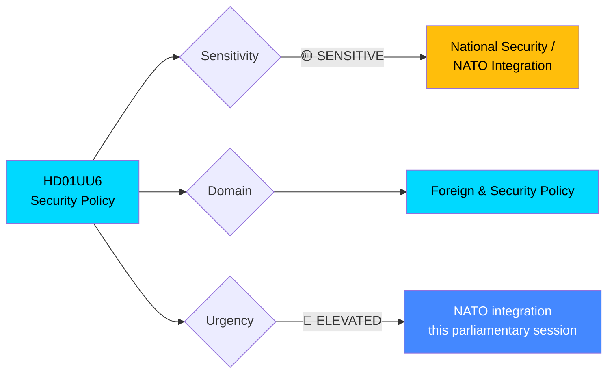

# 🔍 Per-File Political Intelligence Analysis: HD01UU6

| Field | Value |
|-------|-------|
| **Document ID** | HD01UU6 |
| **Document Type** | committeeReports |
| **Title** | Säkerhetspolitik (Security Policy) |
| **Date** | 2026-04-09 |
| **Riksmöte** | 2025/26 |
| **Source MCP Tool** | get_betankanden |
| **Analysis Timestamp** | 2026-04-13 06:55 UTC |
| **Analyst** | news-committee-reports |

## 🎯 Executive Summary

The Foreign Affairs Committee (UU) recommends rejecting all 51 opposition motions on security policy, nuclear disarmament, and the DCA agreement with the USA. This comprehensive rejection of opposition alternatives on NATO membership, nuclear weapons posture, and the Defence Cooperation Agreement signals the governing coalition's firm consolidation of Sweden's post-neutrality security alignment. The committee's blanket referral to "ongoing work" masks significant policy tensions around the DCA agreement's scope and nuclear weapons doctrine that remain unresolved within the coalition itself. **[HIGH]**

## 📊 Political Classification

| Dimension | Score (0-10) | Rationale |
|-----------|-------------|-----------|
| Parliamentary Impact | 8 | 51 motions rejected — signals cross-party security consensus breakdown |
| Policy Impact | 9 | NATO, DCA, nuclear posture — fundamental security architecture |
| Public Interest | 7 | High media salience post-NATO accession; DCA debate ongoing |
| Urgency | 7 | DCA ratification timeline; NATO Force Structure commitments |
| Cross-Party Significance | 8 | S, V, MP, C all submitted motions — opposition alignment fragmented |
| **Total** | **39/50** | **VERY HIGH significance** |

## 🔄 SWOT Analysis

### Strengths
| # | Statement | Evidence | Confidence | Impact |
|---|-----------|----------|------------|--------|
| 1 | Governing coalition (M, KD, L + SD support) maintains unified security policy line | UU6: all 51 motions rejected with committee majority | **[HIGH]** | High |
| 2 | NATO integration proceeding on schedule with bipartisan base | UU6 references ongoing NATO integration work as rationale for rejection | **[MEDIUM]** | High |

### Weaknesses
| # | Statement | Evidence | Confidence | Impact |
|---|-----------|----------|------------|--------|
| 1 | Blanket "ongoing work" rationale avoids substantive policy debate on DCA terms | UU6 summary: "hänvisar bland annat till pågående arbete" for all 51 motions | **[HIGH]** | Medium |
| 2 | SD support for security policy creates internal tension with nationalist voter base | SD participation in NATO/DCA support versus traditional Eurosceptic position | **[MEDIUM]** | Medium |

### Opportunities
| # | Statement | Evidence | Confidence | Impact |
|---|-----------|----------|------------|--------|
| 1 | Cross-party consensus on core NATO membership could be leveraged for broader defence investment | Multiple parties submitted motions accepting NATO but proposing alternative implementations | **[MEDIUM]** | High |

### Threats
| # | Statement | Evidence | Confidence | Impact |
|---|-----------|----------|------------|--------|
| 1 | DCA agreement scope remains contested — potential for parliamentary challenge if terms exceed mandate | UU6 specifically lists DCA as one of the rejected motion topics | **[MEDIUM]** | High |
| 2 | Nuclear weapons posture ambiguity creates vulnerability to external pressure | UU6 covers nuclear weapons policy motions — rejecting clarification requests leaves policy opaque | **[MEDIUM]** | High |

## 📈 Risk Assessment

| Risk | Likelihood (1-5) | Impact (1-5) | Score | Level |
|------|------------------|--------------|-------|-------|
| DCA ratification delay due to insufficient parliamentary debate | 2 | 4 | 8 | 🟡 MEDIUM |
| Opposition fragmentation on security reduces oversight quality | 3 | 3 | 9 | 🟡 MEDIUM |
| SD security policy support erodes before 2026 election | 2 | 5 | 10 | 🟠 HIGH |
| Nuclear posture ambiguity exploited by foreign actors | 2 | 4 | 8 | 🟡 MEDIUM |

## 🔮 Forward Indicators

1. **FöU scheduling of DCA implementation legislation** — if scheduled before May recess, signals government urgency to lock in agreement before election campaign begins **[HIGH]**
2. **SD public statements on nuclear weapons** — any deviation from government line signals fracture in coalition security consensus **[MEDIUM]**
3. **V/MP joint opposition on DCA** — if left-wing parties coordinate, creates Election 2026 campaign issue **[MEDIUM]**

## 🗳️ Election 2026 Implications

- **Electoral Impact**: Security policy consensus benefits incumbents; opposition's 51 rejected motions provide campaign material **[MEDIUM]**
- **Coalition Scenarios**: SD's alignment on security creates post-election leverage regardless of coalition formation **[HIGH]**
- **Voter Salience**: Security/NATO remains top-3 voter concern; DCA debate could intensify **[MEDIUM]**
- **Campaign Vulnerability**: Government's refusal to debate alternatives creates "democratic deficit" attack line **[MEDIUM]**
- **Policy Legacy**: NATO integration and DCA represent irreversible policy — election outcome won't reverse **[HIGH]**
