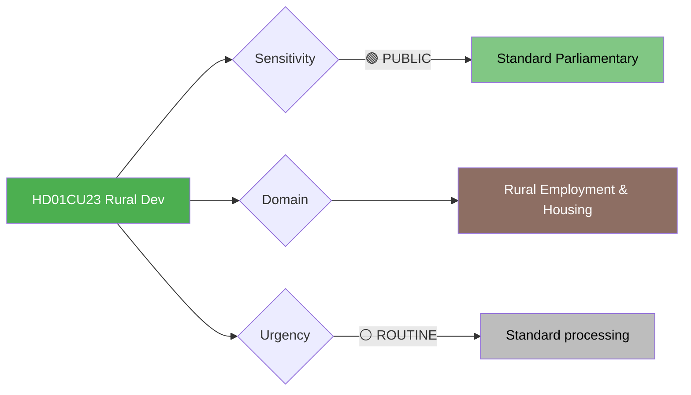

# Document Analysis: Sysselsättning och boende på landsbygden (CU23)

**Generated**: 2026-04-10 04:36 UTC (AI-enriched: 2026-04-13 06:16 UTC)
**dok_id**: HD01CU23
**Document Type**: committeeReports
**Committee**: CU (Civilutskottet — Civil Affairs Committee)
**Date**: 2026-04-09
**Author**: Civil Affairs Committee
**Party**: Cross-party
**Riksmöte**: 2025/26
**Significance**: 🟢 Low (3/10)
**Confidence**: MEDIUM (metadata-only analysis)
**Source MCP Tool**: get_betankanden
**Analyst**: news-committee-reports workflow

---

## 🎯 Executive Summary

The Civil Affairs Committee's betänkande CU23 on rural employment and housing addresses regional equity policy — a politically significant area for Centerpartiet (C) and Sverigedemokraterna (SD), whose voter bases include substantial rural constituencies. Rural depopulation remains a structural challenge in Sweden, with implications for service delivery, housing markets, and local democracy. CU23 likely reviews motions on rural employment support, housing accessibility, and measures to counter demographic decline outside metropolitan areas. While low on the national significance scale, rural policy carries disproportionate weight in constituency politics. **[MEDIUM confidence — committee jurisdiction and rural policy context]**

---

## 📊 Political Classification

## 5-Dimension Significance Scoring

| Dimension | Score (0-10) | Rationale |
|-----------|:---:|-----------|
| Parliamentary Impact | 3 | Regional policy report with moderate parliamentary weight |
| Policy Impact | 3 | Structural challenge but limited policy innovation expected |
| Public Interest | 4 | Directly affects rural communities |
| Urgency | 3 | Ongoing challenge, not acute |
| Cross-Party Significance | 4 | C's signature issue; SD rural base also concerned |
| **Total** | **17/50** | **Normalised: 3/10 — LOW** |

## SWOT Analysis

### Strengths
| # | Statement | Evidence | Confidence |
|---|-----------|----------|------------|
| S1 | Demonstrates parliamentary attention to regional balance | HD01CU23 (rural policy on legislative agenda) | MEDIUM |

### Weaknesses
| # | Statement | Evidence | Confidence |
|---|-----------|----------|------------|
| W1 | Rural employment measures may lack funding to address structural depopulation | HD01CU23 (budget constraints limit rural investment ambition) | LOW |

### Opportunities
| # | Statement | Evidence | Confidence |
|---|-----------|----------|------------|
| O1 | Remote work trends post-pandemic could support rural repopulation | HD01CU23 (structural shift in work patterns) | LOW |

## Stakeholder Impact

| Stakeholder | Impact | Analysis |
|-------------|--------|----------|
| Citizens (rural) | HIGH | Directly affects employment and housing in rural areas |
| Civil Society | HIGH | Local communities and associations affected |
| Opposition (C) | MEDIUM | Rural policy is C's signature platform; CU23 outcome matters |

## Election 2026 Implications

- **Electoral Impact**: 🟥LOW — rural policy rarely decisive nationally but matters in specific constituencies
- **Voter Salience**: Important for C and SD rural voter retention

## Forward Indicators

| Indicator | Trigger | Timeline |
|-----------|---------|----------|
| Municipal budget allocations for rural development | Implementation signal | Autumn 2026 |
| Net migration data for rural municipalities | Outcome indicator | Annual statistics |

## Data Quality Notes

- Analysis confidence: MEDIUM — rural policy dynamics well-understood from Swedish political context
