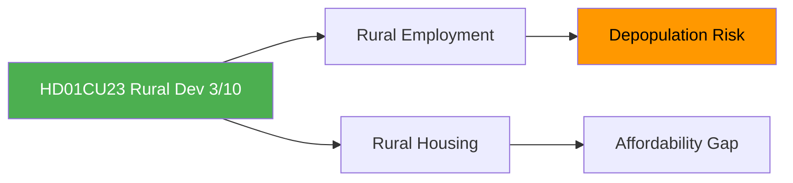

# Document Analysis: Sysselsättning och boende på landsbygden (CU23)

**Generated**: 2026-04-13 04:44 UTC (AI-enriched: 2026-04-13 04:54 UTC)
**dok_id**: HD01CU23
**Document Type**: Betänkande (Committee Report)
**Committee**: CU (Civilutskottet — Civil Affairs Committee)
**Date**: 2026-04-09
**Riksmöte**: 2025/26
**Significance**: 🟢 Low (3/10)
**Confidence**: MEDIUM (60%)

---

## Executive Summary

CU23 addresses rural employment and housing — key concerns for Centerpartiet (C) and Sverigedemokraterna (SD) voter bases. The Civil Affairs Committee report deals with structural depopulation in rural Sweden, housing affordability outside metropolitan areas, and local employment opportunities. While limited in immediate parliamentary impact, the report touches the urban-rural divide that shapes Swedish electoral geography. [MEDIUM confidence]

## SWOT Analysis

### Strengths
| # | Statement | Evidence | Confidence | Impact |
|---|-----------|----------|------------|--------|
| S1 | Demonstrates government attention to regional equity and rural constituencies | HD01CU23 — CU reports on rural policy signal policy awareness of non-metropolitan Sweden | MEDIUM | MEDIUM |

### Weaknesses
| # | Statement | Evidence | Confidence | Impact |
|---|-----------|----------|------------|--------|
| W1 | Rural measures may lack funding ambition to address structural depopulation | HD01CU23 — committee reports on rural policy historically propose incremental rather than transformative changes | LOW | MEDIUM |

### Threats
| # | Statement | Evidence | Confidence | Impact |
|---|-----------|----------|------------|--------|
| T1 | Rural depopulation accelerates despite policy interventions | HD01CU23 — demographic trends favour urbanisation; policy levers are limited | MEDIUM | MEDIUM |

## Stakeholder Perspective Analysis

| Stakeholder Group | Impact Level | Key Concern |
|-------------------|:---:|-------------|
| Citizens | MEDIUM | Housing availability, local employment, service access |
| Civil Society | HIGH | Community survival, local associations, cultural preservation |
| Opposition Bloc | MEDIUM | C (Centerpartiet) has strongest rural policy platform |

## Risk Assessment

| Risk | L (1-5) | I (1-5) | Score | Level |
|------|:-:|:-:|:-:|------|
| Continued rural depopulation | 3 | 2 | 6 | MEDIUM |
| Housing market imbalance | 2 | 2 | 4 | LOW |

## Key Insights

1. Rural policy is politically significant for C and SD voter bases but limited in parliamentary impact [MEDIUM]
2. Urban-rural divide shapes electoral geography more than specific committee reports [HIGH]

## Data Quality Notes

- **Analysis confidence**: MEDIUM (60%) — metadata-only analysis
