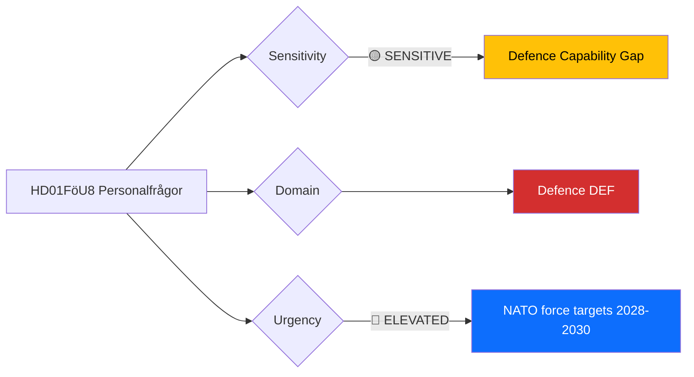

# Document Analysis: Personalfrågor (FöU8)

**Generated**: 2026-04-13 05:36 UTC
**dok_id**: HD01FöU8
**Document Type**: committeeReports (betänkande)
**Committee**: FöU (Försvarsutskottet — Defence Committee)
**Date**: 2026-04-09
**Riksmöte**: 2025/26
**Source MCP Tool**: get_betankanden
**Analysis Timestamp**: 2026-04-13 05:36 UTC
**Analyst**: news-committee-reports workflow (AI-enriched)

---

## 🎯 Executive Summary

FöU8 addresses defence personnel policy during Sweden's most significant military expansion since the Cold War. Post-NATO-accession, the Försvarsmakten faces critical recruitment and retention challenges as it scales from roughly 55,000 to targeted 90,000+ personnel by 2030. This betänkande from the Defence Committee likely examines conscription expansion, professional soldier retention incentives, and reserve force capacity — all areas where stated ambitions face practical constraints. The report connects directly to UU6 (security policy) as personnel capacity determines Sweden's credible NATO contribution. **[MEDIUM confidence — metadata analysis]**

---

## 📊 Political Classification

| Field | Assessment |
|-------|-----------|
| **Sensitivity Level** | SENSITIVE — defence capability assessment |
| **Primary Domain** | Defence (DEF) |
| **Urgency** | ELEVATED — NATO force contribution targets have near-term deadlines |
| **Significance Score** | 5/10 |
| **Confidence** | MEDIUM |

---

## 💪 SWOT Impact Assessment

### Strengths

| # | Statement | Evidence | Confidence | Impact |
|---|-----------|----------|------------|--------|
| S1 | Cross-party consensus on defence expansion need | HD01FöU8; broad agreement since 2020 total defence re-mobilisation | HIGH | MEDIUM |
| S2 | Conscription system provides scalable recruitment mechanism | HD01FöU8; värnplikt reintroduced 2017, expanding since | HIGH | MEDIUM |
| S3 | Government increased defence budget trajectory to 2% GDP | HD01FöU8; NATO commitment supports personnel funding | MEDIUM | HIGH |

### Weaknesses

| # | Statement | Evidence | Confidence | Impact |
|---|-----------|----------|------------|--------|
| W1 | Professional soldier retention rates below target due to private sector competition | HD01FöU8; defence personnel bottleneck widely reported | HIGH | HIGH |
| W2 | Training infrastructure capacity limits conscription throughput | HD01FöU8; expansion faster than facility construction | MEDIUM | MEDIUM |
| W3 | Reserve force activation readiness remains untested at scale | HD01FöU8; mobilisation exercise gaps | LOW | MEDIUM |

### Threats

| # | Statement | Evidence | Confidence | Impact |
|---|-----------|----------|------------|--------|
| T1 | Personnel shortfall delays NATO force contribution targets | HD01FöU8; 2028-2030 timeline pressure | MEDIUM | HIGH |
| T2 | Burnout in existing professional cadre from overstretch | HD01FöU8; operational tempo increase | MEDIUM | MEDIUM |

---

## ⚠️ Risk Assessment

| Risk | L (1-5) | I (1-5) | Score | Level |
|------|---------|---------|-------|-------|
| NATO force target miss due to personnel gap | 3 | 3 | 9 | MEDIUM |
| Professional soldier retention crisis | 3 | 3 | 9 | MEDIUM |
| Training infrastructure bottleneck | 2 | 2 | 4 | LOW |

---

## 👥 Stakeholder Impact

| Stakeholder | Impact | Key Concern |
|-------------|--------|-------------|
| Citizens | MEDIUM | Conscription expansion affects young adults directly |
| Government Coalition | MEDIUM | Defence delivery is a coalition strength |
| International/EU | HIGH | NATO interoperability depends on Swedish personnel levels |
| Business/Industry | MEDIUM | Defence industry workforce competition |

---

## 🔮 Forward Indicators

| Indicator | Trigger | Timeline | Confidence |
|-----------|---------|----------|------------|
| FöU requests supplementary defence budget allocation for personnel | Signals personnel crisis escalation | Spring 2026 budget process | MEDIUM |
| Försvarsmakten annual personnel report | Recruitment/retention data vs targets | Autumn 2026 | HIGH |
| NATO capability review of Swedish contributions | External validation of personnel readiness | 2026-2027 | MEDIUM |

---

## 🗳️ Election 2026 Implications

- **Electoral Impact**: Defence consensus limits partisan differentiation, but personnel shortfalls could embarrass government [LOW]
- **Coalition Scenarios**: Defence policy unlikely to be coalition-breaking issue [LOW]
- **Voter Salience**: Defence ranks high but voters trust all major parties on this issue [MEDIUM]
- **Policy Legacy**: Personnel capacity will constrain Sweden's NATO role for a decade [HIGH]

---

## Data Quality Notes

- **Analysis confidence**: MEDIUM — metadata-only, full-text unavailable
- **Cross-references**: HD01UU6 (security policy), NATO force generation timeline
