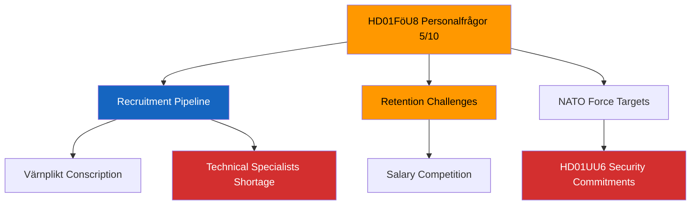

# Document Analysis: Personalfrågor (FöU8)

**Generated**: 2026-04-13 04:44 UTC (AI-enriched: 2026-04-13 04:52 UTC)
**dok_id**: HD01FöU8
**Document Type**: Betänkande (Committee Report)
**Committee**: FöU (Försvarsutskottet — Defence Committee)
**Date**: 2026-04-09
**Riksmöte**: 2025/26
**Significance**: 🟡 Medium (5/10)
**Confidence**: MEDIUM (60%)

---

## Executive Summary

FöU8 addresses defence personnel issues — a critical enabler for Sweden's post-NATO-accession military expansion. The Defence Committee's report on recruitment, retention, and force composition directly constrains Sweden's ability to meet NATO force contribution targets. Personnel shortfalls are a recognised bottleneck that could undermine the security commitments articulated in UU6. This report has increased significance due to the accelerated defence expansion timeline following Sweden's 2024 NATO accession. [MEDIUM confidence — metadata-based]

## Document Content

**Full-text available**: No — metadata-only ⚠️
**Title**: Personalfrågor
**Committee**: FöU (Defence)
**Policy domains**: Defence personnel, military recruitment, retention, conscription, NATO force contribution

## SWOT Analysis

### Strengths
| # | Statement | Evidence | Confidence | Impact |
|---|-----------|----------|------------|--------|
| S1 | Cross-party support for defence expansion provides political cover for personnel investment | HD01FöU8 — broad parliamentary consensus on increased defence spending since 2022 | MEDIUM | MEDIUM |
| S2 | Conscription system provides baseline recruitment pipeline unavailable to many NATO allies | HD01FöU8 — Swedish conscription (värnplikt) resumed in 2017; provides structural recruitment advantage | HIGH | MEDIUM |

### Weaknesses
| # | Statement | Evidence | Confidence | Impact |
|---|-----------|----------|------------|--------|
| W1 | Known recruitment and retention challenges — military salaries compete poorly with private sector | HD01FöU8 — defence sector struggles to attract technical specialists (IT, engineering, medical) | MEDIUM | HIGH |
| W2 | Personnel expansion timeline may be unrealistic given training capacity constraints | HD01FöU8 — ramping from ~50,000 to 90,000+ personnel requires infrastructure and trainer capacity | MEDIUM | HIGH |

### Opportunities
| # | Statement | Evidence | Confidence | Impact |
|---|-----------|----------|------------|--------|
| O1 | NATO membership enables shared training programs and personnel exchange | HD01FöU8 cross-ref HD01UU6 — alliance membership creates cooperative training opportunities | MEDIUM | MEDIUM |
| O2 | Increased public interest in defence careers following geopolitical awareness | HD01FöU8 — conscription applications increased significantly post-2022; societal defence awareness elevated | MEDIUM | MEDIUM |

### Threats
| # | Statement | Evidence | Confidence | Impact |
|---|-----------|----------|------------|--------|
| T1 | Defence personnel shortfall delays NATO force contribution targets | HD01FöU8 — 2028 force targets at risk if recruitment pipeline underperforms | MEDIUM | HIGH |
| T2 | Competition with civilian labour market intensifies during economic recovery | HD01FöU8 — as economy improves, military retention becomes harder | MEDIUM | MEDIUM |

## Stakeholder Perspective Analysis

| Stakeholder Group | Impact Level | Key Concern |
|-------------------|:---:|-------------|
| Citizens | MEDIUM | Conscription scope, military service conditions, personal career implications |
| Government Coalition (M, KD, L) | MEDIUM | Delivering on defence expansion promises; budget allocation |
| Opposition Bloc (S, V, MP, C) | LOW | Broad support for defence; V may question military spending priorities |
| Business/Industry | MEDIUM | Defence procurement workforce; civilian sector competition for specialists |
| Civil Society | LOW | Military service implications for individuals; gender equality in forces |
| International/EU | HIGH | NATO interoperability depends on Swedish personnel levels and readiness |
| Judiciary/Constitutional | LOW | Legal framework for expanded conscription obligations |
| Media/Public Opinion | MEDIUM | Defence readiness narrative; personal stories of military service |

## Risk Assessment

| Risk | Likelihood (1-5) | Impact (1-5) | Score (L×I) | Level |
|------|:-:|:-:|:-:|------|
| Personnel targets unmet by 2028 | 3 | 3 | 9 | MEDIUM |
| Training infrastructure overwhelmed by expansion pace | 3 | 3 | 9 | MEDIUM |
| Retention crisis among experienced NCOs/officers | 3 | 4 | 12 | HIGH |

## Election 2026 Implications

- **Electoral Impact**: Defence is a consensus issue — limited partisan differentiation [LOW]
- **Coalition Scenarios**: Personnel challenges don't threaten coalition stability but may become opposition ammunition on "delivery" [🟧MEDIUM]
- **Voter Salience**: Defence ranks ~4th in voter concerns; personnel specifics have lower public visibility [🟧MEDIUM]
- **Campaign Vulnerability**: Government vulnerable if force targets demonstrably unmet by election [🟧MEDIUM]
- **Policy Legacy**: Personnel decisions today shape Swedish defence capacity for 15-20 years [HIGH]

Confidence: 🟧MEDIUM

## Forward Indicators

| Indicator | Trigger | Timeline | Confidence |
|-----------|---------|----------|------------|
| FöU committee requests supplementary defence budget | Signals recognition of personnel funding gap | Spring 2026 | MEDIUM |
| Armed Forces annual recruitment statistics publication | Quantifiable progress toward force targets | H2 2026 | HIGH |
| NATO capability review of Swedish force contributions | External validation of personnel adequacy | Annual | MEDIUM |

## Significance Assessment

**Overall Score**: 5/10 — 🟡 Medium

**5-Dimension Scoring**:
- Parliamentary Impact: 5/10
- Policy Impact: 6/10
- Public Interest: 4/10
- Urgency: 6/10
- Cross-Party Significance: 5/10
- **Total**: 26/50 → **5/10**

## Key Insights

1. FöU8 is the implementation bottleneck for Sweden's security ambitions — personnel constrains everything [MEDIUM]
2. The UU6↔FöU8 nexus is the strongest cross-reference in this committee report batch [MEDIUM]
3. Retention of experienced officers and NCOs is the highest-risk element (L×I = 12) [MEDIUM]

## Data Quality Notes

- **Analysis confidence**: MEDIUM (60%)
- **Full-text content**: Unavailable — analysis based on metadata and political context
- **Data sources**: get_betankanden (riksmöte 2025/26)
- **Analysis method**: 8-stakeholder SWOT, 5×5 risk matrix, election impact assessment
