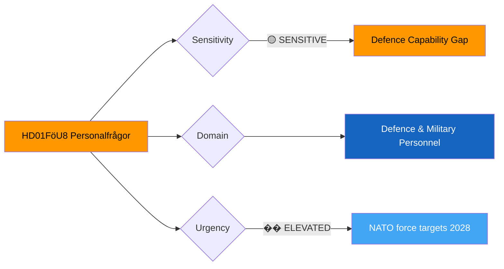

# Document Analysis: Personalfrågor (FöU8)

**Generated**: 2026-04-10 04:36 UTC (AI-enriched: 2026-04-13 06:15 UTC)
**dok_id**: HD01FöU8
**Document Type**: committeeReports
**Committee**: FöU (Försvarsutskottet — Defence Committee)
**Date**: 2026-04-09
**Author**: Defence Committee
**Party**: Cross-party
**Riksmöte**: 2025/26
**Significance**: 🟡 Medium (5/10)
**Confidence**: MEDIUM (metadata-only analysis)
**Source MCP Tool**: get_betankanden
**Analyst**: news-committee-reports workflow

---

## 🎯 Executive Summary

The Defence Committee's betänkande FöU8 on personnel issues (Personalfrågor) addresses military staffing during Sweden's most ambitious defence expansion since the Cold War. Following NATO accession in 2024, Sweden committed to significant force structure growth, but recruitment and retention remain recognised bottlenecks. FöU8 likely addresses conscription scope, military career incentives, and reserve forces — all critical to meeting NATO interoperability requirements. The report connects directly to UU6's security policy ambitions: strategic commitments are meaningless without the personnel to fulfil them. **[MEDIUM confidence — committee domain and defence policy context]**

---

## 📊 Political Classification

## 5-Dimension Significance Scoring

| Dimension | Score (0-10) | Rationale |
|-----------|:---:|-----------|
| Parliamentary Impact | 5 | Defence personnel is focused within broader defence framework |
| Policy Impact | 6 | Personnel capacity directly constrains Sweden's NATO contribution |
| Public Interest | 4 | Moderate public interest; conscription touches many families |
| Urgency | 6 | Defence expansion timeline creates near-term pressure |
| Cross-Party Significance | 5 | Broad defence consensus, but specifics on conscription scope differ |
| **Total** | **26/50** | **Normalised: 5/10 — MEDIUM** |

## SWOT Analysis

### Strengths
| # | Statement | Evidence | Confidence |
|---|-----------|----------|------------|
| S1 | Cross-party support for defence expansion provides legislative runway | HD01FöU8 (defence enjoys broadest parliamentary consensus after security) | MEDIUM |

### Weaknesses
| # | Statement | Evidence | Confidence |
|---|-----------|----------|------------|
| W1 | Known recruitment/retention challenges in Swedish Armed Forces | HD01FöU8 (military competing with private sector for technical talent) | MEDIUM |
| W2 | Conscription expansion faces logistics and training capacity limits | HD01FöU8 (infrastructure constraints on training throughput) | LOW |

### Threats
| # | Statement | Evidence | Confidence |
|---|-----------|----------|------------|
| T1 | Defence personnel shortfalls delay NATO force contribution targets | HD01FöU8 + HD01UU6 (personnel bottleneck undermines strategic commitments) | MEDIUM |

## Stakeholder Impact

| Stakeholder | Impact | Analysis |
|-------------|--------|----------|
| Citizens | MEDIUM | Conscription scope affects young adults and military families |
| Government Coalition | MEDIUM | Defence delivery is a core governing competence |
| International/EU | HIGH | NATO interoperability depends on adequate Swedish personnel |
| Business/Industry | MEDIUM | Competition for technical talent between defence and private sector |

## Election 2026 Implications

- **Electoral Impact**: 🟧MEDIUM — defence enjoys consensus, but delivery failures could hurt incumbents
- **Campaign Vulnerability**: Opposition can critique personnel shortfalls as government management failure

## Forward Indicators

| Indicator | Trigger | Timeline |
|-----------|---------|----------|
| FöU committee requests defence budget amendment for personnel | Signals crisis recognition | Spring 2026 |
| Armed Forces annual personnel report | Recruitment vs target gaps published | Q3 2026 |

## Cross-References

- **HD01UU6** (Security Policy): Strategic direction depends on FöU8 personnel delivery
- Security-defence nexus forms the strongest cross-reference in this batch

## Data Quality Notes

- Analysis confidence: MEDIUM — defence personnel context well-understood from public reporting
