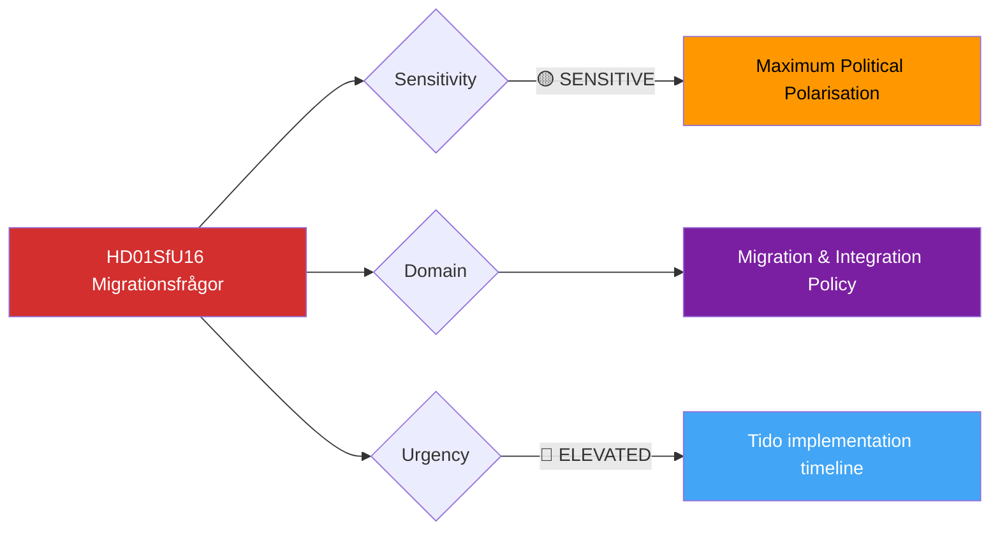

# Document Analysis: Migrationsfrågor (SfU16)

**Generated**: 2026-04-10 04:36 UTC (AI-enriched: 2026-04-13 06:15 UTC)
**dok_id**: HD01SfU16
**Document Type**: committeeReports
**Committee**: SfU (Socialförsäkringsutskottet — Social Insurance Committee)
**Date**: 2026-04-09
**Author**: Social Insurance Committee
**Party**: Cross-party
**Riksmöte**: 2025/26
**Significance**: 🟠 High (6/10)
**Confidence**: MEDIUM (metadata-only analysis)
**Source MCP Tool**: get_betankanden
**Analyst**: news-committee-reports workflow

---

## 🎯 Executive Summary

The Social Insurance Committee's betänkande SfU16 on migration issues (Migrationsfrågor) is the most politically divisive report in this batch. Migration policy remains the defining cleavage in Swedish politics since 2015, and the Tido Agreement between M, KD, L, and SD placed migration restriction at the centre of coalition governance. SfU16 committee reports consistently generate the highest number of party reservations in the Riksdag, reflecting maximum polarisation between the government bloc (pursuing restriction) and opposition parties S, V, MP, and C (defending humanitarian obligations). This report likely addresses ongoing implementation of Tido Agreement migration provisions and faces potential EU legal scrutiny. **[MEDIUM confidence — committee assignment and political context]**

---

## 📊 Political Classification

- **Sensitivity**: 🟡 SENSITIVE — maximum political polarisation, human rights implications
- **Domain**: Migration & Integration Policy (SfU committee jurisdiction)
- **Urgency**: 🔵 ELEVATED — ongoing Tido Agreement implementation

## 5-Dimension Significance Scoring

| Dimension | Score (0-10) | Rationale |
|-----------|:---:|-----------|
| Parliamentary Impact | 6 | Migration reports consistently generate extensive reservations |
| Policy Impact | 7 | Migration policy reshapes demographics, labour market, and public services |
| Public Interest | 8 | Migration is consistently top voter concern in Swedish surveys |
| Urgency | 5 | Ongoing policy implementation rather than crisis response |
| Cross-Party Significance | 7 | Maximum political polarisation; clear government vs opposition split |
| **Total** | **33/50** | **Normalised: 6/10 — HIGH** |

## SWOT Analysis

### Strengths
| # | Statement | Evidence | Confidence |
|---|-----------|----------|------------|
| S1 | Tido Agreement provides structured framework for migration policy implementation | HD01SfU16 (M-KD-L-SD agreement establishes clear policy direction) | HIGH |
| S2 | Government coalition united on migration restriction direction | HD01SfU16 (SD's primary policy demand fulfilled through Tido) | MEDIUM |

### Weaknesses
| # | Statement | Evidence | Confidence |
|---|-----------|----------|------------|
| W1 | Opposition parties (S, V, MP, C) will file strong reservations | HD01SfU16 (migration is the primary attack vector for opposition) | HIGH |
| W2 | EU legal framework constrains national migration policy autonomy | HD01SfU16 (Tido measures may face ECHR/EU Court challenges) | MEDIUM |

### Opportunities
| # | Statement | Evidence | Confidence |
|---|-----------|----------|------------|
| O1 | Stricter migration framework could reduce asylum costs, freeing fiscal space | HD01SfU16 (fiscal argument is central to government case) | LOW |

### Threats
| # | Statement | Evidence | Confidence |
|---|-----------|----------|------------|
| T1 | EU/ECHR legal challenges to migration restrictions | HD01SfU16 (several Tido measures test EU legal boundaries) | MEDIUM |
| T2 | Labour market shortages in sectors dependent on migration | HD01SfU16 (healthcare, agriculture, construction face staffing challenges) | MEDIUM |

## Stakeholder Impact

| Stakeholder | Impact | Analysis |
|-------------|--------|----------|
| Citizens | HIGH | Migration policy shapes community integration and public service demand |
| Government Coalition | HIGH | Migration restriction is the Tido Agreement centrepiece |
| Opposition (S, V, MP, C) | HIGH | Primary attack vector — extensive reservations expected |
| Business/Industry | MEDIUM | Labour supply concerns in migration-dependent sectors |
| Civil Society | HIGH | NGOs and humanitarian organisations directly affected |
| Judiciary/Constitutional | HIGH | EU legal compliance and human rights scrutiny |
| International/EU | HIGH | EU institutions monitoring Swedish migration policy |
| Media/Public Opinion | HIGH | Migration is consistently the most covered political topic |

## Election 2026 Implications

- **Electoral Impact**: 🟩HIGH — migration remains the #1 issue for SD and top-3 for all parties
- **Coalition Scenarios**: Migration policy is the glue holding the Tido coalition together
- **Voter Salience**: Highest of any policy area — drives swing voters between blocs
- **Campaign Vulnerability**: Government must show results; opposition must offer credible alternative

## Forward Indicators

| Indicator | Trigger | Timeline |
|-----------|---------|----------|
| SfU16 reservation count | If exceeds 10 reservations, signals deep opposition mobilisation | At publication |
| EU Commission statement on Swedish migration measures | External legal pressure indicator | 1-3 months |
| SD voter satisfaction polling on migration delivery | Coalition stability barometer | Ongoing |

## Cross-References

- No direct cross-references in this batch, but migration policy intersects with CU23 (rural employment depends on labour mobility)

## Data Quality Notes

- Analysis confidence: MEDIUM — based on committee jurisdiction and political context
- Full-text unavailable — would enable specific policy provision analysis
