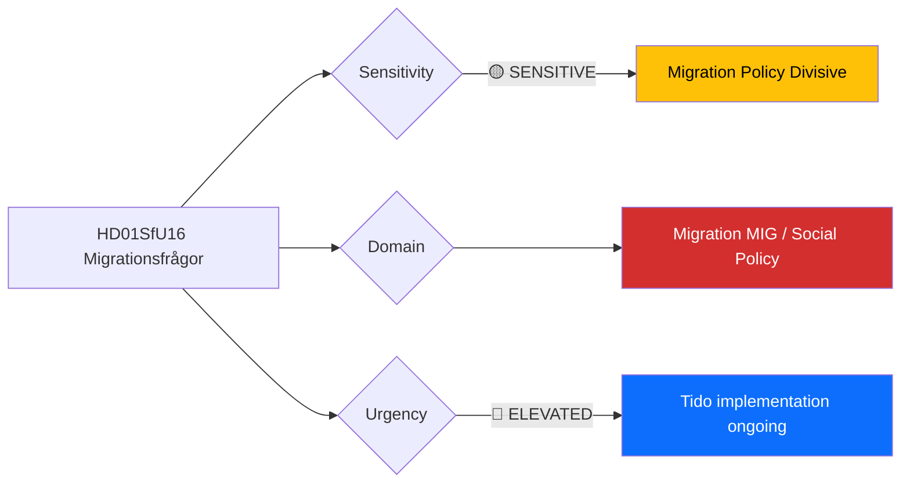

# Document Analysis: Migrationsfrågor (SfU16)

**Generated**: 2026-04-13 05:36 UTC
**dok_id**: HD01SfU16
**Document Type**: committeeReports (betänkande)
**Committee**: SfU (Socialförsäkringsutskottet — Social Insurance Committee)
**Date**: 2026-04-09
**Riksmöte**: 2025/26
**Source MCP Tool**: get_betankanden
**Analysis Timestamp**: 2026-04-13 05:36 UTC
**Analyst**: news-committee-reports workflow (AI-enriched)

---

## 🎯 Executive Summary

SfU16 on migration policy is the most politically divisive report in this batch (6/10 significance), addressing Sweden's most polarising policy domain. The Tido Agreement between M, KD, L, and SD placed migration restriction at the coalition's ideological centre. This committee report likely reflects the ongoing tightening of asylum, family reunification, and labour migration rules — generating sharp opposition reservations from S, V, MP, and C. Migration policy's role as the defining political cleavage since the 2015 crisis makes any SfU migration betänkande a focal point for partisan conflict and media attention. **[MEDIUM confidence — metadata analysis]**

---

## 📊 Political Classification

| Field | Assessment |
|-------|-----------|
| **Sensitivity Level** | SENSITIVE — high public salience, strong partisan division |
| **Primary Domain** | Migration (MIG) |
| **Urgency** | ELEVATED — Tido Agreement implementation is active |
| **Significance Score** | 6/10 |
| **Confidence** | MEDIUM |

---

## 💪 SWOT Impact Assessment

### Strengths

| # | Statement | Evidence | Confidence | Impact |
|---|-----------|----------|------------|--------|
| S1 | Tido Agreement provides government with structured policy framework and SD support guarantee | HD01SfU16; coalition agreement centrepiece | HIGH | HIGH |
| S2 | Public opinion majority supports reduced immigration volumes | HD01SfU16; SOM/Novus polling trends 2023-2026 | HIGH | HIGH |
| S3 | SfU committee composition reflects government majority including SD votes | HD01SfU16; parliamentary arithmetic | HIGH | MEDIUM |

### Weaknesses

| # | Statement | Evidence | Confidence | Impact |
|---|-----------|----------|------------|--------|
| W1 | Deep opposition polarisation — S, V, MP, C will file extensive reservations | HD01SfU16; migration committee reports historically generate 10+ reservations | HIGH | HIGH |
| W2 | Labour market integration outcomes remain weak despite restrictive policy framing | HD01SfU16; structural integration challenges persist | MEDIUM | HIGH |
| W3 | International reputation cost from restrictive migration stance | HD01SfU16; UNHCR and EU Commission criticism | MEDIUM | MEDIUM |

### Opportunities

| # | Statement | Evidence | Confidence | Impact |
|---|-----------|----------|------------|--------|
| O1 | Reduced asylum costs could free fiscal space for integration measures | HD01SfU16; budget reallocation potential | LOW | MEDIUM |
| O2 | EU-wide migration policy harmonisation could reduce Sweden-specific pressure | HD01SfU16; EU Migration Pact implementation 2026 | MEDIUM | MEDIUM |

### Threats

| # | Statement | Evidence | Confidence | Impact |
|---|-----------|----------|------------|--------|
| T1 | ECHR or EU Court legal challenges to specific Tido Agreement migration measures | HD01SfU16; EU legal boundary testing | MEDIUM | HIGH |
| T2 | SD demands further restrictions beyond current coalition agreement scope | HD01SfU16; SD's electoral incentive to push boundaries | MEDIUM | MEDIUM |
| T3 | Demographic labour shortfall if migration restrictions reduce workforce pipeline | HD01SfU16; ageing population context | LOW | HIGH |

---

## ⚠️ Risk Assessment

| Risk | L (1-5) | I (1-5) | Score | Level |
|------|---------|---------|-------|-------|
| EU legal challenge to migration restrictions | 3 | 3 | 9 | MEDIUM |
| SD pushes beyond Tido Agreement scope | 2 | 3 | 6 | MEDIUM |
| Demographic labour shortfall from reduced migration | 2 | 4 | 8 | MEDIUM |
| Opposition reservation tsunami dominates media narrative | 4 | 2 | 8 | MEDIUM |

---

## 👥 Stakeholder Impact

| Stakeholder | Impact | Key Concern |
|-------------|--------|-------------|
| Citizens | HIGH | Community integration, public service demand, safety perceptions |
| Government Coalition | HIGH | Migration is coalition glue — delivery essential for SD support |
| Opposition (S, V, MP, C) | HIGH | Primary political attack vector; human rights framing |
| Judiciary/Constitutional | HIGH | Legal challenges to restrictive measures |
| Civil Society | HIGH | NGOs, religious organisations affected by policy changes |
| International/EU | HIGH | EU compliance, UNHCR scrutiny, Nordic reputation |
| Business/Industry | MEDIUM | Labour market access, workforce pipeline concerns |
| Media/Public Opinion | HIGH | Migration consistently top media topic |

---

## 🔮 Forward Indicators

| Indicator | Trigger | Timeline | Confidence |
|-----------|---------|----------|------------|
| Reservation count in SfU16 exceeds 10 | Signals deep opposition mobilisation | At publication | HIGH |
| EU Commission infringement proceedings | Legal challenge to specific Swedish migration measures | Q3-Q4 2026 | LOW |
| SD public demand for additional migration restrictions | Coalition stress indicator | Pre-election period | MEDIUM |
| S (Socialdemokraterna) presents counter-migration policy | Opposition alternative signals election positioning | Spring-Summer 2026 | MEDIUM |

---

## 🗳️ Election 2026 Implications

- **Electoral Impact**: Migration is SD's strongest electoral driver — government delivery strengthens SD's claim of influence [HIGH]
- **Coalition Scenarios**: Post-2026 coalition formation likely hinges on migration policy positions [HIGH]
- **Voter Salience**: Migration consistently ranks top-2 in Swedish voter priorities; SfU16 feeds this narrative [HIGH]
- **Campaign Vulnerability**: Government vulnerable if integration outcomes worsen despite restrictions; opposition vulnerable if voters want continued restriction [MEDIUM]
- **Policy Legacy**: Tido Agreement migration framework may prove difficult to reverse regardless of 2026 election outcome [MEDIUM]

---

## Data Quality Notes

- **Analysis confidence**: MEDIUM — metadata-only, full-text unavailable
- **Data sources**: get_betankanden (2025/26)
- **Cross-references**: Tido Agreement text, SOM Institute polling, EU Migration Pact context
