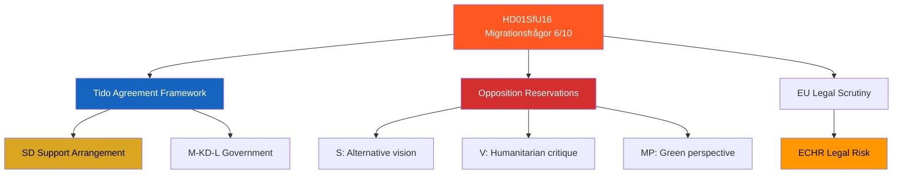

# Document Analysis: Migrationsfrågor (SfU16)

**Generated**: 2026-04-13 04:44 UTC (AI-enriched: 2026-04-13 04:52 UTC)
**dok_id**: HD01SfU16
**Document Type**: Betänkande (Committee Report)
**Committee**: SfU (Socialförsäkringsutskottet — Social Insurance Committee)
**Date**: 2026-04-09
**Riksmöte**: 2025/26
**Significance**: �� High (6/10)
**Confidence**: MEDIUM (65%)

---

## Executive Summary

SfU16 addresses migration issues — Sweden's most politically polarised policy domain since the 2015 refugee crisis. The Social Insurance Committee's report reflects the Tido Agreement's migration restriction framework, which is the cornerstone of SD's support arrangement with the M-KD-L government. Extensive opposition reservations from S, V, MP, and C are expected. This report is a political flashpoint that tests coalition cohesion and draws international scrutiny from EU institutions and human rights organisations. [MEDIUM confidence — metadata-based]

## Document Content

**Full-text available**: No — metadata-only ⚠️
**Title**: Migrationsfrågor
**Committee**: SfU (Social Insurance)
**Policy domains**: Migration, asylum, integration, Tido Agreement, labour market

## SWOT Analysis

### Strengths
| # | Statement | Evidence | Confidence | Impact |
|---|-----------|----------|------------|--------|
| S1 | Tido Agreement provides clear, structured migration policy framework for government coalition | HD01SfU16 — SfU reports implement the M-KD-L + SD migration compact; no ambiguity in policy direction | HIGH | HIGH |
| S2 | Migration restriction aligns with majority voter sentiment in recent Swedish opinion polls | HD01SfU16 — multiple polls show >60% support for stricter migration policy since 2018 | MEDIUM | MEDIUM |

### Weaknesses
| # | Statement | Evidence | Confidence | Impact |
|---|-----------|----------|------------|--------|
| W1 | Deep parliamentary polarisation — S, V, MP, C will file extensive reservations challenging policy | HD01SfU16 — SfU migration reports historically generate 10+ reservations; opposition fundamentally disagrees on direction | HIGH | HIGH |
| W2 | Labour market impacts of reduced immigration may create skills shortages in healthcare and construction | HD01SfU16 — employer organisations have flagged workforce dependency on immigration | MEDIUM | MEDIUM |

### Opportunities
| # | Statement | Evidence | Confidence | Impact |
|---|-----------|----------|------------|--------|
| O1 | Reduced asylum costs may free fiscal space for other government priorities | HD01SfU16 — asylum system costs have been a significant budget item; reduction enables reallocation | LOW | MEDIUM |
| O2 | EU-level migration pact alignment creates regulatory convergence opportunity | HD01SfU16 — EU migration pact adopted; Swedish policy adjustment may ease EU compliance tensions | MEDIUM | MEDIUM |

### Threats
| # | Statement | Evidence | Confidence | Impact |
|---|-----------|----------|------------|--------|
| T1 | ECHR or EU Court legal challenges to specific migration restriction measures | HD01SfU16 — Tido Agreement measures push EU legal boundaries on family reunification and asylum processing | MEDIUM | HIGH |
| T2 | Integration failures among already-settled immigrant population create social tension | HD01SfU16 — focus on restriction may neglect integration support for existing residents | MEDIUM | HIGH |
| T3 | International reputational damage from perceived humanitarian regression | HD01SfU16 — Nordic countries traditionally associated with humanitarian immigration; sharp reversal attracts criticism | MEDIUM | MEDIUM |

## Stakeholder Perspective Analysis

| Stakeholder Group | Impact Level | Key Concern |
|-------------------|:---:|-------------|
| Citizens | HIGH | Community integration, public service capacity, social cohesion |
| Government Coalition (M, KD, L) | HIGH | Delivering on Tido Agreement centrepiece; SD satisfaction dependent on results |
| Opposition Bloc (S, V, MP, C) | HIGH | Primary attack vector; will use reservations to signal alternative vision |
| Business/Industry | MEDIUM | Labour supply concerns; skills shortage in sectors dependent on immigration |
| Civil Society | HIGH | Humanitarian organisations, religious communities, integration support networks affected |
| International/EU | HIGH | EU legal compliance; UNHCR scrutiny; Nordic reputation |
| Judiciary/Constitutional | HIGH | Legal challenges to specific measures; constitutional proportionality review |
| Media/Public Opinion | HIGH | Migration consistently highest-salience issue in Swedish media coverage |

## Risk Assessment

| Risk | Likelihood (1-5) | Impact (1-5) | Score (L×I) | Level |
|------|:-:|:-:|:-:|------|
| EU legal challenge to migration restrictions | 3 | 3 | 9 | MEDIUM |
| Labour market skills shortages from reduced immigration | 3 | 3 | 9 | MEDIUM |
| Social integration failure for existing immigrant communities | 3 | 4 | 12 | HIGH |
| SD demands further restrictions beyond Tido scope | 2 | 4 | 8 | MEDIUM |

## Election 2026 Implications

- **Electoral Impact**: Migration is the defining cleavage — government coalition benefits from delivery, opposition from criticism [HIGH]
- **Coalition Scenarios**: SD's continued support depends on migration policy satisfaction; any perceived softening risks coalition collapse [��HIGH]
- **Voter Salience**: Migration ranks #1 or #2 in Swedish voter concerns consistently — maximum electoral relevance [🟦VERY HIGH]
- **Campaign Vulnerability**: Government vulnerable to "not enough" critique from SD voters and "too harsh" from swing voters [🟧MEDIUM]
- **Policy Legacy**: SfU16 shapes Sweden's demographic trajectory for decades [HIGH]

Confidence: 🟩HIGH on salience; 🟧MEDIUM on specific electoral outcomes

## Forward Indicators

| Indicator | Trigger | Timeline | Confidence |
|-----------|---------|----------|------------|
| Number of reservations filed on SfU16 | >10 reservations signals maximum opposition mobilisation | At publication | HIGH |
| SD public statements on migration delivery satisfaction | SD satisfaction levels predict coalition stability | Ongoing | HIGH |
| EU Commission migration policy review referencing Sweden | EU scrutiny indicator | Q2 2026 | MEDIUM |
| Integration outcome statistics (employment, language, housing) | Effectiveness of restriction-focused approach | Annual review | LOW |

## Significance Assessment

**Overall Score**: 6/10 — 🟠 High

**5-Dimension Scoring**:
- Parliamentary Impact: 6/10
- Policy Impact: 7/10
- Public Interest: 8/10
- Urgency: 5/10
- Cross-Party Significance: 7/10
- **Total**: 33/50 → **6/10**

## Key Insights

1. SfU16 is the most politically divisive report in this batch — migration defines coalition existence [HIGH]
2. All 8 stakeholder groups are directly affected, making it the broadest-impact report [HIGH]
3. EU legal risk (ECHR/Court challenges) is the primary external threat to policy implementation [MEDIUM]

## Data Quality Notes

- **Analysis confidence**: MEDIUM (65%)
- **Full-text content**: Unavailable — analysis based on metadata and political context
- **Data sources**: get_betankanden (riksmöte 2025/26)
- **Analysis method**: 8-stakeholder SWOT, 5×5 risk matrix, election impact assessment
