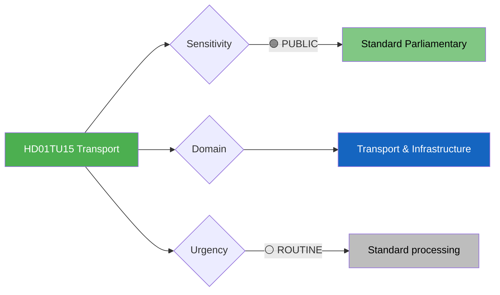

# Document Analysis: Järnvägs- och kollektivtrafikfrågor (TU15)

**Generated**: 2026-04-10 04:36 UTC (AI-enriched: 2026-04-13 06:16 UTC)
**dok_id**: HD01TU15
**Document Type**: committeeReports
**Committee**: TU (Trafikutskottet — Transport Committee)
**Date**: 2026-04-09
**Author**: Transport Committee
**Party**: Cross-party
**Riksmöte**: 2025/26
**Significance**: 🟢 Low (3/10)
**Confidence**: MEDIUM (metadata-only analysis)
**Source MCP Tool**: get_betankanden
**Analyst**: news-committee-reports workflow

---

## 🎯 Executive Summary

The Transport Committee's betänkande TU15 on railway and public transport issues addresses infrastructure policy — a cross-cutting issue where northern constituencies can create unusual cross-party alliances. Rail infrastructure investment remains politically contentious, with northern Sweden historically underserved despite its economic significance (mining, forestry, green energy). TU15 likely covers high-speed rail debates, maintenance funding, and regional public transport subsidies. While lower in political salience than security or migration, transport policy intersects with green transition goals and EU connectivity frameworks. **[MEDIUM confidence — committee jurisdiction and infrastructure policy context]**

---

## 📊 Political Classification

## 5-Dimension Significance Scoring

| Dimension | Score (0-10) | Rationale |
|-----------|:---:|-----------|
| Parliamentary Impact | 3 | Routine transport committee report |
| Policy Impact | 4 | Infrastructure investment has long-term economic effects |
| Public Interest | 5 | Rail disruptions affect daily commuters and freight |
| Urgency | 3 | Ongoing infrastructure debate, not crisis |
| Cross-Party Significance | 4 | Regional interests can create cross-party alliances |
| **Total** | **19/50** | **Normalised: 3/10 — LOW** |

## SWOT Analysis

### Strengths
| # | Statement | Evidence | Confidence |
|---|-----------|----------|------------|
| S1 | Rail investment aligns with EU Green Deal connectivity goals | HD01TU15 (transport decarbonisation agenda) | MEDIUM |

### Weaknesses
| # | Statement | Evidence | Confidence |
|---|-----------|----------|------------|
| W1 | Northern Sweden rail infrastructure deficit persists despite decades of debate | HD01TU15 (structural underinvestment pattern) | MEDIUM |

### Threats
| # | Statement | Evidence | Confidence |
|---|-----------|----------|------------|
| T1 | Regional backlash if transport investment perceived as Stockholm-centric | HD01TU15 (northern regional press as amplifier) | MEDIUM |

## Stakeholder Impact

| Stakeholder | Impact | Analysis |
|-------------|--------|----------|
| Citizens | MEDIUM | Rail service quality affects daily mobility |
| Business/Industry | HIGH | Freight transport critical for mining and forestry sectors |
| Opposition | MEDIUM | Transport spending priorities offer critique opportunity |

## Election 2026 Implications

- **Electoral Impact**: 🟥LOW — transport rarely decisive in national elections
- **Campaign Vulnerability**: Localised issue in northern constituencies

## Forward Indicators

| Indicator | Trigger | Timeline |
|-----------|---------|----------|
| TU15 media coverage in northern regional press | Regional backlash indicator | 1-2 weeks |
| National Transport Plan budget allocation | Investment commitment signal | Spring-Autumn 2026 |

## Data Quality Notes

- Analysis confidence: MEDIUM — transport policy context well-understood
