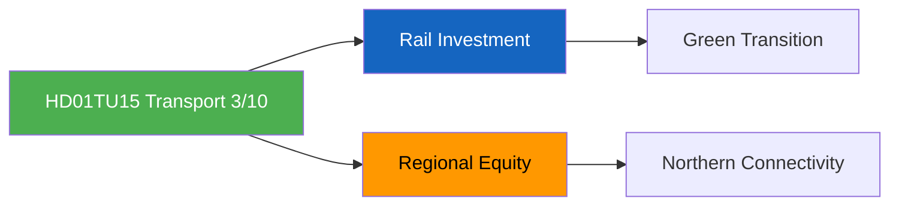

# Document Analysis: Järnvägs- och kollektivtrafikfrågor (TU15)

**Generated**: 2026-04-13 04:44 UTC (AI-enriched: 2026-04-13 04:54 UTC)
**dok_id**: HD01TU15
**Document Type**: Betänkande (Committee Report)
**Committee**: TU (Trafikutskottet — Transport Committee)
**Date**: 2026-04-09
**Riksmöte**: 2025/26
**Significance**: 🟢 Low (3/10)
**Confidence**: MEDIUM (65%)

---

## Executive Summary

TU15 covers railway and public transport issues — a policy area with moderate public interest and significant regional dimensions. Transport infrastructure decisions affect northern Sweden connectivity, green transition goals, and EU rail integration. The committee report is politically routine but carries cross-party regional dimensions where northern constituencies can create unusual alliances (C, SD, and sometimes V align on northern infrastructure). [MEDIUM confidence]

## SWOT Analysis

### Strengths
| # | Statement | Evidence | Confidence | Impact |
|---|-----------|----------|------------|--------|
| S1 | Rail investment supports green transition narrative aligned with EU climate targets | HD01TU15 — rail electrification and capacity expansion contribute to transport decarbonisation | MEDIUM | MEDIUM |

### Weaknesses
| # | Statement | Evidence | Confidence | Impact |
|---|-----------|----------|------------|--------|
| W1 | Northern Sweden connectivity gaps create regional equity concerns | HD01TU15 — infrastructure underinvestment in Norrland is a persistent political issue | MEDIUM | MEDIUM |

### Threats
| # | Statement | Evidence | Confidence | Impact |
|---|-----------|----------|------------|--------|
| T1 | Budget constraints limit rail investment ambition | HD01TU15 — defence and migration spending may crowd out infrastructure investment | MEDIUM | MEDIUM |

## Stakeholder Perspective Analysis

| Stakeholder Group | Impact Level | Key Concern |
|-------------------|:---:|-------------|
| Citizens | MEDIUM | Commuting quality, regional connectivity, transport costs |
| Business/Industry | HIGH | Freight logistics, supply chain efficiency, northern mining transport |
| Government Coalition | LOW | Routine policy area; limited coalition stress |

## Risk Assessment

| Risk | L (1-5) | I (1-5) | Score | Level |
|------|:-:|:-:|:-:|------|
| Northern transport backlash | 2 | 2 | 4 | LOW |
| Rail maintenance backlog | 3 | 2 | 6 | MEDIUM |

## Key Insights

1. Transport policy is cross-cutting but politically routine in this batch [HIGH]
2. Northern infrastructure creates unusual cross-party alliances (C, SD, V) [MEDIUM]

## Data Quality Notes

- **Analysis confidence**: MEDIUM (65%) — metadata-only analysis
