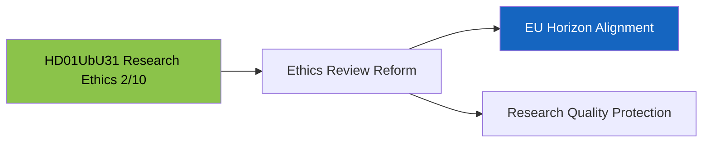

# Document Analysis: Undantag från etikgodkännande för forskning (UbU31)

**Generated**: 2026-04-13 04:44 UTC (AI-enriched: 2026-04-13 04:54 UTC)
**dok_id**: HD01UbU31
**Document Type**: Betänkande (Committee Report)
**Committee**: UbU (Utbildningsutskottet — Education Committee)
**Date**: 2026-04-09
**Riksmöte**: 2025/26
**Significance**: 🟢 Low (2/10)
**Confidence**: MEDIUM (65%)

---

## Executive Summary

UbU31 addresses research ethics exemptions and regulatory reform of the Ethics Review Act (etikprövningslagen). This is a technical regulatory amendment with low political salience but relevance for Sweden's research competitiveness and EU Horizon funding eligibility. The report likely enjoys broad parliamentary consensus as research regulation rarely generates partisan divisions. [MEDIUM confidence]

## SWOT Analysis

### Strengths
| # | Statement | Evidence | Confidence | Impact |
|---|-----------|----------|------------|--------|
| S1 | Regulatory modernisation positions Sweden for EU research funding competitiveness | HD01UbU31 — streamlined ethics review could accelerate Swedish research projects | MEDIUM | LOW |

### Opportunities
| # | Statement | Evidence | Confidence | Impact |
|---|-----------|----------|------------|--------|
| O1 | EU Horizon Europe alignment through regulatory harmonisation | HD01UbU31 — EU research frameworks require compatible ethics review processes | MEDIUM | LOW |

### Threats
| # | Statement | Evidence | Confidence | Impact |
|---|-----------|----------|------------|--------|
| T1 | Ethics exemptions could create regulatory gaps if poorly calibrated | HD01UbU31 — exemptions from ethics review require careful scope definition | LOW | LOW |

## Stakeholder Perspective Analysis

| Stakeholder Group | Impact Level | Key Concern |
|-------------------|:---:|-------------|
| International/EU | MEDIUM | EU regulatory alignment, research cooperation |
| Civil Society | MEDIUM | Research ethics protection, patient/subject rights |
| Business/Industry | MEDIUM | Pharmaceutical and biotech research facilitation |

## Risk Assessment

| Risk | L (1-5) | I (1-5) | Score | Level |
|------|:-:|:-:|:-:|------|
| Research ethics regulatory gap | 1 | 2 | 2 | LOW |

## Key Insights

1. Lowest political significance in this batch — technical regulatory reform with consensus [HIGH]
2. Relevant for Sweden's international research competitiveness but not a political flashpoint [HIGH]

## Data Quality Notes

- **Analysis confidence**: MEDIUM (65%) — metadata-only analysis
