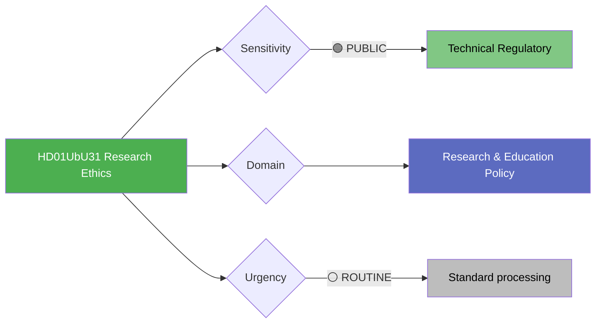

# Document Analysis: Undantag från kravet på etikgodkännande (UbU31)

**Generated**: 2026-04-10 04:36 UTC (AI-enriched: 2026-04-13 06:16 UTC)
**dok_id**: HD01UbU31
**Document Type**: committeeReports
**Committee**: UbU (Utbildningsutskottet — Education Committee)
**Date**: 2026-04-09
**Author**: Education Committee
**Party**: Cross-party
**Riksmöte**: 2025/26
**Significance**: 🟢 Low (2/10)
**Confidence**: MEDIUM (metadata-only analysis)
**Source MCP Tool**: get_betankanden
**Analyst**: news-committee-reports workflow

---

## 🎯 Executive Summary

The Education Committee's betänkande UbU31 on research ethics exemptions addresses a technical regulatory reform — specifically, exceptions to ethics approval requirements for certain research and oversight regulation in the Ethical Review Act (etikprövningslagen). This is the lowest political salience report in the batch, but relevant for Sweden's research competitiveness and EU Horizon funding alignment. The reform likely aims to reduce bureaucratic burden on low-risk research while maintaining research subject protections. Cross-party consensus is expected given the technical nature of the reform. **[MEDIUM confidence — committee jurisdiction and regulatory reform context]**

---

## 📊 Political Classification

## 5-Dimension Significance Scoring

| Dimension | Score (0-10) | Rationale |
|-----------|:---:|-----------|
| Parliamentary Impact | 2 | Technical committee report with minimal debate expected |
| Policy Impact | 3 | Research regulatory efficiency has long-term competitiveness effects |
| Public Interest | 2 | Limited public interest in ethics regulation details |
| Urgency | 2 | No time pressure |
| Cross-Party Significance | 2 | Broad consensus expected on technical reform |
| **Total** | **11/50** | **Normalised: 2/10 — LOW** |

## SWOT Analysis

### Strengths
| # | Statement | Evidence | Confidence |
|---|-----------|----------|------------|
| S1 | Regulatory modernisation signals commitment to research competitiveness | HD01UbU31 (reducing bureaucratic burden on low-risk research) | MEDIUM |

### Opportunities
| # | Statement | Evidence | Confidence |
|---|-----------|----------|------------|
| O1 | Aligns with EU Horizon Europe programme requirements | HD01UbU31 (international regulatory harmonisation) | MEDIUM |

## Stakeholder Impact

| Stakeholder | Impact | Analysis |
|-------------|--------|----------|
| International/EU | MEDIUM | Research competitiveness and Horizon funding alignment |
| Business/Industry | MEDIUM | Pharmaceutical and biotech sector regulatory environment |
| Citizens | LOW | Minimal direct impact on general public |

## Election 2026 Implications

- **Electoral Impact**: ⬛VERY LOW — no electoral relevance
- **Campaign Vulnerability**: None — technical consensus issue

## Forward Indicators

| Indicator | Trigger | Timeline |
|-----------|---------|----------|
| Etikprövningsmyndigheten implementation guidance | Regulatory operationalisation | 6-12 months |
| Swedish research output metrics post-reform | Impact measurement | 2-3 years |

## Data Quality Notes

- Analysis confidence: MEDIUM — technical regulatory reform context understood
