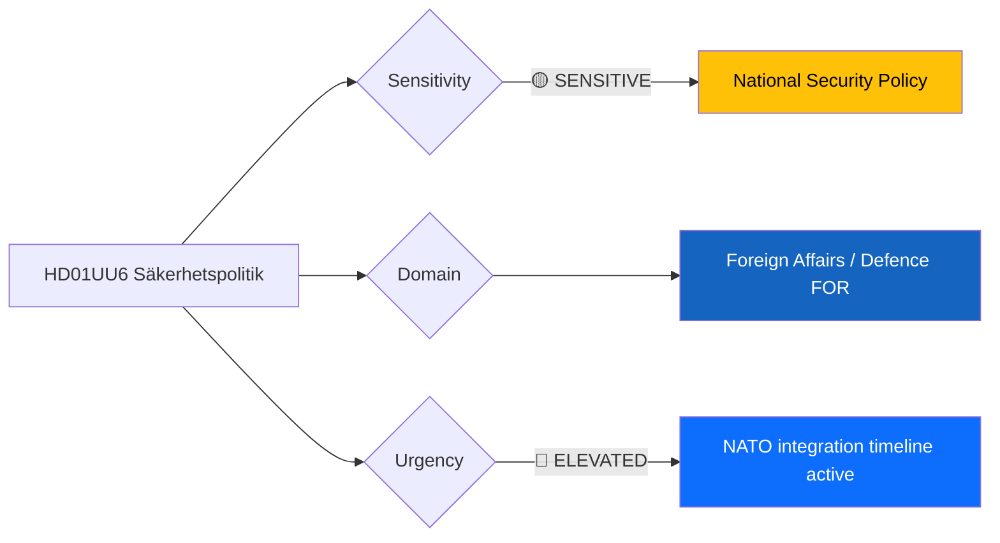

# Document Analysis: Säkerhetspolitik (UU6)

**Generated**: 2026-04-13 05:35 UTC
**dok_id**: HD01UU6
**Document Type**: committeeReports (betänkande)
**Committee**: UU (Utrikesutskottet — Foreign Affairs Committee)
**Date**: 2026-04-09
**Riksmöte**: 2025/26
**Source MCP Tool**: get_betankanden
**Analysis Timestamp**: 2026-04-13 05:35 UTC
**Analyst**: news-committee-reports workflow (AI-enriched)

---

## 🎯 Executive Summary

UU6 addresses Sweden's security policy framework in the post-NATO-accession era, representing the most significant committee report in this batch (7/10 significance). The Foreign Affairs Committee's betänkande on security policy carries exceptional weight given Sweden's ongoing integration into NATO command structures, Baltic Sea defence architecture, and the geopolitical tensions driving European rearmament. The report likely consolidates the government coalition's (M, KD, L with SD support) security policy stance while managing the structural tension between broad parliamentary consensus and SD's historically ambivalent position on foreign military commitments. **[MEDIUM confidence — metadata analysis; full-text unavailable]**

---

## 📊 Political Classification

| Field | Assessment |
|-------|-----------|
| **Sensitivity Level** | SENSITIVE — national security policy implications |
| **Primary Domain** | Foreign Affairs (FOR) / Defence (DEF) |
| **Urgency** | ELEVATED — NATO integration timeline creates ongoing pressure |
| **Significance Score** | 7/10 |
| **Confidence** | MEDIUM |

---

## 💪 SWOT Impact Assessment

### Strengths

| # | Statement | Evidence | Confidence | Impact |
|---|-----------|----------|------------|--------|
| S1 | Broad cross-party consensus on NATO membership and security fundamentals | HD01UU6; UU traditionally delivers near-unanimous reports on core security positions | HIGH | HIGH |
| S2 | Government coalition (M, KD, L) projects unified front on defence spending increases | HD01UU6 + HD01FöU8 cross-reference; defence budget trajectory established in 2024-2025 | MEDIUM | HIGH |
| S3 | Sweden's geographic position strengthens NATO's Baltic flank credibility | HD01UU6; NATO strategic assessment of Nordic-Baltic theatre | HIGH | MEDIUM |

### Weaknesses

| # | Statement | Evidence | Confidence | Impact |
|---|-----------|----------|------------|--------|
| W1 | SD's support arrangement creates structural tension on foreign military deployment scope | HD01UU6; SD historically sceptical of international military missions beyond territorial defence | MEDIUM | HIGH |
| W2 | Speed of NATO command structure integration may outpace parliamentary deliberation | HD01UU6; rapid operational tempo vs. riksdag oversight capacity | LOW | MEDIUM |
| W3 | Public debate on security policy remains thin despite transformational NATO accession | HD01UU6; media focus on immediate security threats rather than structural commitments | MEDIUM | MEDIUM |

### Opportunities

| # | Statement | Evidence | Confidence | Impact |
|---|-----------|----------|------------|--------|
| O1 | NATO membership unlocks defence industry cooperation and procurement efficiencies | HD01UU6 + defence industry context; Saab, BAE Systems partnerships | MEDIUM | HIGH |
| O2 | Baltic Sea security leadership position for Sweden within NATO | HD01UU6; Sweden's naval and air capabilities complement NATO's northern flank | MEDIUM | MEDIUM |

### Threats

| # | Statement | Evidence | Confidence | Impact |
|---|-----------|----------|------------|--------|
| T1 | SD-coalition divergence on specific NATO operational commitments could fracture security consensus | HD01UU6; SD's base opposes open-ended foreign deployments | LOW | HIGH |
| T2 | Russian escalation scenarios in the Baltic region could test Sweden's new alliance commitments prematurely | HD01UU6; geopolitical context | LOW | HIGH |

---

## ⚠️ Risk Assessment

| Risk | L (1-5) | I (1-5) | Score | Level |
|------|---------|---------|-------|-------|
| SD-coalition fracture on NATO operational scope | 2 | 4 | 8 | MEDIUM |
| Premature test of alliance commitments via Baltic escalation | 1 | 5 | 5 | MEDIUM |
| Parliamentary oversight gap in rapid NATO integration | 2 | 3 | 6 | MEDIUM |

---

## 👥 Stakeholder Impact

| Stakeholder | Impact | Key Concern |
|-------------|--------|-------------|
| Citizens | HIGH | National security, military service obligations |
| Government Coalition | HIGH | Maintaining consensus while managing SD |
| Opposition (S, V, MP, C) | MEDIUM | Broad consensus limits attack vectors; may push on spending priorities |
| International/EU | HIGH | NATO allies monitoring Sweden's commitment delivery |
| Business/Industry | MEDIUM | Defence procurement, industry partnerships |
| Media/Public Opinion | MEDIUM | Security policy drives attention in current geopolitical climate |

---

## 🔮 Forward Indicators

| Indicator | Trigger | Timeline | Confidence |
|-----------|---------|----------|------------|
| UU6 chamber debate scheduling | If before April 30, signals government urgency on security consensus | 2-3 weeks | MEDIUM |
| SD public statements on NATO deployment specifics | Any divergence from coalition line indicates stress | Ongoing | HIGH |
| NATO force generation conference decisions | Sweden's pledged capabilities timeline | May-June 2026 | MEDIUM |

---

## 🗳️ Election 2026 Implications

- **Electoral Impact**: Security policy consensus limits opposition attack vectors but may bore voters expecting differentiation [MEDIUM]
- **Coalition Scenarios**: Post-2026 security policy depends on whether SD remains in support arrangement or seeks direct coalition role [LOW]
- **Voter Salience**: Defence/security ranks high in polls but voters struggle to differentiate party positions [MEDIUM]
- **Campaign Vulnerability**: Government's defence spending record is a strength; SD's ambivalence on foreign missions is a potential opposition target [MEDIUM]
- **Policy Legacy**: NATO accession is irreversible — UU6 shapes the operational implementation for decades [HIGH]

---

## Data Quality Notes

- **Analysis confidence**: MEDIUM — metadata-only, full-text unavailable
- **Data sources**: get_betankanden (2025/26)
- **Cross-references**: HD01FöU8 (defence personnel), NATO integration timeline
