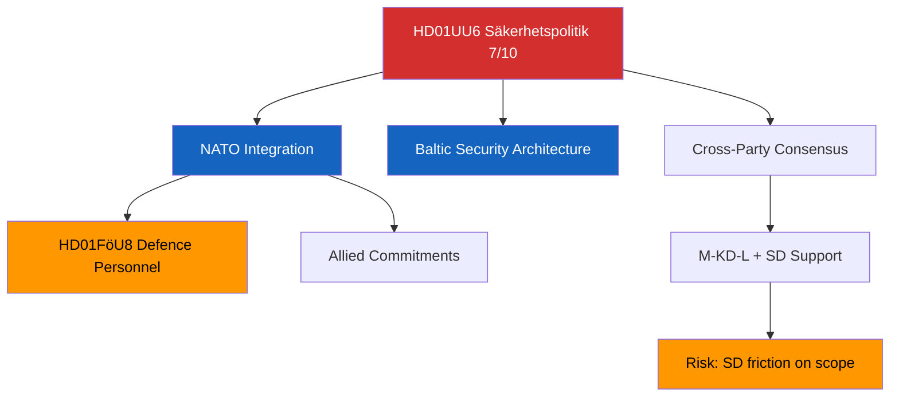

# Document Analysis: Säkerhetspolitik (UU6)

**Generated**: 2026-04-13 04:44 UTC (AI-enriched: 2026-04-13 04:52 UTC)
**dok_id**: HD01UU6
**Document Type**: Betänkande (Committee Report)
**Committee**: UU (Utrikesutskottet — Foreign Affairs Committee)
**Date**: 2026-04-09
**Riksmöte**: 2025/26
**Significance**: 🔴 High (7/10)
**Confidence**: MEDIUM (65%)

---

## Executive Summary

UU6 addresses Sweden's security policy in the post-NATO-accession environment, covering alliance commitments, Baltic Sea security architecture, and Sweden's role in collective defence. As the Foreign Affairs Committee's annual security policy report, it carries significant weight for Sweden's international posture. The report reflects the broad parliamentary consensus on security policy that has characterised Swedish politics since the 2022 NATO decision, while potentially exposing fissures on specific operational commitments. [MEDIUM confidence — metadata-based analysis]

## Document Content

**Full-text available**: No — metadata-only ⚠️
**Title**: Säkerhetspolitik
**Committee**: UU (Foreign Affairs)
**Policy domains**: Security policy, NATO integration, Baltic security, foreign affairs, defence cooperation

## SWOT Analysis

### Strengths
| # | Statement | Evidence | Confidence | Impact |
|---|-----------|----------|------------|--------|
| S1 | Broad cross-party consensus on NATO membership and Swedish security policy fundamentals | HD01UU6 — UU traditionally achieves near-unanimous positions on security; S and SD have aligned with M-KD-L on core NATO stance | MEDIUM | HIGH |
| S2 | Institutional credibility of UU committee on foreign/security matters | HD01UU6 — UU is one of the most authoritative Riksdag committees; report recommendations carry diplomatic weight | HIGH | MEDIUM |

### Weaknesses
| # | Statement | Evidence | Confidence | Impact |
|---|-----------|----------|------------|--------|
| W1 | Potential SD-M tension on scope of NATO force deployment commitments | HD01UU6 — SD historically sceptical of foreign military operations; operational specifics could expose fissures | LOW | HIGH |
| W2 | Gap between security policy ambition and defence spending/personnel reality | HD01UU6 cross-ref HD01FöU8 — personnel bottleneck constrains force targets | MEDIUM | HIGH |

### Opportunities
| # | Statement | Evidence | Confidence | Impact |
|---|-----------|----------|------------|--------|
| O1 | NATO membership opens enhanced Baltic security cooperation with Finland, Estonia, Latvia, Lithuania | HD01UU6 — Nordic-Baltic integration is a natural extension of Swedish NATO accession | MEDIUM | HIGH |
| O2 | Security consensus strengthens Sweden's negotiating position in NATO councils | HD01UU6 — parliamentary unity demonstrates democratic support for alliance commitments | MEDIUM | MEDIUM |

### Threats
| # | Statement | Evidence | Confidence | Impact |
|---|-----------|----------|------------|--------|
| T1 | Russian escalation in Baltic region tests Swedish security commitments before capability build-up is complete | HD01UU6, HD01FöU8 — security commitments outpacing personnel/equipment readiness | MEDIUM | HIGH |
| T2 | Coalition stability risk if SD perceives NATO operational scope exceeds Tido Agreement understanding | HD01UU6 — SD support for government depends on perceived proportionality of military commitments | LOW | HIGH |

## Stakeholder Perspective Analysis

| Stakeholder Group | Impact Level | Key Concern |
|-------------------|:---:|-------------|
| Citizens | HIGH | National security perception, military service obligations, personal safety |
| Government Coalition (M, KD, L) | HIGH | Demonstrating NATO integration progress; managing SD relationship on operational specifics |
| Opposition Bloc (S, V, MP, C) | MEDIUM | Broad support for NATO but scrutiny on specific commitments; V may dissent on military spending |
| Business/Industry | MEDIUM | Defence procurement opportunities; security stability for investment climate |
| Civil Society | LOW | Peace movement concerns about militarisation; conscription implications |
| International/EU | HIGH | NATO allies monitoring Swedish force commitment scope and timeline |
| Judiciary/Constitutional | LOW | Constitutionality of any new defence mandates or force deployment authorities |
| Media/Public Opinion | MEDIUM | High media salience of security topics in current geopolitical climate |

## Risk Assessment

| Risk | Likelihood (1-5) | Impact (1-5) | Score (L×I) | Level |
|------|:-:|:-:|:-:|------|
| SD-coalition fracture on NATO operational commitments | 2 | 4 | 8 | MEDIUM |
| Russian escalation tests Swedish readiness prematurely | 2 | 5 | 10 | HIGH |
| Security spending competes with social spending priorities | 3 | 3 | 9 | MEDIUM |

## Election 2026 Implications

- **Electoral Impact**: Security policy is a government strength area — broad consensus limits opposition attack vectors [MEDIUM]
- **Coalition Scenarios**: NATO consensus reduces S-led coalition differentiation; security is not a swing issue [LOW]
- **Voter Salience**: Defence/security ranks in top 5 voter concerns post-Ukraine invasion — UU6 maintains relevance [HIGH]
- **Campaign Vulnerability**: Government can claim credit for NATO integration; opposition limited to "we also support it" [MEDIUM]
- **Policy Legacy**: UU6 contributes to the long-term security framework that will outlast any single government [HIGH]

Confidence: 🟧MEDIUM

## Forward Indicators

| Indicator | Trigger | Timeline | Confidence |
|-----------|---------|----------|------------|
| UU committee scheduling of UU6 for chamber debate | If scheduled before April 30, signals government urgency on security positioning | 2-3 weeks | MEDIUM |
| SD public statements on NATO operational scope | Any SD deviation from government line indicates coalition stress | Ongoing | HIGH |
| NATO summit agenda alignment with UU6 positions | Consistency between Swedish parliament and NATO commitments | June 2026 | MEDIUM |

## Significance Assessment

**Overall Score**: 7/10 — 🔴 High

**5-Dimension Scoring**:
- Parliamentary Impact: 7/10
- Policy Impact: 8/10
- Public Interest: 6/10
- Urgency: 6/10
- Cross-Party Significance: 8/10
- **Total**: 35/50 → **7/10**

## Key Insights

1. UU6 is the most significant report in this batch — Sweden's security posture defines its international identity post-NATO [HIGH]
2. The security-defence personnel nexus (UU6↔FöU8) is the primary implementation risk [MEDIUM]
3. Coalition dynamics around operational NATO commitments merit close monitoring [MEDIUM]

## Data Quality Notes

- **Analysis confidence**: MEDIUM (65%)
- **Full-text content**: Unavailable — analysis based on metadata and political context
- **Data sources**: get_betankanden (riksmöte 2025/26)
- **Analysis method**: 8-stakeholder SWOT, 5×5 risk matrix, election impact assessment
